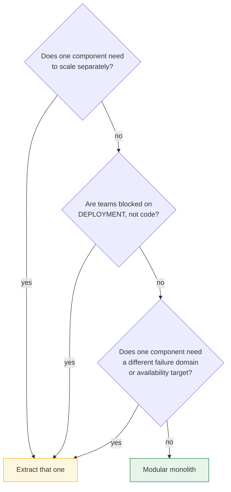

> Distribution is a cost you pay for a short, specific list of benefits. This lesson is how to
> tell whether you are actually receiving any of them, and what the bill looks like if you are
> not.

| | |
|---|---|
| **Module** | [07 — The modular monolith](/modules/modular-monolith/README) |
| **Prerequisites** | none — though [00-01](/modules/foundations/01-why-distributed-systems) sharpens it |
| **Also known as** | monolith-first, majestic monolith, modulith |
| **Category** | Structure |

---

## 1. The problem

A team of twelve, eighteen months in, running fourteen microservices. Their actual working
week:

- Adding a field to an order touches four services and needs three PRs merged in order.
- Local development requires nine containers; onboarding takes four days.
- Debugging a failed checkout means correlating logs across six services.
- 40% of their infrastructure spend is service-to-service communication and observability.
- Every service has its own CI pipeline, its own dependency updates, its own CVEs.
- Two engineers are effectively full-time platform engineers, from twelve.
- Peak traffic is 40 requests per second.

Nothing here is a mistake in *implementation*. Every service is well built. The mistake was
made once, at the start, when "we're building microservices" was decided before anyone
identified which force required them.

**The system has all the costs from [Module 00](/modules/foundations/README) and receives none
of the benefits, because at 40 rps nothing needed to scale independently and at twelve people
nobody was blocking anyone.**

## 2. In plain language

A restaurant deciding whether to open a second kitchen across town.

A second kitchen genuinely solves two problems: one kitchen cannot cook enough covers, and two
head chefs cannot both run one pass. Those are real, and when you have them the second kitchen
is worth its cost.

What it does *not* solve is a disorganised kitchen. If your one kitchen is chaotic because the
prep station and the pastry station share a bench and nobody owns the fridge, opening a second
location does not fix that — it gives you two chaotic kitchens plus a courier problem, a
duplicate stock system, and phone calls at 7pm about whose fridge has the truffles.

**The fix for a disorganised kitchen is stations with clear boundaries.** You can do that
inside one kitchen, today, for free. And if you later open the second location, you move a
station that already exists as a unit — rather than trying to divide a bench that three people
share.

**Where the analogy breaks down:** a kitchen's boundaries are physical and self-enforcing. A
module's boundary is a convention, and conventions decay unless something mechanical enforces
them — which is [07-02](/modules/modular-monolith/02-module-boundaries-and-enforcement)'s entire subject.

## 3. How it works

### What you actually get from distribution

Two things that module boundaries alone cannot give you:

1. **Independent deployment** — ship one component without shipping the others.
2. **Independent scaling** — run 40 copies of one component and 2 of another, and give them
   different hardware.

Two more are genuinely distribution's, with qualifications: **runtime fault isolation**
(partial — see §6) and **per-component technology choice** (real, and rarely worth its price).

The rest of what is commonly claimed is a property of **module boundaries**, which are free:

| Claimed benefit | Actually requires |
|---|---|
| Clear ownership | Module boundaries |
| Small, comprehensible codebases | Module boundaries |
| Teams not blocking each other on code | Module boundaries |
| Enforced separation of concerns | Module boundaries + a build rule |
| Technology choice per component | Distribution (and rarely worth it) |
| Fault isolation | Distribution — *partially*; see §6 |
| Independent deployment | Distribution |
| Independent scaling | Distribution |

**Four rows require distribution; two of those four come with an asterisk. Four rows are
free.** If your pain is in the free four — and it usually is — you have a module problem, and
distributing will not fix it. It will add a network to it.

### The bill

Splitting one deployable into N adds, per service and forever:

| Cost | Detail |
|---|---|
| Network in the call path | [Fallacies](/modules/foundations/02-fallacies-of-distributed-computing), [partial failure](/modules/foundations/03-failure-models-and-partial-failure) |
| Resilience machinery | Timeouts, retries, breakers, bulkheads — [Module 02](/modules/resilience/README) |
| Distributed data | Sagas, outbox, idempotency — [Module 04](/modules/data-and-consistency/README) |
| Availability multiplication | 5 services at 99.9% synchronous = 99.5% |
| Operations | Pipeline, dashboards, alerts, on-call, dependency updates × N |
| Debugging | [Distributed tracing](/modules/operations-and-evolution/01-observability) becomes mandatory, not optional |
| Local development | N processes to run, or a compromise that hides real behaviour |
| Contract management | [Schema evolution](/modules/communication/04-serialization-and-schema-evolution) between every pair |

**The platform floor matters most.** That cost is roughly fixed whether you have 3 services or
30 — which is exactly why 3 services is usually the worst number to have.

### The test



Note that the "yes" branch says *extract that one* — not *distribute everything*. The common
case is one component with a genuinely different profile (image processing, report generation,
a public API with hostile traffic) and everything else perfectly happy together.

**"Are teams blocked on deployment, not code?"** is the question people get wrong. Two teams in
one codebase who can merge and deploy independently are not blocked. Two teams who must
coordinate a release train are. The distinction is about the *pipeline*, not the repository.

### Scale markers, honestly

Rough, contested, and better than no anchor at all:

| Situation | Reasonable default |
|---|---|
| < 10 engineers | Modular monolith. Always |
| 10–30 engineers | Modular monolith; extract 1–3 components with genuine profiles |
| 30–100 engineers | Several services along team lines; most still modular inside |
| > 100 engineers | Deployment independence usually dominates; distribute |
| Any size, < 1000 rps | Scale is not your reason. Find a different one |

Shopify, GitHub, Stack Overflow and Basecamp run enormous businesses on well-structured
monoliths. Scale alone has never been the argument.

## 4. Pseudo-code

**The same feature, three ways.**

```
# ════════ 1. BIG BALL OF MUD — one deployable, no boundaries ════════
service ShopFlow:
  handler place_order(cmd):
    customer = db.query("SELECT * FROM customers WHERE id = ?", cmd.customer_id)
    stock    = db.query("SELECT * FROM stock WHERE sku IN (?)", cmd.skus)
    price    = db.query("SELECT * FROM prices WHERE sku IN (?)", cmd.skus)
    atomically:
      db.execute("UPDATE stock SET qty = qty - ? ...")
      db.execute("INSERT INTO orders ...")
      db.execute("INSERT INTO loyalty_points ...")
    email.send(customer.email, ...)
# ✓ Simple, fast, one transaction, trivially debuggable.
# ✗ Any code may touch any table. Ownership is undefined. Changing the stock
#   schema requires grepping the whole codebase and hoping.


# ════════ 2. MICROSERVICES — the same feature, distributed ════════
service OrderService:
  uses inventory: Client<InventoryService>
    with timeout(300ms), retry(max: 2, backoff: exponential(jitter: full)),
         circuit_breaker(threshold: 5), bulkhead(size: 40)          # Module 02
  uses pricing: Client<PricingService> with timeout(200ms), ...
  uses loyalty: Client<LoyaltyService> with timeout(200ms), ...

  @timeout(2s)
  @idempotent(key: request_id)                                       # 01-03
  handler place_order(ctx, cmd) -> Result<Order, OrderError>:
    saga = OrderSaga.start(cmd)                                      # 04-02
    reservation = await inventory.reserve(ctx, cmd.lines,
                    idempotency_key: ctx.key)?                       # can fail 3 ways
    try:
      price = await pricing.quote(ctx, cmd.lines)?
    catch:
      await inventory.release(reservation.id)                        # compensation
      raise
    atomically:
      orders.put(order.id, order)
      outbox.append(OrderPlaced(...))                                # 04-03
    return Ok(order)
# ✓ Deploy and scale independently.
# ✗ Everything above the return statement is machinery that exists ONLY because
#   the call crosses a network. Count the lesson references: seven.


# ════════ 3. MODULAR MONOLITH — boundaries, no network ════════
module Ordering:
  requires Inventory.ReservationApi                # a published interface (07-02)
  requires Pricing.QuoteApi
  uses orders: Repository<Order>                   # OUR schema only (07-04)

  handler place_order(cmd: PlaceOrder) -> Result<Order, OrderError>:
    # In-process calls: no network, so no timeout, no partial application, and
    # no ambiguous outcome from THIS call (00-03). Nothing here to retry.
    #
    # SCOPE, precisely: what disappears is NETWORK-induced ambiguity between
    # modules, and partial failure across the transaction below. What does NOT
    # disappear — a process crash mid-operation; a commit whose outcome we never
    # learn because the database connection dropped; and any external side effect
    # (charging a card, sending mail), which is ambiguous whether or not you are
    # a monolith. Module 02 shrinks here; it does not vanish.
    quote = pricing.quote(cmd.lines)?

    atomically:                                    # ONE local transaction across
      reservation = inventory.reserve(cmd.lines)?  # both modules' tables (07-04)
      order = Order.create(cmd, quote)?
      orders.save(order)
      events.publish(OrderPlaced(order.id, ...))   # in-process (07-03)
    return Ok(order)
# ✓ Boundaries are real and compiler-enforced.
# ✓ One transaction across both modules: no saga, no outbox, no compensation.
# ✓ One process to run, one log, one stack trace.
# ✗ Deploys together. Scales together.
# ✗ Still needs Module 02 at the real edges — the PSP, the ERP, the carrier do
#   not care that you are a monolith.
```

**The bill, made arithmetic.**

```
# ShopFlow: 12 engineers, 600 orders/s peak, 12,000 catalogue reads/s.
#
# ── Microservices, 6 services ──
#   Resilience config per dependency pair (12 pairs)      Module 02
#   Sagas for order placement                             04-02
#   Outbox + idempotent consumers                         04-03, 04-04
#   Distributed tracing (mandatory)                       11-01
#   6 pipelines, 6 dashboards, 6 on-call runbooks         11-02
#   Availability: 0.999^4 = 99.6% for checkout
#   Platform investment: ~2 engineers, ongoing            = 17% of the team
#
# ── Modular monolith, 6 modules ──
#   Resilience: only at the true edges (PSP, ERP, carrier)
#   Sagas: none. One database, one transaction.
#   Outbox: none. Events are in-process.
#   Tracing: useful, not mandatory. One process, one stack.
#   1 pipeline, 1 dashboard, 1 runbook
#   Availability: the process's own, ~99.95%
#   Platform investment: ~0.2 engineers
#
# The catalogue read path (12,000 rps) is the ONE component with a genuinely
# different profile. Extract that one (07-05). Leave the other five together.
# That is not a compromise — it is the correct answer to the test in §3.
```

## 5. Knobs and variants

| Knob | Guidance | Failure if wrong |
|---|---|---|
| Starting architecture | Modular monolith, essentially always | Starting distributed freezes unproven boundaries |
| When to extract | One component, one demonstrated force | "We're going microservices" as a programme, not a response |
| Module count | Match bounded contexts ([06-05](/modules/domain-driven-design/05-strategic-design-bounded-contexts-and-context-maps)) | Modules per technical layer buy nothing |
| Repository layout | Single repo, modules as top-level packages | Repo-per-module reintroduces coordination cost with no benefit |
| Deployment | One artefact | — |
| Scaling | Scale the whole thing horizontally first | It works further than people expect ([03-01](/modules/scalability/01-stateless-services-and-horizontal-scaling)) |
| Database | One, with a schema per module ([07-04](/modules/modular-monolith/04-data-and-transactions-in-a-modular-monolith)) | One shared schema erodes to a ball of mud |

## 6. Challenges and failure modes

- **Boundaries erode without enforcement.** The central risk, and the reason this architecture
  has a bad reputation among people who have only seen the version without a build rule. Solved
  in [07-02](/modules/modular-monolith/02-module-boundaries-and-enforcement); unsolvable by convention.
- **The shared transaction shortcut.** One transaction across three modules is the single
  cheapest thing to write and the single most expensive thing to unpick later
  ([07-04](/modules/modular-monolith/04-data-and-transactions-in-a-modular-monolith)).
- **No fault isolation.** True and worth stating plainly: a memory leak or a runaway thread in
  one module affects all of them. Modules isolate *change*, not *runtime*. Where runtime
  isolation genuinely matters, that component is a candidate for extraction.
- **Scaling is all-or-nothing.** Running 40 copies to serve one hot module wastes memory.
  Usually cheaper than the distributed alternative; occasionally not — and that is the signal.
- **Build times.** A large monolith can develop slow builds and slow test suites. Fixable with
  module-level compilation and test partitioning, but it needs deliberate attention.
- **One runtime, one language.** A genuine constraint. If a component truly needs a different
  ecosystem, it is a candidate for extraction.
- **Organisational scepticism.** "Monolith" reads as legacy. The word "modular" does real work
  here, and so does being able to show the enforcement rule.
- **Deployment coupling at scale.** With 100 engineers on one artefact, the release train
  becomes the bottleneck. This is the genuine limit, and it arrives from *organisation size*,
  not from traffic.

## 7. Alternatives

- **Microservices from the start.** Correct when boundaries are genuinely known (a re-platform
  of a system you have already run) *and* the organisation is already large.
- **Big ball of mud.** No boundaries at all. Fastest for a prototype, and the default outcome
  if boundaries are not enforced.
- **Service-oriented / coarse services.** 3–6 large services along team lines. A reasonable
  middle ground, and the natural next step from a modular monolith.
- **Self-contained systems.** Vertical slices, each with UI, logic and data, deployed
  independently. Fewer, larger units than microservices; much less inter-service chatter.
- **Serverless functions.** Extreme granularity with the platform absorbing the operations. A
  different trade of the same axis.
- **Modular monolith with one extracted component.** The most common good answer in practice,
  and the one this course recommends for ShopFlow.

## 8. Trade-offs

| Advantage | Disadvantage |
|---|---|
| No network between components: no timeouts, retries or partial failure | No independent deployment |
| Local transactions: no sagas, no outbox, no eventual consistency | No independent scaling |
| One process to run, debug, trace and deploy | No runtime fault isolation between modules |
| Boundaries can be moved in an afternoon | One language and runtime |
| Platform cost near zero; team stays on product | Build and test times need active management |
| Extraction later is a week, if the rules were kept | Requires discipline that distribution enforces automatically |

**That last row is the honest counter-argument** and deserves stating: microservices enforce
boundaries because crossing one is physically hard. A modular monolith must enforce them
artificially. Teams that will not maintain a build rule may genuinely be better served by the
network — expensive discipline is still discipline.

## 9. Complexity introduced

- **Operational.** Less than any alternative. One artefact, one pipeline, one dashboard.
- **Cognitive.** Engineers must respect boundaries that the runtime does not force. This is a
  real cultural requirement, not a technical one.
- **Failure surface.** Smaller than distributed: no partial failure, no distributed data, no
  version skew between components.
- **Testing.** Substantially easier — in-process integration tests are fast and deterministic.
  The risk is a single test suite growing slow enough that people stop running it.

## 10. Related concepts

- **Builds on:** [06-05 Bounded contexts](/modules/domain-driven-design/05-strategic-design-bounded-contexts-and-context-maps)
- **Composes with:** [07-02 Enforcement](/modules/modular-monolith/02-module-boundaries-and-enforcement), [03-01 Horizontal scaling](/modules/scalability/01-stateless-services-and-horizontal-scaling)
- **Conflicts with / tension:** organisational fashion; and genuinely, deployment independence at scale
- **Contrast with:** [00-01 Why distributed systems](/modules/foundations/01-why-distributed-systems) — the same trade-off, argued from the other side. Read both
- **Leads to:** [07-02 Module boundaries and enforcement](/modules/modular-monolith/02-module-boundaries-and-enforcement)

## 11. Exercises

1. **Trace it.** Take the microservices version in §4. Delete every line that exists only
   because a call crosses a network. What fraction of the handler remains, and which lessons
   did you just avoid needing?
2. **Extend it.** For a system you work on, answer the three questions in the §3 test honestly.
   If any answer is yes, name the *one* component it applies to.
3. **Break it.** Argue the strongest case *against* the modular monolith for a 60-engineer
   organisation shipping daily. At what team size does your argument become decisive, and what
   would you measure to know you had reached it?

## 12. References

- Martin Fowler, "MonolithFirst" (2015) and "Microservice Premium".
- Sam Newman, *Monolith to Microservices* (2019) — Ch. 1, which argues this case better than most monolith advocates do.
- Simon Brown, "Modular Monoliths" (talk, 2015) — the origin of the modern framing.
- Shopify Engineering, "Deconstructing the Monolith" (2019) — componentisation at very large scale, without distributing.
- Kelsey Hightower's remarks on monoliths, and Amazon Prime Video's 2023 write-up on consolidating a distributed service back into one.
- DHH, "The Majestic Monolith" (2016).

---

**Up:** [Module 07](/modules/modular-monolith/README) · **Previous:** [← Module 06](/modules/domain-driven-design/README) · **Next:** [07-02 Module boundaries and enforcement →](/modules/modular-monolith/02-module-boundaries-and-enforcement)
