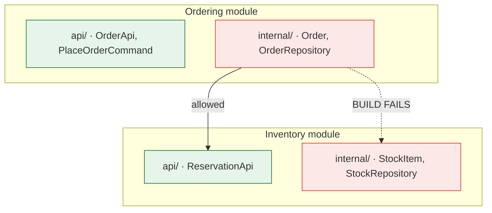

> A boundary that is not mechanically enforced is a boundary that has already been crossed.
> This is the lesson the modular monolith lives or dies on.

| | |
|---|---|
| **Module** | [07 — The modular monolith](/modules/modular-monolith/README) |
| **Prerequisites** | [07-01 Why a modular monolith first](/modules/modular-monolith/01-why-a-modular-monolith-first) |
| **Also known as** | architecture fitness functions, dependency rules, package-by-feature |
| **Category** | Structure |

---

## 1. The problem

ShopFlow's team agrees the modular boundaries. They write them in a design document, present
them at an architecture review, and put a diagram on the wiki.

Fourteen months later:

- `OrderService` imports `InventoryRepository` directly, because someone needed a stock count
  on a Friday afternoon and the interface did not expose it.
- `CatalogModule` and `PricingModule` import each other's types; neither can be understood
  alone.
- A "common" package contains `Order`, `Product` and `Customer` — every module depends on it,
  so every module depends on every module.
- A junior engineer added a cross-module import in their first week. It passed review, because
  the reviewer could not see the boundary either.

The document is still on the wiki. It is accurate about the intent and describes nothing about
the system.

**Nobody defected. The boundary simply had no physical existence, and code flows into whatever
shape has the least resistance.**

## 2. In plain language

An open-plan office where the departments are marked out with tape on the floor.

Day one, everyone respects the tape. By month three someone has moved a desk six inches to
reach a socket. By month six the marketing team's printer is inside the finance area, because
that is where the power point is. Nobody ever decided to dissolve the boundary; it was
dissolved by a hundred locally-reasonable decisions.

Now put in walls with doors. The doors are usable — this is not about preventing
collaboration — but going between departments is a deliberate act you notice. Nobody's desk
drifts through a wall.

**The difference between tape and walls is not intent. It is whether crossing the boundary
requires a decision or merely requires not thinking about it.**

**Where the analogy breaks down:** walls are expensive and permanent. A build rule is cheap and
can be changed in a commit — which is the point. You want boundaries that are hard to cross
accidentally and easy to move deliberately.

## 3. How it works

### What a module is

A module is a **bounded context** ([06-05](/modules/domain-driven-design/05-strategic-design-bounded-contexts-and-context-maps))
with a compilation boundary. Three parts:

| Part | Visibility | Contains |
|---|---|---|
| **Public API** | Exported | Interfaces, commands, queries, published event types, DTOs |
| **Internals** | Private | Aggregates, repositories, domain services, persistence |
| **Required APIs** | Declared | The other modules' public APIs this module depends on |

The critical rule: **domain types do not appear in the public API.** A module publishes DTOs
and interfaces, never its aggregates. If `Ordering` exposes its `Order` aggregate, every
consumer is coupled to its internal model, and the boundary is decorative.

### Package by feature, not by layer

The layout decision that makes everything else possible:

```
✗ package by layer                     ✓ package by feature
  controllers/                           ordering/
    OrderController                        api/          ← public
    ProductController                        OrderApi
  services/                                  PlaceOrderCommand
    OrderService                           internal/     ← private
    ProductService                           Order            (aggregate)
  repositories/                              OrderRepository
    OrderRepository                          PlaceOrderHandler
    ProductRepository                        OrderTable
                                         inventory/
                                           api/
                                           internal/
```

Layer-first makes *every* boundary a horizontal cut, which is exactly the wrong axis: a change
to ordering touches three packages, and nothing prevents `OrderService` from calling
`ProductRepository`. Feature-first makes the module the unit, and the layers live *inside* it.

### The enforcement ladder

From weakest to strongest. **Use at least level 3.**

| Level | Mechanism | Strength |
|---|---|---|
| 1 | A document | None. This is §1 |
| 2 | Code review | Weak — reviewers cannot see what they cannot see |
| 3 | **Architecture tests** (ArchUnit, NetArchTest, import-linter, dependency-cruiser) | Good. Fails the build. Works in every language |
| 4 | **Language visibility** (Java modules, .NET `internal`, Go internal packages, Rust `pub(crate)`) | Strong. The compiler refuses |
| 5 | **Separate build units** — one compilation unit per module, explicit dependencies | Strongest. A module physically cannot see another's internals |

Level 5 has a further benefit: the dependency graph becomes a build file, which means it is
reviewable in a diff. "Why does Ordering now depend on Shipping?" becomes a pull-request
comment rather than an archaeology project.



### The dependency graph must be acyclic

Two modules that import each other are one module with extra ceremony. Cycles are the most
common structural decay, and they are always fixable by one of four moves:

1. **Extract the shared concept** into a third module both depend on.
2. **Invert the dependency** — the upstream module declares an interface the downstream
   implements.
3. **Use an event** — B reacts to A's event instead of A calling B
   ([07-03](/modules/modular-monolith/03-in-process-communication-between-modules)).
4. **Merge them** — sometimes the honest answer is that they are one context.

### The "common" module trap

Every modular monolith grows a `common`, `shared` or `core` package. It is fine for genuinely
technical things — `Result`, logging, `Clock`, HTTP helpers. It is fatal for **domain types**:
the moment `Order` lives in `common`, every module depends on it, and a change to `Order` is a
change to everything. You have rebuilt the ball of mud with better package names.

**Rule: `shared` may contain nothing that a domain expert would recognise.**

## 4. Pseudo-code

**Before — tape on the floor.**

```
package com.shopflow.services:
  service OrderService:
    uses inventory_repo: InventoryRepository        # TRAP: another module's internals
    uses product_repo: ProductRepository            # TRAP: and another
    fn place_order(cmd):
      stock = inventory_repo.find_by_sku(cmd.sku)   # reaching straight into the DB
      stock.qty -= cmd.qty                          # mutating another module's aggregate
      inventory_repo.save(stock)
# There is no boundary. There is a naming convention.
```

**The pattern — walls with doors.**

```
# ════════════════ Module: Inventory ════════════════
module Inventory:

  # ---- PUBLIC: the door. DTOs and interfaces only. No aggregates. ----
  public interface ReservationApi:
    fn reserve(order_id: OrderId, lines: List<LineRequest>)
        -> Result<ReservationView, ReservationError>
    fn release(reservation_id: ReservationId) -> Result<Unit, Error>

  public record LineRequest:  sku: String, qty: Int      # DTO: primitives, stable
  public record ReservationView: id: ReservationId, expires_at: Instant
  public enum ReservationError: OUT_OF_STOCK(skus: List<String>) | INVALID_SKU

  public event StockReserved: order_id: OrderId, at: Instant     # published type

  # ---- INTERNAL: the room. Nothing here is visible outside. ----
  internal aggregate StockItem:                       # our model. Ours alone.
    sku: SKU
    on_hand: Quantity
    reserved: Quantity
    invariants: reserved <= on_hand
    fn reserve(q: Quantity) -> Result<StockItem, StockError>: ...

  internal interface StockRepository:
    fn get(sku: SKU) -> Result<StockItem, NotFound>
    fn save(s: StockItem) -> Result<Unit, ConflictError>

  internal service ReservationService implements ReservationApi:
    uses stock: StockRepository
    fn reserve(order_id, lines) -> Result<ReservationView, ReservationError>:
      # Translate at the boundary: primitives in, domain types inside.
      # This is an anti-corruption layer between modules (08-06), and it is why
      # extraction later is cheap (07-05).
      skus = lines.map(l => SKU.parse(l.sku)?)
      ...
      return Ok(ReservationView(id: r.id, expires_at: r.expires_at))


# ════════════════ Module: Ordering ════════════════
module Ordering:
  requires Inventory.ReservationApi                   # declared, reviewable
  requires Pricing.QuoteApi

  public interface OrderApi:
    fn place(cmd: PlaceOrderCommand) -> Result<OrderView, OrderError>

  internal service PlaceOrderHandler:
    uses reservations: Inventory.ReservationApi       # the API. Never the internals.
    uses orders: OrderRepository                      # our own

    fn place(cmd) -> Result<OrderView, OrderError>:
      r = reservations.reserve(cmd.order_id,
            cmd.lines.map(l => Inventory.LineRequest(l.sku.value, l.qty.value)))?
      ...
      # TRAP if we imported Inventory.internal.StockItem here: it would compile
      # today, and it would make Inventory unable to change its own model — and
      # unextractable without touching Ordering.
```

**The enforcement — the actual deliverable of this lesson.**

```
# Architecture tests. These run in CI and fail the build. Without them, everything
# above is a naming convention.

architecture_test "modules may not reach into another module's internals":
  for m in all_modules():
    no_class_in(m).may_depend_on(other_modules().internals())
    # This single rule is the difference between a modular monolith and a
    # monolith with folders.

architecture_test "the module dependency graph is acyclic":
  assert modules().dependency_graph().is_acyclic()
  # Two modules importing each other are one module. Catch it on day one, not
  # in the extraction attempt two years later.

architecture_test "declared dependencies are complete":
  for m in all_modules():
    assert m.actual_dependencies() subset_of m.declared_requires()
    # A new cross-module dependency must be an explicit, reviewable change to
    # the module manifest — not an import statement nobody notices.

architecture_test "shared contains no domain concepts":
  assert no_class_in("shared").is_annotated_with(Aggregate | Entity | DomainEvent)
  assert no_class_in("shared").name_matches("Order|Product|Customer|Payment")
  # The common-module trap (§3), automated.

architecture_test "each module owns its schema":
  for m in all_modules():
    assert m.sql_references() subset_of m.owned_tables()     # see 07-04

architecture_test "public APIs expose no domain types":
  for m in all_modules():
    for t in m.public_api_types():
      assert t.is_dto_or_interface()
      assert not t.references(m.internal_types())
```

**Fixing a cycle — the four moves, worked.**

```
# The cycle: Ordering needs a price; Pricing needs the customer's order history.
#   Ordering -> Pricing -> Ordering       ✗ build fails, correctly

# Move 1 — extract the shared concept.
module CustomerHistory:                # both depend on this; no cycle
  public interface HistoryApi: fn lifetime_value(id: CustomerId) -> Money

# Move 2 — invert. Pricing declares what it needs; Ordering supplies it.
module Pricing:
  public interface CustomerContext:    # Pricing OWNS the interface
    fn lifetime_value(id: CustomerId) -> Money
module Ordering:
  internal service OrderingCustomerContext implements Pricing.CustomerContext: ...
  # Dependency now points one way: Ordering -> Pricing. Cycle gone.

# Move 3 — event. Pricing keeps its own projection, updated by Ordering's events.
module Pricing:
  internal policy TrackSpendWhenOrderPlaced:
    on Ordering.OrderPlaced(e): spend.add(e.customer_id, e.total)
  # No call, no dependency, no cycle. Costs eventual consistency (07-03).

# Move 4 — merge. If they genuinely share invariants, they are one context (06-05).
```

## 5. Knobs and variants

| Knob | Guidance | Failure if wrong |
|---|---|---|
| Enforcement level | ≥3 (architecture tests); 5 if the language allows | Levels 1–2 are §1 |
| Package layout | By feature, then layer inside | Layer-first makes the wrong cut the easy one |
| Public API contents | DTOs and interfaces only | Exposing aggregates couples consumers to your model |
| Module granularity | One per bounded context | Modules per layer or per table buy nothing |
| `shared` contents | Technical only, never domain | Domain types in shared = universal coupling |
| Cycles | Forbidden, enforced | Cycles make modules unextractable and unreadable |
| Dependency declaration | Explicit manifest, diffable | Implicit dependencies grow unnoticed |
| Test placement | Inside the module | A central test package can see everything and hides violations |

## 6. Challenges and failure modes

- **Enforcement added later.** Adding architecture tests to an eroded codebase produces 400
  failures and gets disabled. Add them on day one, when they pass trivially. If you are
  retrofitting, freeze the current violations as an explicit allow-list and forbid new ones —
  a ratchet, not a cliff.
- **The `shared` module absorbing the domain.** Gradual, plausible at every step, fatal.
- **Cycles introduced by a helpful refactor.** Someone extracts a common utility that happens
  to reference both modules. The acyclic test is what catches it.
- **Public API exposing internals indirectly.** `OrderApi` returns `OrderView`, which contains
  `Money`, which lives in `Ordering.internal`. The API is public; its transitive types are not.
  Test for it.
- **Test packages that see everything.** A central integration-test module importing all
  internals is a legitimate exception — and it must be an explicit, named exception, or it
  becomes the hole every violation escapes through.
- **Reflection and dependency injection** bypassing visibility at runtime. Architecture tests
  operating on bytecode/AST catch what the compiler cannot.
- **Boundaries that are wrong, and enforced.** Enforcement makes a bad boundary painful, which
  is *useful information* — but only if the team treats the pain as a signal to move the
  boundary rather than a reason to add an exception.
- **Modules too small.** Twelve modules for a domain with four contexts means constant
  cross-module traffic and no benefit.

## 7. Alternatives

- **Separate repositories per module.** Physical separation, strongest possible enforcement, and
  it reintroduces cross-repo coordination and versioning — most of the microservices tax with
  none of the deployment benefit. Rarely worth it.
- **Language-level modules only** (Java Platform Module System, .NET assemblies, Go internal).
  Strong and free where available; usually insufficient alone because they cannot express "no
  cycles" or "shared holds no domain types".
- **Convention plus review.** Level 2. Works in a stable three-person team and nowhere else.
- **Runtime isolation** (OSGi, class loaders, separate processes on one host). Heavy, and it
  buys runtime isolation that modules genuinely lack — occasionally the right answer for a
  plugin architecture.
- **Microservices.** Enforcement by network. Expensive, effective, and it also enforces the
  boundaries you got *wrong*.

## 8. Trade-offs

| Advantage | Disadvantage |
|---|---|
| Boundaries are real, and violations fail the build | Some legitimate changes now need a deliberate manifest edit |
| The dependency graph is visible and reviewable | Architecture tests are code to maintain |
| Extraction later is cheap because the seam already exists | Boundary crossings require DTOs and mapping |
| Newcomers cannot violate a boundary by accident | Enforcement can entrench a boundary that should move |
| Cycles are caught on the day they appear | Retrofitting onto an eroded codebase is genuinely painful |

## 9. Complexity introduced

- **Operational.** None. This is all build-time.
- **Cognitive.** Engineers must know which module they are in and use published APIs. The build
  teaches this faster than any document.
- **Failure surface.** None at runtime. The risk is social: a team that routes around the rules
  with exceptions has the costs and none of the benefit.
- **Testing.** Architecture tests are cheap to write, fast to run, and among the highest-value
  tests in the codebase — they prevent a class of decay that no unit test can see.

## 10. Related concepts

- **Builds on:** [07-01 Why a modular monolith](/modules/modular-monolith/01-why-a-modular-monolith-first), [06-05 Bounded contexts](/modules/domain-driven-design/05-strategic-design-bounded-contexts-and-context-maps)
- **Composes with:** [07-03 In-process communication](/modules/modular-monolith/03-in-process-communication-between-modules), [07-04 Data ownership](/modules/modular-monolith/04-data-and-transactions-in-a-modular-monolith), [06-04 Ports and adapters](/modules/domain-driven-design/04-repositories-factories-and-the-application-layer)
- **Conflicts with / tension:** short-term convenience; the fastest fix always crosses a boundary
- **Contrast with:** [08-06 Anti-corruption layer](/modules/microservice-architecture/06-anti-corruption-layer) — the same translation discipline, applied to systems you do not own
- **Leads to:** [07-03 In-process communication between modules](/modules/modular-monolith/03-in-process-communication-between-modules)

## 11. Exercises

1. **Trace it.** An engineer adds `import Inventory.internal.StockItem` to `Ordering`. Walk
   through what happens with each enforcement level 1–5. At which level do they find out, and
   how long after writing it?
2. **Extend it.** Write the architecture test that forbids a module's public API from exposing
   any type that transitively references an internal type. Why is the transitive case the one
   that actually bites?
3. **Break it.** Your team retrofits architecture tests onto an 18-month-old codebase and gets
   400 violations. Design the ratchet: what do you allow, what do you forbid, and how do you
   ensure the allow-list shrinks rather than grows?

## 12. References

- Simon Brown, "Modular Monoliths" and *Software Architecture for Developers* — the package-by-feature argument.
- ArchUnit (Java), NetArchTest (.NET), import-linter (Python), dependency-cruiser (JS), go-arch-lint — the tooling.
- Neal Ford, Rebecca Parsons, Patrick Kua, *Building Evolutionary Architectures* (2017) — architecture fitness functions.
- Kirk Knoernschild, *Java Application Architecture* (2012) — module design principles, still the most thorough treatment.
- Oliver Drotbohm, *Spring Modulith* documentation — enforcement and module-level testing in practice.
- Robert C. Martin, "The Acyclic Dependencies Principle".

---

**Up:** [Module 07](/modules/modular-monolith/README) · **Previous:** [← 07-01](/modules/modular-monolith/01-why-a-modular-monolith-first) · **Next:** [07-03 In-process communication between modules →](/modules/modular-monolith/03-in-process-communication-between-modules)
