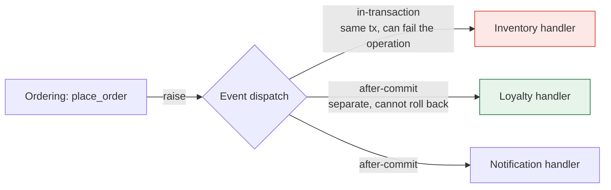

> Modules must talk. Every mechanism you choose here is a decision about how coupled they
> become — and about how hard it will be to put a network between them later.

| | |
|---|---|
| **Module** | [07 — The modular monolith](/modules/modular-monolith/README) |
| **Prerequisites** | [07-02 Module boundaries](/modules/modular-monolith/02-module-boundaries-and-enforcement) |
| **Also known as** | module APIs, in-process events, internal pub/sub |
| **Category** | Integration |

---

## 1. The problem

Ordering needs three things from other modules:

1. **A stock reservation.** It cannot proceed without knowing whether the reservation
   succeeded. The answer must be immediate and authoritative.
2. **Loyalty points awarded.** Must happen, but not before the customer sees "order placed",
   and Ordering should not know that loyalty exists.
3. **The customer's tier**, to apply a discount. Read-only, changes rarely, needed on every
   checkout.

Use one mechanism for all three and you get one of two failures. Direct calls everywhere means
Ordering imports five modules, knows about loyalty and marketing, and can never be extracted.
Events everywhere means the reservation result arrives asynchronously — so the customer is told
their order succeeded before anyone checked whether the item exists.

**The mechanisms are not interchangeable, and choosing per interaction is the skill.**

## 2. In plain language

An office with three ways to communicate, each correct for different things.

**Walking over and asking** gets an immediate answer and requires the other person to be free.
You use it when you cannot continue without the answer — "is this in stock?" — and it is the
right tool despite the interruption.

**Putting a note in the pigeonhole** lets you carry on. You do not know when it will be read.
You use it when the work must happen but not now, and when you do not need to know who picks
it up.

**Announcing on the noticeboard** tells whoever cares. You do not know who reads it and you do
not want to. Adding a new interested department requires nothing from you.

The mistake is picking one and using it for everything. An office that only uses the
noticeboard cannot answer a question; an office that only walks over grinds to a halt whenever
one person is busy — and everyone ends up knowing everyone else's business.

**Where the analogy breaks down:** an in-process call, unlike walking over, cannot fail
halfway. That is precisely the property you lose when the module later becomes a service, and
the reason the shape of these calls matters so much.

## 3. How it works

### The three mechanisms

| | **Direct call via API** | **In-process event** | **Shared read model** |
|---|---|---|---|
| Coupling | Caller knows the callee | Publisher knows nobody | Reader knows a projection |
| Timing | Synchronous, immediate | Same transaction or after commit | Immediate, possibly stale |
| Result | Returns a value | Returns nothing | Returns data |
| Failure | Propagates to the caller | Isolated per handler | Cannot fail meaningfully |
| Use for | You need the answer to continue | Announcing a fact | Frequently-read foreign data |
| Later becomes | An RPC call ([01-01](/modules/communication/01-synchronous-request-response)) | A message ([01-02](/modules/communication/02-asynchronous-messaging)) | A replicated read model ([04-06](/modules/data-and-consistency/06-cqrs)) |

**The bottom row is the design principle.** Choose the in-process mechanism that matches the
distributed mechanism you would use if this were a service — then extraction is a change of
transport, not a change of design.

### Direct calls: keep them shallow

A direct call to another module's published API is correct when the caller needs the answer.
Two constraints keep it honest:

- **Only through the published interface**, never internals ([07-02](/modules/modular-monolith/02-module-boundaries-and-enforcement)).
- **Depth of one.** If Ordering calls Inventory which calls Pricing which calls Ordering, you
  have a distributed call chain with no network — and a cycle
  ([07-02](/modules/modular-monolith/02-module-boundaries-and-enforcement) forbids it).

### In-process events: two flavours, and the difference matters



| | In-transaction | After-commit |
|---|---|---|
| Runs | Before commit, same transaction | After the transaction commits |
| Handler failure | Rolls back the whole operation | Does not affect the original operation |
| Consistency | Strong | Eventual |
| Use for | Invariants that must hold together | Side effects: email, points, indexing |
| On extraction | Becomes a synchronous call — or a redesign | Becomes an [outbox](/modules/data-and-consistency/03-transactional-outbox) message |

**In-transaction handlers are the trap.** They are convenient and they mean a loyalty bug can
roll back an order. Worse, they cannot survive extraction: once the handler is in another
process, "same transaction" is unavailable and you are into
[sagas](/modules/data-and-consistency/02-saga). Use after-commit by default; use
in-transaction only where the modules genuinely share an invariant, and note it as a future
extraction cost.

**The loss you accept with after-commit:** if the process crashes between commit and handler,
the side effect is lost. In a monolith this is usually acceptable — it is a rare window and the
work is recoverable. When it is not acceptable, use a persisted job table
([10-02](/modules/performance-and-concurrency/02-asynchronous-processing-and-work-queues)),
which is the outbox pattern arriving early.

### Shared read models

For foreign data read constantly and changed rarely — customer tier, product name, tax class —
neither a call nor an event per read is right. The consuming module keeps its own **small
projection**, updated by events.

This is the same pattern as [CQRS](/modules/data-and-consistency/06-cqrs) and the same idea
as a local snapshot in [08-01](/modules/microservice-architecture/01-decomposition-and-bounded-contexts).
Doing it in the monolith feels redundant — the data is *right there* in another table — and
doing it anyway is what makes extraction possible.

### What must never happen

**Direct database access across modules.** Reading another module's tables is the shortcut that
ends the architecture: it couples you to their schema, bypasses their invariants, and cannot be
detected without a build rule ([07-04](/modules/modular-monolith/04-data-and-transactions-in-a-modular-monolith)).

## 4. Pseudo-code

**Before — one mechanism for everything.**

```
module Ordering:
  uses inventory_repo: InventoryRepository       # TRAP: internals (07-02)
  uses loyalty_service: LoyaltyService           # TRAP: why does Ordering know loyalty?
  uses email: EmailService
  uses search: SearchIndexer
  uses marketing: MarketingService

  fn place_order(cmd):
    stock = inventory_repo.find(cmd.sku)
    stock.qty -= cmd.qty
    inventory_repo.save(stock)
    orders.save(order)
    loyalty_service.award(cmd.customer_id, order.total)
    email.send_confirmation(order)
    search.index(order)
    marketing.record_conversion(order)
# Ordering now depends on five modules and cannot be extracted, tested in
# isolation, or understood without reading all six.
```

**The pattern — the right mechanism per interaction.**

```
module Ordering:
  requires Inventory.ReservationApi              # 1. we NEED the answer
  # no requires for Loyalty, Notification, Search, Marketing — they listen (2)
  uses customer_tiers: CustomerTierProjection    # 3. our own copy of foreign data
  uses orders: OrderRepository
  uses events: EventBus

  fn place_order(cmd: PlaceOrderCommand) -> Result<OrderView, OrderError>:

    # ── 3. Shared read model: read constantly, changes rarely, local and fast.
    tier = customer_tiers.tier_of(cmd.customer_id) ?? BRONZE
    #    @eventually_consistent(lag: ~1s). A stale tier costs a wrong discount
    #    on one order — acceptable, and stated. A call per checkout would not be.

    atomically:
      # ── 1. Direct call: we cannot proceed without knowing the answer.
      reservation = inventory.reserve(cmd.order_id,
                      cmd.lines.map(to_line_request))?      # ? propagates the error

      order = Order.create(cmd, discount_for(tier))?
      orders.save(order)

      # ── 2. Announce. Ordering does not know or care who listens.
      events.publish_after_commit(OrderPlaced(
        order_id: order.id, customer_id: cmd.customer_id,
        total: order.total, at: now()))

    return Ok(to_view(order))
    # Ordering's declared dependencies: ONE. Adding a sixth consequence requires
    # no change to this file, and no knowledge of it.


# ── Consumers subscribe. Ordering never learns they exist. ──
module Loyalty:
  internal policy AwardPointsWhenOrderPlaced:
    on Ordering.OrderPlaced(e):                   # after-commit: a loyalty failure
      points.award(e.customer_id, e.total)        # must not roll back the order

module Notification:
  internal policy SendConfirmationWhenOrderPlaced:
    on Ordering.OrderPlaced(e): email.send(...)
```

**The event bus — and the dispatch decision made explicit.**

```
internal service InProcessEventBus:
  state in_transaction: Map<Type, List<Handler>> = {}
  state after_commit: Map<Type, List<Handler>> = {}
  state pending: List<Event> = []                 # buffered until commit

  fn publish_in_transaction(e: Event):
    for h in in_transaction.get(type_of(e)):
      h(e)                                        # exceptions propagate and roll back
    # WHY this exists at all: two modules sharing an invariant. WHY to avoid it:
    # it cannot survive extraction (§3), and it lets any handler fail the operation.

  fn publish_after_commit(e: Event):
    pending.append(e)                             # nothing runs yet

  on transaction_committed:
    for e in pending:
      for h in after_commit.get(type_of(e)):
        try:
          h(e)
        catch Error as err:
          # One handler failing must not affect the others, or the original
          # operation, which is already committed.
          log.error("event handler failed", handler: h, event: e, err: err)
          metrics.increment("event_handler.failed", tags: {handler: name_of(h)})
          # TRAP: this failure is now silent to the user and invisible unless
          # someone alerts on that metric. See §6.
    pending.clear()

  on transaction_rolled_back:
    pending.clear()                               # the fact never happened
```

**Guaranteed side effects — when losing one is unacceptable.**

```
module Ordering:
  fn place_order(cmd) -> Result<OrderView, OrderError>:
    atomically:
      order = Order.create(cmd)?
      orders.save(order)
      # Committed WITH the order, in the same transaction, in the same database.
      # A crash cannot lose it. This is the outbox (04-03) — arriving early,
      # because "must not be lost" is the same requirement in a monolith.
      jobs.enqueue(Job(type: "send_confirmation", payload: order.id,
                       idempotency_key: "confirm:" + order.id))
    return Ok(to_view(order))
# Use for: emails the customer is promised, financial postings, partner webhooks.
# Do NOT use for: search indexing, analytics, cache warming — losing one of
# those on a crash costs nothing, and the job table is not free.
```

**The shared read model, maintained by events.**

```
module Ordering:
  # A tiny projection of foreign data. Four fields, not forty.
  internal record CustomerTierProjection:
    customer_id: CustomerId
    tier: Tier
    updated_at: Instant

  internal policy TrackCustomerTier:
    on Accounts.CustomerTierChanged(e):
      tiers.upsert(e.customer_id, e.new_tier, now())
    on Accounts.CustomerRegistered(e):
      tiers.upsert(e.customer_id, BRONZE, now())

# WHY not just call Accounts.get_customer() on every checkout?
#   - It couples checkout's latency and availability to Accounts, for a field
#     that changes twice a year.
#   - After extraction it becomes a network call on the hot path (01-01).
#   - The projection is 3 fields; the Customer aggregate is 40.
# COST: eventual consistency, and a rebuild path if the projection drifts.
```

## 5. Knobs and variants

| Knob | Guidance | Failure if wrong |
|---|---|---|
| Mechanism | Match what you would use distributed | A mismatch makes extraction a redesign |
| Dispatch timing | After-commit by default | In-transaction lets a side effect roll back the operation |
| Guaranteed effects | Persisted job table | After-commit handlers are lost on a crash |
| Call depth | One hop | Chains recreate distributed coupling with no network |
| Event payload | Rich enough that handlers need no callback | Thin events force calls back into the publisher |
| Event types | Published by the owning module, versioned | Ad-hoc payload maps become undocumented contracts |
| Handler isolation | One handler's failure isolated | An unhandled exception can abort remaining handlers |
| Read models | For frequently-read, rarely-changed foreign data | A call per read couples the hot path |

## 6. Challenges and failure modes

- **Silent handler failures.** An after-commit handler throws; the operation already succeeded;
  the user sees success and never gets their email. This is the direct in-process analogue of
  a dead-letter queue with nobody watching
  ([05-06](/modules/messaging-and-eip/06-dead-letter-channel-and-poison-messages)). **Alert
  on handler failure rate**, or you will not know.
- **In-transaction handlers everywhere.** Convenient, and they turn every module into a
  potential cause of every failure — and they cannot be extracted.
- **Event chains.** A raises an event, whose handler raises another, whose handler raises a
  third. Ten hops later, one user action has caused forty writes and nobody can draw the graph.
  Cap the depth; log the chain.
- **Cycles via events.** Events are not exempt from the acyclic rule if they create a logical
  loop: Ordering → Loyalty → Ordering will eventually deadlock or recurse.
- **Ordering assumptions.** Handlers run in registration order today. Depending on that is a
  bug that survives until someone reorders a config file.
- **Events used as commands.** `OrderShouldBeShipped` published as an event, with exactly one
  handler that must succeed, is a direct call in disguise
  ([06-03](/modules/domain-driven-design/03-domain-events-and-domain-services)).
- **Read models drifting.** A missed event leaves a projection permanently wrong. Needs a
  rebuild path, and ideally a periodic consistency check.
- **Synchronous chains through APIs.** Module A → B → C → D in one request works fine in
  process, and becomes a four-hop distributed call chain on extraction, with the availability
  arithmetic from [00-01](/modules/foundations/01-why-distributed-systems).

## 7. Alternatives

- **Direct calls only.** Simplest, most traceable, fully synchronous. Every new consequence
  edits the caller, and coupling grows monotonically.
- **A real message broker in-process.** Using Kafka or RabbitMQ between modules of one
  deployable. Gives durability and exactly the semantics you will need later — at the cost of
  running a broker for a monolith, and of losing the local transaction.
- **A persisted job/outbox table for everything.** Every cross-module effect durable and
  retryable. More robust, more machinery, and slower.
- **Mediator / command bus.** All interactions as commands through a central dispatcher.
  Uniform and testable, and the indirection makes flow harder to follow.
- **Shared database tables.** The thing this lesson forbids. Fast to write; ends the
  architecture ([07-04](/modules/modular-monolith/04-data-and-transactions-in-a-modular-monolith)).

## 8. Trade-offs

| Advantage | Disadvantage |
|---|---|
| No network: no timeouts, retries or partial failure | No isolation: a slow handler slows the caller |
| Events let consumers be added without touching the publisher | Flow is no longer visible in one call stack |
| Choosing the distributed-equivalent mechanism makes extraction mechanical | Requires discipline that in-process calls do not force |
| Local transactions available where genuinely needed | In-transaction handlers are a future extraction cost |
| Read models remove foreign data from the hot path | Projections can drift and need rebuilding |

## 9. Complexity introduced

- **Operational.** Minimal: one metric for handler failures and one for job-table depth.
- **Cognitive.** Indirection. The code that runs is not the code you are reading — mitigated by
  named policies ([06-03](/modules/domain-driven-design/03-domain-events-and-domain-services))
  and a generated list of handlers per event.
- **Failure surface.** Silent handler failures, event chains, projection drift.
- **Testing.** Easy and fast — publish an event, assert the handler ran, all in memory. Test
  that a failing handler does not affect the others; that path is rarely exercised otherwise.

## 10. Related concepts

- **Builds on:** [07-02 Module boundaries](/modules/modular-monolith/02-module-boundaries-and-enforcement)
- **Composes with:** [06-03 Domain events](/modules/domain-driven-design/03-domain-events-and-domain-services), [04-03 Outbox](/modules/data-and-consistency/03-transactional-outbox) (what the job table becomes), [04-06 CQRS](/modules/data-and-consistency/06-cqrs)
- **Conflicts with / tension:** traceability — events trade a readable call stack for decoupling
- **Contrast with:** [01-01](/modules/communication/01-synchronous-request-response) and [01-02](/modules/communication/02-asynchronous-messaging) — the same three choices, with a network. Deliberately the same taxonomy
- **Leads to:** [07-04 Data and transactions in a modular monolith](/modules/modular-monolith/04-data-and-transactions-in-a-modular-monolith)

## 11. Exercises

1. **Trace it.** `AwardPointsWhenOrderPlaced` throws. Walk through the after-commit path: what
   does the customer see, what does the database contain, and how does anyone find out?
2. **Extend it.** ShopFlow adds fraud checking: it must run *before* the order is accepted and
   may reject it. Which mechanism, and why not the other two? What does that imply about
   extracting fraud into a service later?
3. **Break it.** Ordering publishes `OrderPlaced`; Loyalty handles it and publishes
   `PointsAwarded`; Marketing handles that and calls `Ordering.tag_order()`. Draw the graph.
   What has been created, and which architecture test from [07-02](/modules/modular-monolith/02-module-boundaries-and-enforcement)
   fails to catch it?

## 12. References

- Oliver Drotbohm, Spring Modulith documentation — application events, transactional event listeners and the event publication registry.
- Vaughn Vernon, *Implementing Domain-Driven Design* — Ch. 8 and 13, in-process and cross-context event handling.
- Kamil Grzybek, "Modular Monolith: Integration Styles" (2020) — the clearest write-up of exactly this trade-off.
- Martin Fowler, "What do you mean by 'Event-Driven'?" (2017).
- Chris Richardson, *Microservices Patterns* — Ch. 3, for the distributed equivalents of each mechanism.

---

**Up:** [Module 07](/modules/modular-monolith/README) · **Previous:** [← 07-02](/modules/modular-monolith/02-module-boundaries-and-enforcement) · **Next:** [07-04 Data and transactions in a modular monolith →](/modules/modular-monolith/04-data-and-transactions-in-a-modular-monolith)
