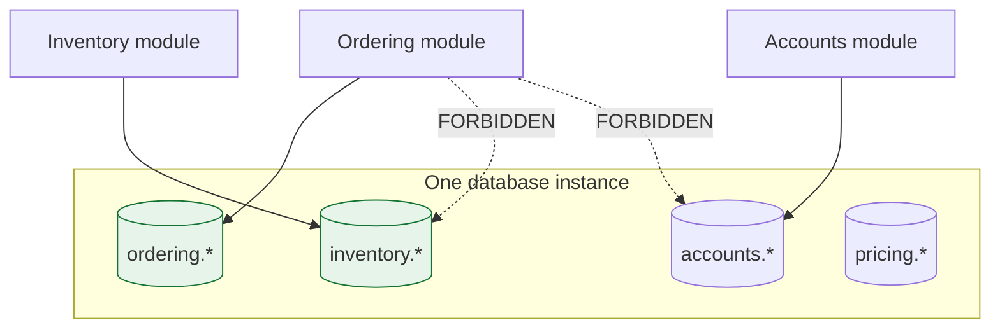

> One database, many private schemas. This is where the architecture is usually lost — not by
> a decision, but by a join written on a Friday afternoon.

| | |
|---|---|
| **Module** | [07 — The modular monolith](/modules/modular-monolith/README) |
| **Prerequisites** | [07-02 Module boundaries](/modules/modular-monolith/02-module-boundaries-and-enforcement), [07-03 In-process communication](/modules/modular-monolith/03-in-process-communication-between-modules) |
| **Also known as** | schema per module, logical data separation, data ownership |
| **Category** | Structure |

---

## 1. The problem

ShopFlow's modules are cleanly separated in code. The architecture tests pass. Then:

```sql
SELECT o.*, c.email, c.tier, s.qty_on_hand
FROM ordering.orders o
JOIN accounts.customers c ON c.id = o.customer_id
JOIN inventory.stock s ON s.sku = o.sku
```

One query, three modules' tables. It is fast, correct, and took four minutes to write. It also:

- Couples Ordering to the *physical schema* of two other modules — not their APIs, their column
  names.
- Bypasses Inventory's invariants entirely; the reservation logic might as well not exist.
- Means Accounts cannot rename a column without breaking a query in a module they do not own
  and cannot find.
- Makes extracting *any* of the three impossible without first finding every such query.

The code boundaries are enforced. The data boundary was never enforced at all, and the database
does not care about your architecture tests.

## 2. In plain language

Flatmates sharing a kitchen with separate cupboards.

The agreement is clear: your cupboard, my cupboard. It works — until someone is out of sugar
and takes some from yours, because it is *right there* and asking would take longer. Nothing
bad happens. So it happens again, and then the arrangement is fiction: nobody can reorganise
their own cupboard without breaking someone else's habits, and moving out means discovering
that half your things are in other people's shelves.

**The lock is not about trust.** It is about making "just take it" require a decision rather
than a reach. And critically: the flatmates can still share — they ask, or they leave things on
the shared counter deliberately. What changes is that sharing becomes visible.

**Where the analogy breaks down:** a cupboard lock is obvious. A database grants a query
silently, and the violation is discovered years later when someone tries to move out.

## 3. How it works

### One database, N schemas

The modular monolith keeps **one physical database** — that is where the transactional
simplicity comes from — with **one schema (or table prefix) per module**, and permissions that
enforce it.



Rules:

1. **A module reads and writes only its own schema.**
2. **No foreign keys across schemas.** A cross-schema FK is a hard coupling the database will
   enforce against you at exactly the wrong moment.
3. **Cross-module data is obtained via APIs or events** ([07-03](/modules/modular-monolith/03-in-process-communication-between-modules)),
   never by querying.
4. **Migrations are per module**, owned by that module, in that module's directory.

### Enforcement

Code-level architecture tests cannot see SQL strings. You need database-level enforcement:

| Level | Mechanism |
|---|---|
| Database grants | One DB user per module; `GRANT` only on its own schema. **The strongest option** |
| Connection per module | Each module gets a connection configured with its own credentials |
| Static analysis | Parse SQL literals and migration files; assert table prefixes |
| Migration ownership | Each module's migrations live in its directory; CI checks no module migrates another's tables |

Database grants are the equivalent of level 5 enforcement from
[07-02](/modules/modular-monolith/02-module-boundaries-and-enforcement): the violation does not fail a test, it
fails at runtime with a permission error, in development, immediately.

### The transaction question — the real advantage, and the real trap

This is what the modular monolith buys you and what most easily destroys it.

**The advantage:** because it is one database, a business operation spanning two modules can be
one ACID transaction. No [saga](/modules/data-and-consistency/02-saga), no
[outbox](/modules/data-and-consistency/03-transactional-outbox), no compensation, no
eventual consistency. That is an enormous saving and it is legitimate to use it.

**The trap:** every multi-module transaction is a future extraction cost. When Inventory becomes
a service, that transaction becomes a distributed one — which means it becomes a saga, which
means the operation must be redesigned.

So the rule is not "never" — it is **deliberate and recorded**:

| Situation | Approach |
|---|---|
| Within one module | Transaction freely. This is just an aggregate boundary ([06-02](/modules/domain-driven-design/02-entities-value-objects-and-aggregates)) |
| Across modules, invariant must be immediate | One transaction — and **record it as an extraction cost** |
| Across modules, eventual is acceptable | Separate transactions + after-commit event ([07-03](/modules/modular-monolith/03-in-process-communication-between-modules)) |
| Across modules, must not be lost | Separate transactions + persisted job in the *same* transaction |

Keeping an explicit list of the multi-module transactions is the single most useful artefact
for the day you decide to extract. Without it, extraction begins with an archaeology project.

### Reporting and cross-module queries

The legitimate need behind the §1 query. Three answers, none of which is a join:

1. **API composition** — ask each module, join in memory. Fine at low volume.
2. **A read model** ([04-06](/modules/data-and-consistency/06-cqrs)) — a reporting schema
   populated by events, owned by a reporting module. It may denormalise across contexts freely,
   because it owns its own tables.
3. **A dedicated analytics store** — replicate to a warehouse. The correct answer for real
   reporting.

**"Reporting needs a join" is the most common justification for breaking the boundary, and a
read model answers it completely.**

## 4. Pseudo-code

**Before — shared schema, shared everything.**

```
module Ordering:
  fn order_summary(id) -> Summary:
    return db.query("""
      SELECT o.*, c.email, c.tier, s.qty_on_hand
      FROM orders o
      JOIN customers c ON c.id = o.customer_id      # TRAP: Accounts' table
      JOIN stock s ON s.sku = o.sku                 # TRAP: Inventory's table
    """, id)
# Fast, correct, and it has just made three modules inseparable.
```

**The pattern — private schemas, enforced by the database.**

```
# ── Provisioning: one user per module, grants only on its own schema. ──
#   CREATE SCHEMA ordering;  CREATE USER ordering_svc;
#   GRANT USAGE, CREATE ON SCHEMA ordering TO ordering_svc;
#   GRANT SELECT, INSERT, UPDATE, DELETE ON ALL TABLES IN SCHEMA ordering TO ordering_svc;
#   REVOKE ALL ON SCHEMA inventory FROM ordering_svc;      ← the important line
#   REVOKE ALL ON SCHEMA accounts  FROM ordering_svc;
#
# A developer who writes the §1 query now gets a permission error on their laptop,
# on the day they write it, instead of a production coupling discovered in 2027.

module Ordering:
  uses db: Store<Any, Any> with credentials("ordering_svc")   # scoped connection
  # Every table reference below is ordering.*, or it fails.

  internal record OrderTable:                 # ordering.orders
    id, customer_id, total_minor, currency, lifecycle, version
    # customer_id is a plain column. NOT a foreign key to accounts.customers —
    # a cross-schema FK would couple the two modules' deployment and migration
    # order permanently.

  internal record CustomerTierProjection:     # ordering.customer_tiers
    customer_id, tier, updated_at
    # OUR copy of the two Accounts fields we actually need (07-03). Three
    # columns, not forty. Maintained by events, owned by us.
```

**The transaction decision, made explicitly.**

```
module Ordering:

  # ── Case 1: within one module. Transact freely. ──
  fn cancel_order(id: OrderId) -> Result<Unit, OrderError>:
    atomically:                                # ordering.* only
      order = orders.get(id)?
      orders.save(order.cancel()?)
    return Ok(unit)

  # ── Case 2: across modules, invariant must be immediate. ──
  fn place_order(cmd) -> Result<OrderView, OrderError>:
    # Deliberate, audited exception: the composition root supplies one shared database
    # transaction through a checkout role that alone may write both schemas. Ordinary
    # module credentials remain schema-scoped; module APIs receive the shared unit of work.
    with checkout_transaction as tx:
      # EXTRACTION COST — RECORDED. Spans ordering.* and inventory.*.
      # Justification: we must not accept an order we cannot fulfil, and the
      # business will not accept a window where both might be true.
      # If Inventory is extracted, this becomes a saga (04-02) with a
      # reservation + confirm protocol. Estimated: 3 days. See EXTRACTION-COSTS.md
      reservation = inventory.reserve(tx, cmd.order_id, cmd.lines)?
      order = Order.create(cmd)?
      orders.save(tx, order)
      events.publish_after_commit(tx, OrderPlaced(order.id, ...))
    return Ok(to_view(order))

  # ── Case 3: across modules, eventual is fine. Do NOT share a transaction. ──
  fn place_order_v2(cmd) -> Result<OrderView, OrderError>:
    atomically:
      order = Order.create(cmd)?
      orders.save(order)                       # ordering.* only
      events.publish_after_commit(OrderPlaced(...))
    return Ok(to_view(order))
    # Loyalty, Notification and Search each commit their own transaction in
    # their own schema when they handle the event. Extraction here is free.
```

**Cross-module reporting, without a join.**

```
# The §1 query, answered properly: a reporting module that owns its own schema
# and populates it from events. It may denormalise as much as it likes.

module Reporting:
  uses db: Store<Any, Any> with credentials("reporting_svc")   # reporting.* only

  internal record OrderReportRow:              # reporting.order_report
    order_id, customer_email, customer_tier, total_minor,
    line_count, placed_at, stock_at_order_time

  internal policy BuildRowWhenOrderPlaced:
    on Ordering.OrderPlaced(e):
      rows.insert(OrderReportRow(
        order_id: e.order_id, total_minor: e.total.amount,
        line_count: e.lines.size, placed_at: e.at, ...))

  internal policy EnrichWhenCustomerChanged:
    on Accounts.CustomerTierChanged(e):
      rows.update_where(customer_id: e.customer_id, set: {customer_tier: e.new_tier})

  fn order_report(filter) -> List<OrderReportRow>:
    # One table, in our schema, shaped for this report. No joins across modules,
    # no coupling, and it survives any module being extracted.
    return db.query("SELECT * FROM reporting.order_report WHERE ...", filter)
```

**Migrations, owned per module.**

```
# ordering/migrations/
#   V001__create_orders.sql            -- CREATE TABLE ordering.orders (...)
#   V002__add_currency.sql
# inventory/migrations/
#   V001__create_stock.sql             -- CREATE TABLE inventory.stock (...)
#
# CI rule: a module's migrations may only reference its own schema.
architecture_test "migrations touch only the owning module's schema":
  for m in all_modules():
    for mig in m.migrations():
      assert mig.referenced_schemas() == {m.schema}

# WHY per-module migrations: on extraction, the schema and its history move as a
# unit. One shared migrations/ directory means untangling which change belonged
# to whom, in order, from a single linear history.
```

## 5. Knobs and variants

| Knob | Guidance | Failure if wrong |
|---|---|---|
| Physical databases | One | Multiple loses the local transaction, which is the whole point |
| Logical separation | Schema per module | Table prefixes work; schemas are clearer |
| Enforcement | DB grants, one user per module | Convention alone is §1 |
| Cross-schema FKs | Forbidden | Couples migration order and deployment permanently |
| Multi-module transactions | Allowed, recorded, justified | Unrecorded ones make extraction archaeology |
| Cross-module reads | API, event or read model | A join ends the architecture |
| Migrations | Per module, own schema only | A shared history cannot be split |
| Connection pools | Per module ([10-03](/modules/performance-and-concurrency/03-resource-pooling)) | One pool means one module can starve the rest |

## 6. Challenges and failure modes

- **The convenient join.** The way this architecture dies. Nobody decides to abandon the
  boundary; someone writes one query. Only database grants reliably prevent it.
- **Unrecorded multi-module transactions.** Individually reasonable, collectively an extraction
  blocker nobody can enumerate. Keep the list.
- **Cross-schema foreign keys.** They feel like good hygiene. They mean the two modules must be
  migrated together, deployed together, and can never be separated without dropping constraints
  in production.
- **The shared "lookup" table.** Countries, currencies, tax classes. Genuinely shared reference
  data — but as soon as one module writes to it, it is that module's, and everyone else needs a
  read model or an API.
- **Reporting pressure.** "Just one join for the finance report." It is never one, and it is
  never removed.
- **Connection pool contention.** All modules sharing one pool means a slow reporting query
  starves checkout ([10-03](/modules/performance-and-concurrency/03-resource-pooling)).
  Separate pools with separate credentials solve both problems at once.
- **Transaction scope creep.** A transaction opened at the top of a request and left open
  across every module call is one giant multi-module transaction that nobody wrote down.
- **ORM lazy loading across schemas.** An ORM configured with all entities can silently join
  across modules. Configure per-module persistence units, or the ORM will undo the boundary.
- **Distributed monolith by database.** Extracting services that still share a database is
  strictly worse than the modular monolith — network cost, no ownership benefit
  ([08-03](/modules/microservice-architecture/03-database-per-service)).

## 7. Alternatives

- **One shared schema, code boundaries only.** Simpler, and the data boundary erodes first —
  which is the boundary that matters for extraction.
- **A database per module, from the start.** Strongest separation, and it forfeits local
  transactions, which is most of why you chose a monolith. Occasionally right when one module
  genuinely needs a different storage technology.
- **Separate schemas without grants.** Better documentation, no enforcement. Better than
  nothing; not sufficient.
- **CQRS throughout** ([04-06](/modules/data-and-consistency/06-cqrs)). Every cross-module
  read via a projection, no exceptions. Clean, consistent, and more machinery than most
  monoliths need.
- **Views as the module API.** Each module exposes read-only views; others query those. A
  pragmatic middle ground, and it still couples consumers to a database-shaped contract.

## 8. Trade-offs

| Advantage | Disadvantage |
|---|---|
| Local ACID transactions where genuinely needed | Every multi-module transaction is a future extraction cost |
| Data ownership is enforced by the database itself | Cross-module reads need APIs, events or projections |
| One database to operate, back up and restore | One database is a single failure domain for all modules |
| Migrations move with the module on extraction | Per-module migration discipline is extra process |
| Reporting via read models survives any future split | Read models are duplication, and must be maintained |

## 9. Complexity introduced

- **Operational.** Per-module database users and grants; per-module migration pipelines;
  per-module connection pools. All modest, all one-off.
- **Cognitive.** Engineers must obtain foreign data through an API or projection rather than a
  join — which feels absurd when the table is visibly right there, and is the entire point.
- **Failure surface.** Projection drift; a module unable to start because a grant is missing.
  Both are loud and immediate rather than silent.
- **Testing.** Tests must run with per-module credentials, or they will pass on queries that
  fail in production. This is easy to get wrong and worth an explicit check.

## 10. Related concepts

- **Builds on:** [07-02 Module boundaries](/modules/modular-monolith/02-module-boundaries-and-enforcement), [07-03 In-process communication](/modules/modular-monolith/03-in-process-communication-between-modules)
- **Composes with:** [06-02 Aggregates](/modules/domain-driven-design/02-entities-value-objects-and-aggregates), [04-06 CQRS](/modules/data-and-consistency/06-cqrs), [10-03 Resource pooling](/modules/performance-and-concurrency/03-resource-pooling)
- **Conflicts with / tension:** reporting convenience, and normalisation instincts
- **Contrast with:** [08-03 Database per service](/modules/microservice-architecture/03-database-per-service) — the same ownership rule, enforced by separate databases instead of grants. Read that lesson to see what you are deferring
- **Leads to:** [07-05 Extracting a module into a service](/modules/modular-monolith/05-extracting-a-module-into-a-service)

## 11. Exercises

1. **Trace it.** A developer writes the §1 query. Walk through what happens under each
   enforcement level in §3. At which level do they find out, and what do they do next?
2. **Extend it.** Finance needs a monthly report joining orders, customers, payments and
   shipments. Design it without a cross-module join. What does it cost to build, and what does
   it cost to keep correct?
3. **Break it.** ShopFlow has 14 multi-module transactions, none recorded. Estimate the work to
   extract Inventory. Now do the same assuming all 14 were documented with justifications. What
   is the difference actually made of?

## 12. References

- Kamil Grzybek, "Modular Monolith: Architectural Drivers" and the accompanying reference implementation — the most complete worked example available.
- Sam Newman, *Monolith to Microservices* (2019) — Ch. 4, splitting the database. Read it *before* you need it.
- Oliver Drotbohm, Spring Modulith — per-module persistence and test slicing.
- Martin Fowler, "IntegrationDatabase" vs "ApplicationDatabase".
- PostgreSQL documentation on schemas, roles and `GRANT` — the enforcement mechanism, in detail.

---

**Up:** [Module 07](/modules/modular-monolith/README) · **Previous:** [← 07-03](/modules/modular-monolith/03-in-process-communication-between-modules) · **Next:** [07-05 Extracting a module into a service →](/modules/modular-monolith/05-extracting-a-module-into-a-service)
