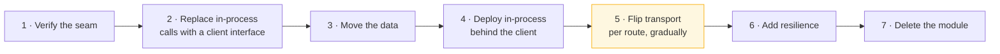

> The payoff. If the previous four lessons were followed, this is a week of mechanical work
> rather than a quarter of archaeology — and the option to *not* do it remains open.

| | |
|---|---|
| **Module** | [07 — The modular monolith](/modules/modular-monolith/README) |
| **Prerequisites** | [07-04 Data and transactions](/modules/modular-monolith/04-data-and-transactions-in-a-modular-monolith) |
| **Also known as** | service extraction, decomposition, the modulith exit |
| **Category** | Structure |

---

## 1. The problem

ShopFlow's catalogue module serves 12,000 requests per second. The rest of the system serves
600. To handle catalogue traffic they run 40 instances of the entire monolith — 40 copies of
ordering, payments, shipping and reporting, all idle, all consuming memory and database
connections.

**This is the first genuine appearance of the "independent scaling" force from
[07-01](/modules/modular-monolith/01-why-a-modular-monolith-first).** Not a preference, not a fashion — an
arithmetic fact with a monthly invoice attached.

The question is no longer *whether* to extract. It is whether the four preceding lessons were
followed well enough that extraction is a week, and what to do about the places where they were
not.

## 2. In plain language

Moving one department out of a shared office into its own building.

If the department already had its own room, its own filing cabinets, its own phone extension
and a written list of which other departments it deals with — the move is logistics. Pack the
cabinets, keep the phone number working, update the directory. A week.

If the department's desks were interleaved with three others, its files were in everyone's
cabinets, and half its work involved reaching across a shared bench — the move is a
reorganisation project. Months, and you will discover dependencies nobody knew about by
breaking them.

**The move is the same in both cases. The preparation was different, and the preparation
happened years earlier.**

**Where the analogy breaks down:** a department that moves out can still walk back for a
document. Once a module is behind a network, every one of those reaches becomes a call that can
time out, and there is no walking back.

## 3. How it works

### Is extraction warranted?

Re-apply the [07-01](/modules/modular-monolith/01-why-a-modular-monolith-first) test, and be strict. Then check
that this module is a *good candidate*:

| Good candidate | Poor candidate |
|---|---|
| Few dependencies on other modules | Depends on five modules |
| No multi-module transactions, or few and recorded | Central to many shared transactions |
| Clear, stable API | API changes weekly |
| A demonstrated force: scale, deployment, failure isolation | "It feels big" |
| Owned by one team | Shared ownership |
| Read-heavy or otherwise independently scalable | Tightly interleaved writes |

**ShopFlow's catalogue is close to ideal**: read-heavy, one dependency, no multi-module
transactions, a stable API. Ordering, which sits in the middle of everything, would be a poor
first choice — which is exactly why you extract the *edges* first.

### The preparation, which has already happened

If [07-02](/modules/modular-monolith/02-module-boundaries-and-enforcement) through
[07-04](/modules/modular-monolith/04-data-and-transactions-in-a-modular-monolith) were followed, you already have:

| Already done | Because of |
|---|---|
| A published API with DTOs, no domain types | [07-02](/modules/modular-monolith/02-module-boundaries-and-enforcement) |
| No inbound references to internals | [07-02](/modules/modular-monolith/02-module-boundaries-and-enforcement) |
| A private schema with its own migrations | [07-04](/modules/modular-monolith/04-data-and-transactions-in-a-modular-monolith) |
| Events already published and consumed | [07-03](/modules/modular-monolith/03-in-process-communication-between-modules) |
| A recorded list of multi-module transactions | [07-04](/modules/modular-monolith/04-data-and-transactions-in-a-modular-monolith) |

What remains is transport, data movement and the resilience the network now demands.

### The sequence



Step 4 is the one people skip and should not: **deploy the client abstraction while the
implementation is still in-process.** Every call now goes through the interface that will later
be remote, and any hidden coupling surfaces before a network exists.

Step 5 uses the [strangler](/modules/microservice-architecture/05-strangler-fig) technique —
route a percentage of traffic to the remote implementation, compare, ramp. The extraction
becomes reversible by configuration until the very end.

### What the network adds

The costs from [07-01](/modules/modular-monolith/01-why-a-modular-monolith-first) arrive now, and they must be
budgeted as part of the extraction, not discovered afterwards:

| Now required | Lesson |
|---|---|
| Timeouts and deadlines | [02-01](/modules/resilience/01-timeouts-and-deadlines) |
| Retries and idempotency | [02-02](/modules/resilience/02-retries-backoff-and-jitter), [01-03](/modules/communication/03-delivery-guarantees-and-idempotency) |
| Circuit breaker and bulkhead | [02-03](/modules/resilience/03-circuit-breaker), [02-04](/modules/resilience/04-bulkhead) |
| Fallback for the now-fallible call | [02-07](/modules/resilience/07-fallback-and-graceful-degradation) |
| Outbox for events that used to be in-process | [04-03](/modules/data-and-consistency/03-transactional-outbox) |
| Saga for each multi-module transaction | [04-02](/modules/data-and-consistency/02-saga) |
| Distributed tracing | [11-01](/modules/operations-and-evolution/01-observability) |
| Versioned contract | [01-04](/modules/communication/04-serialization-and-schema-evolution) |

**Nine lessons of machinery, per extraction.** That list is the real price, and seeing it
written out is often what makes a team decide to extract one module rather than six.

## 4. Pseudo-code

**Step 1 — verify the seam is real.**

```
extraction_check "Catalogue":
  assert inbound_references_to("Catalogue.internal") == []        # 07-02
  assert schema_references("catalogue.*") == only_from("Catalogue")  # 07-04
  assert multi_module_transactions_involving("Catalogue") == []   # 07-04
  assert Catalogue.public_api().types().all(is_dto_or_interface)  # 07-02
  # If any fails, fix it BEFORE extracting. Fixing it in-process is a refactor;
  # fixing it across a network is a redesign.
```

**Step 2–4 — the client interface, implemented in-process first.**

```
# The interface both implementations satisfy. This is the module's existing
# public API (07-02) — which is why this step is nearly free.
interface CatalogApi:
  fn get_product(sku: String) -> Result<ProductView, CatalogError>
  fn get_products(skus: List<String>) -> Result<List<ProductView>, CatalogError>

# Implementation A: the module, still in-process. Deploy THIS first.
internal service LocalCatalogApi implements CatalogApi:
  uses catalogue: Catalogue.ProductService
  fn get_product(sku) -> Result<ProductView, CatalogError>:
    return catalogue.find(SKU.parse(sku)?)

# Implementation B: the remote service. Not switched on yet.
internal service RemoteCatalogApi implements CatalogApi:
  uses client: Client<CatalogService>
    with timeout(200ms),                                          # 02-01
         retry(max: 2, backoff: exponential(base: 20ms, jitter: full)),  # 02-02
         circuit_breaker(threshold: 5, cooldown: 30s),            # 02-03
         bulkhead(size: 50)                                       # 02-04
  uses cache: Cache<String, ProductView>

  fn get_product(sku) -> Result<ProductView, CatalogError>:
    match await client.get_product(sku) timeout 200ms:
      case Ok(p):
        cache.put(sku, p, ttl: 5m + jitter(30s))
        return Ok(p)
      case Err(_):
        # A call that could not fail now can. Decide what happens (02-07).
        if stale = cache.get_stale(sku): return Ok(stale)
        return Err(CatalogUnavailable)

# Consumers depend on the interface only. They never change again.
module Ordering:
  uses catalog: CatalogApi           # Local today, Remote tomorrow, no diff here
```

**Step 3 — moving the data.**

```
# The schema already exists separately (07-04), so this is a copy, not a split.

# Phase 1 — replicate. New service reads its own copy; monolith still authoritative.
service CatalogDataMigration:
  every 1m:
    for change in monolith_db.cdc("catalogue.*", since: checkpoint):
      catalog_db.upsert(change)                    # 04-03 CDC, used for migration

# Phase 2 — dual write, monolith still authoritative.
# Phase 3 — flip authority: the service writes; the monolith syncs FROM it.
# Phase 4 — stop syncing; drop catalogue.* from the monolith database.
#
# TRAP: skipping phase 3 and staying on dual-write "temporarily". Teams stay
# there for years, paying for two datastores and a sync, with two sources of
# truth and no reconciliation. Phase 3→4 must be scheduled work with an owner
# (08-05 §6).
```

**Step 5 — flip transport gradually.**

```
service CatalogApiRouter implements CatalogApi:
  uses local: LocalCatalogApi
  uses remote: RemoteCatalogApi
  uses flags: FlagClient                                          # 11-03

  fn get_product(sku) -> Result<ProductView, CatalogError>:
    pct = flags.value("catalog.remote_percentage", default: 0)

    if flags.enabled("catalog.compare"):
      # Comparison running (08-05): remote answers are graded, local answers
      # are returned. Any behavioural difference surfaces before any user sees it.
      local_r = local.get_product(sku)
      spawn compare(sku, local_r, remote.get_product(sku))
      return local_r

    # Sticky by SKU so a product does not flip between sources mid-session.
    if hash(sku) mod 100 < pct: return remote.get_product(sku)
    return local.get_product(sku)

# Ramp: 0 → compare for a week → 1% → 10% → 50% → 100%. Rollback at any point
# is a flag change (11-03), not a deploy.
```

**Handling a recorded multi-module transaction.**

```
# From the EXTRACTION-COSTS list in 07-04: place_order spans ordering.* and
# inventory.*. If Inventory is the module being extracted, that transaction must
# become a saga. This is the expensive item, and it was known in advance.

# Before — one local transaction.
fn place_order(cmd) -> Result<OrderView, OrderError>:
  atomically:
    reservation = inventory.reserve(cmd.order_id, cmd.lines)?
    orders.save(Order.create(cmd)?)

# After — reserve/confirm with expiry: a saga in all but name (04-02).
fn place_order(cmd) -> Result<OrderView, OrderError>:
  # Step 1: a compensatable reservation with a TTL, in the remote service.
  reservation = await inventory.reserve(cmd.order_id, cmd.lines,
                  ttl: 15m, idempotency_key: cmd.request_id)?      # 01-03
  try:
    atomically:                                    # ordering.* only now
      order = Order.create(cmd, reservation.id)?
      orders.save(order)
      outbox.append(OrderPlaced(order.id, ...))    # 04-03: in-process event
    return Ok(to_view(order))                      # became a durable one
  catch Error:
    spawn inventory.release(reservation.id)        # compensation
    raise
# WHY the TTL matters: if we crash between reserve and save, nobody releases the
# reservation. Expiry makes the failure self-healing without a coordinator.
```

**Step 7 — and the extraction record.**

```
# ── EXTRACTION RECORD: Catalogue → catalog-service, 2026-Q3 ──
# Trigger:    12,000 rps vs 600 rps elsewhere; 40 monolith instances for one module
# Duration:   9 days (est. 5)
# Went well:  API already existed (07-02); schema already private (07-04);
#             events already published (07-03); no multi-module transactions
# Cost:       +1 pipeline, +1 dashboard, +1 on-call runbook, +2ms p50 on
#             product reads, and the nine lessons of machinery in §3
# Surprise:   two reporting queries joined catalogue.* — they predated the grants
#             and had been added via a superuser connection. Cost 2 of the 9 days.
# Result:     6 monolith instances + 12 catalog instances. Infra cost -45%.
#
# NOT extracted, and why:
#   Ordering  — central to 3 recorded multi-module transactions. No forcing need.
#   Pricing   — changes weekly with Ordering. Extracting would create a release
#               train between two teams, which is the coupling we are avoiding.
```

## 5. Knobs and variants

| Knob | Guidance | Failure if wrong |
|---|---|---|
| Which module first | An edge module with few dependencies | A central module first turns extraction into a rewrite |
| How many | One at a time, with a demonstrated force each | Extracting everything is the §1 problem of [07-01](/modules/modular-monolith/01-why-a-modular-monolith-first) |
| Client interface first | Always, deployed in-process | Skipping it hides coupling until the network exists |
| Transport flip | Gradual, flag-controlled, sticky | Big-bang cutover has no safe rollback |
| Comparison running | For all read paths, before cutover | Behavioural differences found in production instead |
| Data migration | Replicate → dual-write → flip → stop | Staying on dual-write becomes permanent |
| Multi-module transactions | Convert to reserve/confirm with expiry | A saga without expiry needs a coordinator to recover |
| Rollback | A flag, until the data authority flips | After the data flip, rollback is a data migration |

## 6. Challenges and failure modes

- **Hidden coupling found late.** A reporting query, an admin script, a cron job that predates
  the grants. Step 1 is what finds these — and it is the step under time pressure.
- **The reverse-direction dependency.** Everyone checks what the extracted module depends on;
  fewer check what depends on *it* in ways the API does not capture — shared caches, shared
  config, ordering assumptions.
- **Extracting the wrong module.** The one that "feels big" is usually the one in the middle,
  with the most dependencies, and it is the worst first choice.
- **Stopping halfway.** Dual-write becomes permanent; two sources of truth; nobody owns
  reconciliation. Schedule the final phase as work with an owner.
- **Forgetting the resilience budget.** The extraction ships, and the nine lessons of machinery
  in §3 are "a follow-up ticket". The first dependency slowdown then takes down checkout.
- **Latency regression.** An in-process call at 0.001ms becomes 2ms. Fine once; not fine in a
  loop. Look for N+1 patterns that were free in-process
  ([01-01](/modules/communication/01-synchronous-request-response)).
- **Shared library extracted alongside.** The new service and the monolith both depend on a
  common domain library, so they must be released together — the deployment coupling you
  extracted to escape ([08-01](/modules/microservice-architecture/01-decomposition-and-bounded-contexts)).
- **Extraction as a programme.** "We are extracting all modules this year" converts a
  responsive technique into the microservices-first mistake with extra steps.
- **No decision to stop.** The correct end state for most systems is a monolith plus two or
  three extracted services — not zero modules remaining.

## 7. Alternatives

- **Don't extract. Scale the monolith.** 40 instances of a monolith is often cheaper than one
  extraction plus its permanent operational cost. Compute both before deciding.
- **Extract only the read path.** A read replica plus a thin read-only service handles the
  catalogue case with none of the write-path complexity.
- **Vertical scaling / caching.** [Caching](/modules/scalability/03-caching) at 95% hit rate
  removes the load that motivated the extraction entirely. **Try this first** — it is a week and
  it is reversible.
- **Split the deployment, not the code.** Deploy the same artefact with different configuration
  — one fleet serving catalogue routes, one serving checkout. Independent *scaling* with no
  code change at all. Underused, and frequently sufficient.
- **Merge back.** If an extraction did not deliver, reversing it is legitimate and increasingly
  well documented.

## 8. Trade-offs

| Advantage | Disadvantage |
|---|---|
| The hot component scales on its own | Nine lessons of machinery, permanently |
| Deployment becomes independent for that module | A network in the call path, with all of [Module 00](/modules/foundations/README) |
| Its failures no longer share a process with checkout | Multi-module transactions become sagas |
| Infrastructure cost can drop substantially | +1 pipeline, dashboard, runbook and on-call rotation |
| The remaining monolith gets simpler | Latency increases on every extracted call |

## 9. Complexity introduced

- **Operational.** One more deployable and everything that entails, forever. Plus a migration
  period during which both paths must be monitored.
- **Cognitive.** The system is now heterogeneous: some calls are in-process, some are remote,
  and engineers must know which.
- **Failure surface.** Everything from [Module 02](/modules/resilience/README) that did not
  apply yesterday applies today.
- **Testing.** Contract tests between monolith and service; the extracted module's tests must
  now run against a real transport at least once.

## 10. Related concepts

- **Builds on:** [07-02](/modules/modular-monolith/02-module-boundaries-and-enforcement), [07-03](/modules/modular-monolith/03-in-process-communication-between-modules), [07-04](/modules/modular-monolith/04-data-and-transactions-in-a-modular-monolith)
- **Composes with:** [08-05 Strangler fig](/modules/microservice-architecture/05-strangler-fig) (the routing and comparison technique), [11-03 Feature flags](/modules/operations-and-evolution/03-configuration-and-feature-flags), [04-02 Saga](/modules/data-and-consistency/02-saga)
- **Conflicts with / tension:** the whole of [Module 07](/modules/modular-monolith/README) — this lesson is the deliberate exit from it
- **Contrast with:** [08-01 Decomposition](/modules/microservice-architecture/01-decomposition-and-bounded-contexts) — splitting a system with no prepared seams. This lesson is that one, made cheap by preparation
- **Leads to:** [Module 08 — Microservice architecture](/modules/microservice-architecture/README)

## 11. Exercises

1. **Trace it.** Run the step-1 extraction check against Ordering instead of Catalogue. Which
   assertions fail, and what would each cost to fix before extraction?
2. **Extend it.** Write the full plan for extracting Inventory, including the conversion of the
   recorded `place_order` transaction into a saga. How many days, and which of the nine lessons
   in §3 do you need?
3. **Break it.** The team extracts Catalogue but skips step 4 (deploying the client interface
   in-process first). Describe a coupling that would have surfaced in step 4 and instead
   surfaces during the traffic ramp — and what it costs at that point.

## 12. References

- Sam Newman, *Monolith to Microservices* (2019) — the definitive treatment; Ch. 3 on splitting the monolith and Ch. 4 on the database.
- Martin Fowler, "StranglerFigApplication" and "BranchByAbstraction".
- Shopify Engineering, "Deconstructing the Monolith" — componentisation with deliberate restraint about extraction.
- Amazon Prime Video Tech Blog (2023) — a well-documented case of consolidating distributed components back into one.
- Kamil Grzybek, "Modular Monolith: Domain-Centric Design" — the extraction-readiness argument.
- Michael Feathers, *Working Effectively with Legacy Code* — seams, which is what all of Module 07 has been building.

---

**Up:** [Module 07](/modules/modular-monolith/README) · **Previous:** [← 07-04](/modules/modular-monolith/04-data-and-transactions-in-a-modular-monolith) · **Next:** [Module 08 — Microservice architecture →](/modules/microservice-architecture/README)
