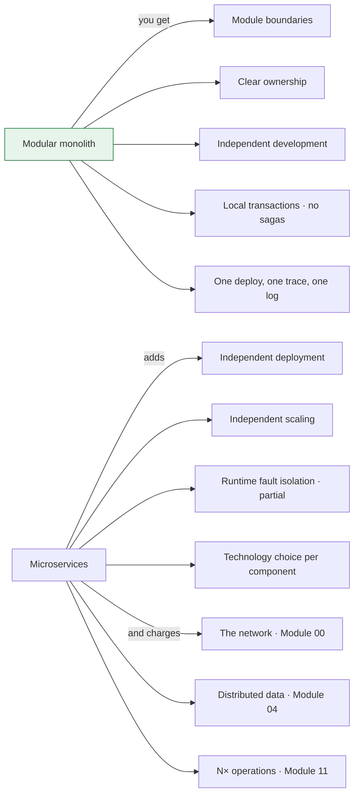

> One deployable, many modules, real boundaries. It gets you most of what microservices
> promise, at a fraction of the cost, and it keeps the option of splitting later open — which
> is the option most teams give away for free.

This module is written to stand alone. If you have arrived for the modular monolith and
nothing else, you can read it in isolation; it links outward to what each decision costs
later, but it does not require the earlier modules.

## What you will be able to do

- Argue the case for a modular monolith with numbers rather than taste.
- Draw module boundaries that the compiler enforces, not the wiki.
- Let modules talk without letting them entangle.
- Keep data private inside one database, and know exactly which shortcut forecloses a future split.
- Extract a module into a service in days rather than quarters — or decide not to, deliberately.

## Lessons

| # | Lesson | The question it answers |
|---|---|---|
| 07-01 | [Why a modular monolith first](/modules/modular-monolith/01-why-a-modular-monolith-first) | What does distribution actually buy, and when? |
| 07-02 | [Module boundaries and enforcement](/modules/modular-monolith/02-module-boundaries-and-enforcement) | How do I stop the boundary eroding? |
| 07-03 | [In-process communication between modules](/modules/modular-monolith/03-in-process-communication-between-modules) | How do modules talk without coupling? |
| 07-04 | [Data and transactions in a modular monolith](/modules/modular-monolith/04-data-and-transactions-in-a-modular-monolith) | Who owns which tables, and when may I join? |
| 07-05 | [Extracting a module into a service](/modules/modular-monolith/05-extracting-a-module-into-a-service) | How do I split one out when the time comes? |

## The one idea

**The two benefits people actually buy microservices for — independent deployment and
independent scaling — are the two that module boundaries cannot provide. Most of the rest is a
property of good boundaries, which you can have without a network.**

Read that in the negative. Clear ownership, small comprehensible codebases, enforced
separation of concerns, teams that don't block each other on *code* — none of those requires
distribution. Two things genuinely do, beyond deployment and scaling: **runtime fault
isolation** (only partially — a shared database or a saturated downstream is still shared) and
**per-component technology choice** (real, and rarely worth its price). Needing any of the four
is a specific condition you can test for rather than assume.

The modular monolith is the architecture that takes the left column and declines the right one
**until the right one is demonstrably needed** — and it is designed so that saying yes later is
a week of work rather than a rewrite.

## The relationship to the other modules

| Module | Relationship |
|---|---|
| [06 — DDD](/modules/domain-driven-design/README) | Supplies the boundaries. A module is a bounded context that has not been distributed |
| [08 — Microservices](/modules/microservice-architecture/README) | The next step, *if* you need it. Same boundaries, now with a network |
| [04 — Data and consistency](/modules/data-and-consistency/README) | Mostly unnecessary here. One database means local transactions, not sagas |
| [02 — Resilience](/modules/resilience/README) | Needed only at the real edges. In-process calls do not time out; the payment provider still does |

That last row is the honest summary of what you are buying: **the modular monolith lets you
skip Modules 02 and 04 almost entirely.** That is not a small saving. It is most of the
complexity in this course.

## ShopFlow at the end of this module

Still on the counterfactual path begun in [Module 06](/modules/domain-driven-design/README) —
the same business, modelled first and never distributed. See
[How ShopFlow evolves](/domain/RUNNING-EXAMPLE#how-shopflow-evolves) for how the two
paths relate, and [07-05](/modules/modular-monolith/05-extracting-a-module-into-a-service) for where they converge.

One deployable, one database, six modules aligned to the bounded contexts from
[Module 06](/modules/domain-driven-design/README). Each owns its schema; no module reads
another's tables; the build fails if anyone tries. Modules communicate through published
interfaces and in-process events. Placing an order is one local transaction with no saga, no
outbox and no eventual consistency.

And when checkout genuinely needs to scale separately from the catalogue, that module comes out
in about a week — because everything in this module was designed to make that day boring.

---

**Up:** [Curriculum](/CURRICULUM) · **Previous:** [← Module 06](/modules/domain-driven-design/README) · **Next:** [07-01 Why a modular monolith first →](/modules/modular-monolith/01-why-a-modular-monolith-first)
