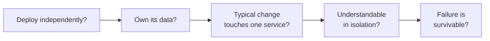

> The most consequential and least reversible decision in the course. Cut along how the
> business changes, not along the nouns in your database.

| | |
|---|---|
| **Module** | [08 — Microservice architecture](/modules/microservice-architecture/README) |
| **Prerequisites** | [00-01 Why distributed systems](/modules/foundations/01-why-distributed-systems), [04-02 Saga](/modules/data-and-consistency/02-saga) |
| **Also known as** | bounded context, service boundaries, domain-driven decomposition |
| **Category** | Structure |

---

## 1. The problem

ShopFlow is split into services named after its database tables: `CustomerService`,
`ProductService`, `OrderService`, `AddressService`, `PriceService`.

Six months later:

- Adding a "gift wrapping" option touches five services and needs three teams to agree a
  release date.
- `CustomerService` is called synchronously by everything and is down 0.1% of the time, which
  means the whole system is down 0.1% of the time.
- Nobody can define "product". Merchandising means SKU, description and images. Inventory means
  a physical unit in a bin. Pricing means a price list entry with tax rules. `ProductService`
  tries to be all three, so every change breaks one of them.
- A "simple" order query joins across four services.

The system has all the costs of distribution and none of the benefits. It has a name:
**the distributed monolith**.

## 2. In plain language

Imagine reorganising a company by *nouns*: a Department of Customers, a Department of Products,
a Department of Money. Every real task — launching a product, handling a complaint, running a
promotion — needs all three departments to coordinate. Nothing can be done by one department
alone.

Companies do not organise this way. They organise by *capability*: Sales, Fulfilment, Support,
Finance. Each can complete a whole meaningful job. They still talk to each other, but the
common tasks live inside one department.

And here is the part that maps directly onto software: **each department means something
slightly different by "customer".** Sales means a prospect with a pipeline stage. Support means
a person with a ticket history. Finance means a billing entity with a VAT number. Trying to
force one universal definition of "customer" onto all three produces a form with ninety fields,
two thirds of which are blank for any given department.

**Where the analogy breaks down:** departments share a building and can shout down the corridor.
Services get a network, with everything in
[Module 00](/modules/foundations/README) attached.

## 3. How it works

### Bounded contexts

A **bounded context** is a boundary within which a model has one consistent meaning. Outside it,
the same word means something else, and that is fine — expected, even.

ShopFlow's "product", honestly:

| Context | What "product" means | Attributes it cares about |
|---|---|---|
| **Catalogue** | Something a customer can browse | name, description, images, category |
| **Inventory** | A physical thing in a location | SKU, bin, quantity, reservation |
| **Pricing** | A price list entry | base price, VAT class, discounts |
| **Shipping** | A box with mass and dimensions | weight, dimensions, hazmat class |

**Four contexts, four models, one shared identifier.** The mistake is building one `Product`
with every attribute; the right answer is four models linked by SKU, each owned by one team.

### How to find the boundaries

In rough order of usefulness:

1. **Business capabilities.** What whole jobs does the business do? "Fulfil an order" is a
   capability. "Manage addresses" is not.
2. **Language.** Where the same word means different things, you have found a boundary. Where a
   term is used identically, you are probably inside one context.
3. **Change coupling.** Look at your commit history: which files change together? Things that
   change together belong together — this is the single most reliable empirical signal.
4. **Data ownership.** Who is authoritative for each piece of data? Exactly one context should
   be.
5. **Transaction boundaries.** Things that must change atomically should live together. If a
   split forces a [saga](/modules/data-and-consistency/02-saga) on your hottest path, the
   split is probably wrong.
6. **Team structure.** Conway's Law is not advice; it is a description. Boundaries that cut
   across teams will erode.

### The tests



If a boundary fails any of these, it is not a service boundary; it is a package boundary that
has been given a network.

### Sizing

"Micro" is a misleading prefix. The right size is **the smallest unit that can own a business
capability end to end**, which is usually much larger than teams expect. A service that cannot
answer a meaningful business question without calling three others is too small.

Useful heuristic: a service should be ownable by one team, and a team should own between one
and a handful of services. Not the reverse.

## 4. Pseudo-code

**Before — entity services, and what they force.**

```
service CustomerService:  uses customers: Store<CustomerId, Customer>
service ProductService:   uses products: Store<Sku, Product>       # all four meanings
service OrderService:     uses orders: Store<OrderId, Order>
service PriceService:     uses prices: Store<Sku, Price>

service OrderService:
  handler place_order(cmd) -> Result<Order, OrderError>:
    # TRAP: four synchronous calls to satisfy ONE business operation. Availability
    # is the product of five services; latency is their sum; and a change to the
    # order flow touches four teams.
    customer = await customers.get(cmd.customer_id)?
    products = await products.get_many(cmd.skus())?
    prices   = await prices.get_many(cmd.skus())?
    address  = await addresses.get(customer.default_address_id)?
    ...
```

**The pattern — contexts that own whole capabilities.**

```
# ---------- Context: Ordering. Owns the order lifecycle. ----------
service OrderService:
  uses orders: Store<OrderId, Order>

  # Data from other contexts is held LOCALLY, in the shape ordering needs.
  # Not a cache: a local model, owned by us, kept current by events.
  uses customer_snapshots: Store<CustomerId, OrderingCustomer>

  record OrderingCustomer:              # ordering's model of a customer.
    id: CustomerId                      # NOT the CRM's Customer. Four fields, not forty.
    tier: Tier
    credit_limit: Money
    blocked: Bool

  on event CustomerTierChanged(e): customer_snapshots.update(e.id, {tier: e.tier})
  on event CustomerBlocked(e):     customer_snapshots.update(e.id, {blocked: true})

  @timeout(2s)
  handler place_order(ctx, cmd: PlaceOrder) -> Result<Order, OrderError>:
    # Local read: no network, no availability coupling, no latency.
    c = customer_snapshots.get(cmd.customer_id) ?? OrderingCustomer.default()
    if c.blocked: return Err(CustomerBlocked)

    # The price is carried IN the command, captured when the basket was built.
    # WHY: the price the customer saw is the price they pay. Re-fetching it at
    # checkout is both a network call AND a business bug.
    order = Order(id: cmd.order_id, lines: cmd.lines, total: total_of(cmd.lines), ...)

    # Persist the order and the reservation request together. A remote reserve before this
    # transaction can leak stock if we crash or time out before the order is durable.
    atomically:
      orders.put(order.id, order with { status: PENDING_RESERVATION })
      outbox.append(ReserveInventory(order.id, order.lines, idempotency_key: order.id))
    return Ok(order)


# ---------- Context: Inventory. Owns physical stock. ----------
service InventoryService:
  uses stock: Store<Sku, StockLevel>
  record InventoryProduct:            # inventory's model. Three fields.
    sku: Sku
    bin_location: String
    unit_of_measure: String
  # Does NOT know about descriptions, images, prices or customers.


# ---------- Context: Catalogue. Owns what customers browse. ----------
service CatalogService:
  record CatalogProduct:              # catalogue's model. Same SKU, different shape.
    sku: Sku
    name: String
    description: String
    images: List<Url>
    category: CategoryId
```

**The diagnostic — a distributed monolith, in code.**

```
# Symptom 1: synchronous call chains for a single operation.
#   order → customer → address → geo → tax          (availability multiplies)
#
# Symptom 2: a shared database, or a shared library of domain types.
#   both services import `com.shopflow.domain.Order`   (deploy coupling)
#
# Symptom 3: features that always touch N services.
#   "add gift wrapping" → order, catalogue, pricing, shipping, notification
#
# Symptom 4: a service that cannot start without another being up.
#   OrderService.on_start: await customers.health()    (boot coupling)
#
# Symptom 5: shared release trains.
#   "we deploy on Thursdays, all together"             (the giveaway)
#
# Any two of these and you have paid for distribution and received a monolith.
```

**Splitting safely — extract behaviour before data.**

```
# Step 1: find the seam INSIDE the monolith. No network yet.
module Ordering:                     # a package boundary, enforced by the compiler
  fn place_order(cmd) -> Result<Order, OrderError>: ...

# Step 2: make all cross-module calls explicit and interface-based.
#         If this is painful, the boundary is wrong — and you have found that out
#         for the cost of a refactor rather than a distributed system.

# Step 3: split the data. This is the expensive, irreversible step.
#         Ordering stops joining to `customers`; it subscribes to events instead.

# Step 4: only now, deploy separately.
#
# Most failed decompositions do step 4 first, discover the boundary is wrong at
# step 3, and are then stuck with a network between two things that should be one.
```

## 5. Knobs and variants

| Knob | Guidance | Failure if wrong |
|---|---|---|
| Boundary basis | Business capability, not entity | Entity services force chatty cross-service flows |
| Granularity | Smallest unit owning a whole capability | Too small: chatty and coupled. Too large: back to the monolith |
| Shared data | Each context keeps its own model, fed by events | Shared models couple deployments permanently |
| Shared libraries | Only for technical concerns, never domain types | A shared domain library is a shared deployment |
| Split order | Behaviour first, data last | Splitting data first freezes a boundary you haven't validated |
| Team alignment | One team owns a context | Boundaries across teams erode within months |
| When to split | After the domain stabilises | Early splits freeze the wrong lines |

## 6. Challenges and failure modes

- **Entity services.** `CustomerService`, `ProductService`. The most common decomposition
  mistake, because table names are the easiest thing to see.
- **The distributed monolith.** Diagnosed above. Costly, common, and hard to reverse.
- **Boundaries frozen too early.** Extracting a service before the domain is understood turns a
  cheap refactor into a migration project.
- **The shared domain library.** Convenient, and it recreates deploy coupling completely.
  Technical libraries (logging, HTTP clients) are fine; `Order` is not.
- **Chatty boundaries.** If two services exchange ten messages per operation, they are one
  service that has been cut in half.
- **Everyone depends on one service.** A `CustomerService` called by all nine services is a
  single point of failure and a permanent bottleneck. Distribute the data, not the calls.
- **Sagas on the hot path.** If your most common operation needs a
  [saga](/modules/data-and-consistency/02-saga), the transaction boundary was cut in the
  wrong place.
- **Boundaries drawn by architects, not by teams.** Boundaries that do not match ownership are
  eroded by the people doing the work, every time.
- **Never revisiting.** Boundaries that were right in year one are wrong in year three. Merging
  two services is a legitimate, underused move.

## 7. Alternatives

- **Modular monolith.** Enforced boundaries at compile time, one deployable. All the design
  benefits, none of the distribution costs, and the boundary can be moved in an afternoon.
  **The correct starting point for almost every system.**
- **Extract only the hotspot.** One service for the one component with genuinely different
  scaling or availability needs. Everything else stays.
- **Self-contained systems.** Larger units, each with its own UI, logic and data — vertical
  slices rather than layers. Fewer, bigger services; much less inter-service chatter.
- **Merge back.** If two services always change together, joining them is a real improvement,
  not an admission of failure.

## 8. Trade-offs

| Advantage of good boundaries | Disadvantage |
|---|---|
| Most changes touch one service and one team | Getting them right requires domain understanding you may not have yet |
| Services are independently deployable and scalable | Cross-context operations need sagas and eventual consistency |
| Failure is contained to a capability | Data is duplicated across contexts and must be kept current |
| Teams work without cross-team coordination | Duplication feels wrong to engineers trained on normalisation |
| Each model stays small and coherent | "Which service owns this?" becomes a recurring question |

## 9. Complexity introduced

- **Operational.** More deployables, each with its own pipeline, dashboards and on-call.
- **Cognitive.** Multiple models for the same real-world concept, deliberately. This is the
  hardest idea in the lesson for most engineers to accept.
- **Failure surface.** Stale local snapshots, cross-context inconsistency, ownership disputes.
- **Testing.** Contract tests per boundary; end-to-end tests become expensive and slow, so most
  confidence must come from contracts.

## 10. Related concepts

- **Builds on:** [00-01 Why distributed systems](/modules/foundations/01-why-distributed-systems)
- **Composes with:** [08-03 Database per service](/modules/microservice-architecture/03-database-per-service), [08-06 Anti-corruption layer](/modules/microservice-architecture/06-anti-corruption-layer), [04-02 Saga](/modules/data-and-consistency/02-saga)
- **Conflicts with / tension:** data normalisation — good boundaries require duplication
- **Contrast with:** layered architecture, which splits by technical concern rather than by capability
- **Leads to:** [08-02 API gateway and BFF](/modules/microservice-architecture/02-api-gateway-and-backend-for-frontend)

## 11. Exercises

1. **Trace it.** Take the "Before" entity-service code. Compute its availability given five
   services at 99.9%, then its p99 latency given 40ms per call. Rewrite it using local snapshots
   and recompute both.
2. **Extend it.** Add "gift wrapping" (a per-item option affecting price, packaging and
   shipping weight) to the bounded-context version. Which contexts change, and which do not?
3. **Break it.** ShopFlow's `CustomerService` is called synchronously by all nine services.
   Propose a redesign that removes the coupling, and state exactly what consistency you gave up
   and where a user would notice.

## 12. References

- Eric Evans, *Domain-Driven Design* (2003) — bounded contexts, context maps, ubiquitous language.
- Vaughn Vernon, *Implementing Domain-Driven Design* — the practical follow-up.
- Sam Newman, *Building Microservices*, 2nd ed. — Ch. 2–3, and *Monolith to Microservices*.
- Chris Richardson, *Microservices Patterns* — Ch. 2, decomposition strategies.
- Alberto Brandolini, *EventStorming* — the most effective workshop technique for finding boundaries.
- Melvin Conway, "How Do Committees Invent?" (1968).

---

**Up:** [Module 08](/modules/microservice-architecture/README) · **Previous:** [← Module 07](/modules/modular-monolith/README) · **Next:** [08-02 API gateway and backend-for-frontend →](/modules/microservice-architecture/02-api-gateway-and-backend-for-frontend)
