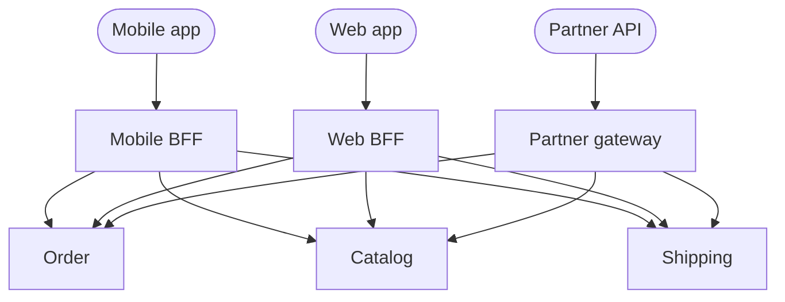

> One front door for many services. It removes the chatty client problem and creates a
> component every team must change and no team owns.

| | |
|---|---|
| **Module** | [08 — Microservice architecture](/modules/microservice-architecture/README) |
| **Prerequisites** | [08-01 Bounded contexts](/modules/microservice-architecture/01-decomposition-and-bounded-contexts), [01-01 Synchronous request/response](/modules/communication/01-synchronous-request-response) |
| **Also known as** | edge service, API façade, BFF, edge gateway |
| **Category** | Structure |

---

## 1. The problem

ShopFlow's mobile app renders an order screen. With nine services and no gateway, it must:

- Call Order, Catalog, Shipping, Account and Payment — five round trips, over mobile radio, at
  150ms each. 750ms before anything renders.
- Know all five hostnames, and be updated when any changes.
- Implement authentication five times.
- Download full responses and discard 80% of the fields, over a metered connection.
- Be redeployed — through an app store review — whenever a service is split.

Meanwhile every service independently implements auth, rate limiting, CORS, TLS termination
and request logging, slightly differently, with slightly different bugs.

## 2. In plain language

A hotel concierge. Instead of the guest phoning housekeeping, the restaurant, the spa and the
garage, they make one request. The concierge knows the extensions, speaks to each department,
and comes back with one answer.

Two things fall out. The guest is insulated from the hotel's internal reorganisations — when the
spa moves to a different building, only the concierge learns about it. And the concierge is the
natural place for things every request needs: checking you are a guest, noting your room number,
enforcing quiet hours.

And two costs. The concierge is a single point of failure — if they are unavailable, guests
cannot reach anything. And they slowly accumulate knowledge of every department's business, so
that changing anything requires talking to them first.

**Where the analogy breaks down:** one concierge can serve a family and a conference delegate
differently through judgement. Software needs a *separate* gateway per client type, which is
what a BFF is.

## 3. How it works

### What belongs in a gateway

| Belongs | Does not belong |
|---|---|
| TLS termination | Business rules |
| Authentication (verify the token) | Authorisation decisions about domain objects |
| Coarse rate limiting and quotas | Data transformation specific to one service |
| Routing and service discovery | Anything requiring domain knowledge |
| Request/response aggregation | Storage of domain state |
| Protocol translation (REST ↔ gRPC) | Orchestration of business processes |
| Caching of public responses | Long-running workflows |
| Request logging and trace initiation | |

**The line: the gateway may know about *transport and identity*. It must not know about
*domain rules*.** Every gateway drifts across that line, and preventing the drift is a
governance problem, not a technical one.

### API gateway vs BFF



A single gateway serving all clients accumulates conditionals: mobile wants fewer fields, web
wants more, partners want a stable versioned contract. **Backend-for-frontend** gives each
client type its own gateway, owned by the team that owns that client.

Rule of thumb: **one BFF per client type, owned by the client team, not by a platform team.**
The mobile team changing the mobile BFF should not require anyone's permission — that is the
entire point.

### Aggregation and its hazards

A gateway that calls five services inherits every fan-out problem:

- Latency is the *maximum* of the calls (if concurrent) or the *sum* (if not). Always concurrent.
- Availability is the *product*, unless partial responses are supported.
- One slow service delays the whole response — so per-call timeouts and
  [bulkheads](/modules/resilience/04-bulkhead) are mandatory.

**Partial responses are the single most valuable feature of an aggregating gateway.** Returning
the order without the tracking number is far better than returning nothing
([02-07](/modules/resilience/07-fallback-and-graceful-degradation)).

## 4. Pseudo-code

**Before — the chatty client.**

```
# Mobile app
order    = await http.get("https://orders.shopflow.com/v1/orders/" + id)
customer = await http.get("https://accounts.shopflow.com/v1/customers/" + order.customer_id)
products = await http.get("https://catalog.shopflow.com/v1/products?skus=" + skus)
shipment = await http.get("https://shipping.shopflow.com/v1/shipments?order=" + id)
payment  = await http.get("https://payments.shopflow.com/v1/payments?order=" + id)
# 5 sequential round trips × 150ms = 750ms, 5 auth implementations, ~340KB
# transferred to render a screen that displays about 2KB of information.
```

**The pattern — a BFF that aggregates, degrades and shapes.**

```
service MobileBFF:
  uses orders: Client<OrderService>     with timeout(300ms), bulkhead(size: 100)
  uses catalog: Client<CatalogService>  with timeout(200ms), bulkhead(size: 100)
  uses shipping: Client<ShippingService> with timeout(200ms), bulkhead(size: 50)
  uses payments: Client<PaymentService> with timeout(200ms), bulkhead(size: 50)

  # Shaped for ONE screen on ONE client. That is the point.
  record MobileOrderView:
    order_id: OrderId
    status_label: String            # already localised — the phone shouldn't decide
    total_formatted: String         # already formatted — no currency logic on device
    items: List<MobileItem>         # name + thumbnail URL only. No descriptions.
    tracking: Option<String>
    degraded: List<String>

  @timeout(800ms)
  @rate_limit(100/s per client)
  handler get_order(ctx: RequestContext, id: OrderId) -> Result<MobileOrderView, Error>:
    # Authorisation is checked HERE only for coarse identity. The order service
    # still checks that this customer owns this order — the gateway is not a
    # security boundary on its own (see §6).
    order = match await orders.get(ctx, id):
      case Ok(o): o
      case Err(NotFound): return Err(NotFound)
      case Err(e): return Err(Unavailable)      # tier 0: no order, no screen

    degraded = []

    # Everything else is concurrent and individually optional.
    with deadline(now() + 400ms):
      parallel:
        products_r = catalog.get_summaries(ctx, order.skus(),
                                           fields: [sku, name, thumb_url])
        shipment_r = shipping.for_order(ctx, id)
        payment_r  = payments.for_order(ctx, id)

    products = products_r.unwrap_or_else(() => { degraded.append("products"); [] })
    products_by_sku = products.index_by(p => p.sku)
    shipment = shipment_r.unwrap_or_else(() => { degraded.append("tracking"); None })
    payment  = payment_r.unwrap_or_else(() => { degraded.append("payment"); None })

    # Shaping happens here, once, on a server we can deploy hourly — instead of
    # in an app we can deploy fortnightly if the review goes well.
    return Ok(MobileOrderView(
      order_id: order.id,
      status_label: localise(order.status, ctx.locale),
      total_formatted: format_money(order.total, ctx.locale),
      items: order.lines.map(line => to_mobile_item(line, products_by_sku.get(line.sku))),
      tracking: shipment?.tracking_number,
      degraded: degraded))
    # One round trip, ~2KB, 400ms, and the screen renders even when three of the
    # four downstream services are unavailable.
```

**The shared edge — cross-cutting concerns, once.**

```
service ApiGateway:
  uses routes: Store<String, RouteConfig>
  state limiters: Map<ClientId, RateLimiter>

  handler handle(req: HttpRequest) -> HttpResponse:
    # 1. Route first: its configuration supplies the request budget.
    route = routes.get(req.path) ?? return 404

    # 2. Trace context starts here, and propagates to everything downstream.
    ctx = RequestContext(trace_id: req.header("traceparent") ?? uuid(),
                         correlation_id: uuid(),
                         deadline: now() + route.timeout)

    # 3. Authentication: verify the token. NOT authorisation of domain objects.
    claims = match verify_jwt(req.header("Authorization")):
      case Ok(c): c
      case Err(_): return 401

    # 4. Coarse rate limiting, at the cheapest possible point (02-05).
    if not limiters.get(claims.client_id).try_acquire():
      return 429 with {"Retry-After": limiters.get(claims.client_id).retry_after()}

    # 5. Forward, with identity attached. Downstream services must still authorise.
    return await forward(route.upstream, req,
                         headers: {"X-Trace-Id": ctx.trace_id,
                                   "X-Client-Id": claims.client_id,
                                   "X-Customer-Id": claims.sub,
                                   "X-Deadline": ctx.deadline})
      timeout remaining(ctx)

  # TRAP: the tempting next step is to add "just one" business rule here —
  # "GOLD customers skip the fraud check". Six months later the gateway contains
  # the pricing rules, and every team is blocked on the platform team's release.
  # The line is: transport and identity, never domain.
```

## 5. Knobs and variants

| Knob | Guidance | Failure if wrong |
|---|---|---|
| One gateway vs BFFs | BFF per client type, owned by client teams | A single gateway becomes a contested bottleneck |
| Ownership | Client team owns its BFF | Platform-owned BFFs queue every client change |
| Aggregation | Concurrent, with per-call timeouts | Sequential aggregation sums latency |
| Partial responses | Support them | Otherwise availability is the product of all upstreams |
| Auth | Verify at the edge, authorise in services | Edge-only authorisation is bypassed by any internal caller |
| Routing config | Data, not code | Code routing means a gateway deploy per new service |
| Caching | Public, non-personalised responses only | Caching personalised responses leaks data between users |
| Business logic | **None** | The gateway becomes a monolith everyone must change |

## 6. Challenges and failure modes

- **The gateway becomes a monolith.** Logic accumulates one reasonable exception at a time, and
  eventually every feature requires a gateway change. The most common long-term failure.
- **Single point of failure.** Everything flows through it. It needs redundancy, the whole of
  [Module 02](/modules/resilience/README), and its own scaling headroom.
- **Trusting the gateway as a security boundary.** If services assume "the gateway checked it",
  then anything that reaches a service directly — a misconfigured network policy, a compromised
  pod, an internal tool — bypasses all authorisation. **Services must authorise independently.**
  Defence in depth ([00-02, fallacy 4](/modules/foundations/02-fallacies-of-distributed-computing)).
- **Aggregation multiplying failure.** Five upstreams at 99.9% give 99.5% unless partial
  responses exist.
- **Deployment bottleneck.** One shared gateway with nine teams' changes queued behind one
  release process reintroduces exactly the coupling microservices removed.
- **BFF proliferation.** Six BFFs, each duplicating auth and error handling. Share libraries for
  the mechanics, not the shaping.
- **Caching personalised responses.** A cache key missing `customer_id` shows one customer's
  order to another. Rare, catastrophic, and always a key-design bug
  ([03-03](/modules/scalability/03-caching)).
- **Timeout stacking.** The gateway's timeout must exceed its upstreams' but fit the client's
  budget ([02-01](/modules/resilience/01-timeouts-and-deadlines)).

## 7. Alternatives

- **Direct client-to-service.** No gateway; clients call services. Fine for internal or
  low-client-count systems, and it exposes topology to clients.
- **GraphQL.** The client specifies the shape it wants in one request. Eliminates over-fetching
  and per-client BFFs, and brings query-cost control, caching complexity and a schema that
  becomes a shared dependency.
- **[Service mesh ingress](/modules/microservice-architecture/04-sidecar-and-service-mesh).** Routing, TLS, retries and rate
  limiting at the network layer without an application component. No aggregation or shaping.
- **CDN / edge functions.** Push aggregation and caching to the edge of the network. Excellent
  latency; limited compute and state.
- **[CQRS read models](/modules/data-and-consistency/06-cqrs).** Pre-join the data
  asynchronously so the gateway does a single read instead of five calls. Better latency and
  availability; costs eventual consistency.

## 8. Trade-offs

| Advantage | Disadvantage |
|---|---|
| One round trip instead of five, over the slowest network | A component every request depends on |
| Clients are insulated from internal topology | Clients gain a dependency on a team's release cadence |
| Cross-cutting concerns implemented once | Tempting place to put business logic, and it always drifts there |
| Response shaping keeps mobile payloads small | Another deployable, another scaling and on-call concern |
| A natural place for partial responses and degradation | Aggregation multiplies upstream failure unless handled |

## 9. Complexity introduced

- **Operational.** A highly available gateway tier; per-route latency and error dashboards;
  routing configuration management; capacity for the sum of all traffic.
- **Cognitive.** Requests now traverse an extra hop that must be understood when debugging, and
  the gateway's config is a second place where behaviour is defined.
- **Failure surface.** Gateway outage, aggregation timeouts, cache key mistakes, timeout
  stacking, routing misconfiguration.
- **Testing.** Needs tests for partial upstream failure, and contract tests between BFF and
  each upstream.

## 10. Related concepts

- **Builds on:** [08-01 Bounded contexts](/modules/microservice-architecture/01-decomposition-and-bounded-contexts), [01-01 Synchronous request/response](/modules/communication/01-synchronous-request-response)
- **Composes with:** [02-05 Rate limiting](/modules/resilience/05-rate-limiting-and-throttling), [02-07 Degradation](/modules/resilience/07-fallback-and-graceful-degradation), [05-05 Scatter-gather](/modules/messaging-and-eip/05-splitter-aggregator-and-scatter-gather)
- **Conflicts with / tension:** team autonomy, if one gateway is shared by many teams
- **Contrast with:** [08-04 Service mesh](/modules/microservice-architecture/04-sidecar-and-service-mesh) — the gateway handles north-south (client→system) traffic, the mesh handles east-west (service→service)
- **Leads to:** [08-03 Database per service](/modules/microservice-architecture/03-database-per-service)

## 11. Exercises

1. **Trace it.** The mobile BFF aggregates four upstreams, each 99.9% available. Compute the
   screen's availability with and without partial responses. Which upstream must be tier 0?
2. **Extend it.** Add a web BFF that needs full descriptions, reviews and recommendations on the
   same screen. What do the two BFFs share, and what must they not share?
3. **Break it.** The gateway caches `GET /orders/{id}` for 30 seconds with the URL as the key.
   Describe the incident. Then find a second, subtler bug in the same caching decision.

## 12. References

- Sam Newman, "Backends For Frontends" (2015) and *Building Microservices*, 2nd ed., Ch. 5.
- Chris Richardson, *Microservices Patterns* — Ch. 8, API gateway and API composition.
- Netflix Tech Blog, "Embracing the Differences: Inside the Netflix API Redesign" — the original BFF motivation.
- Phil Calçado, "The Back-end for Front-end Pattern (BFF)".
- Kong / Envoy / AWS API Gateway documentation — for what production gateways actually do.

---

**Up:** [Module 08](/modules/microservice-architecture/README) · **Previous:** [← 08-01](/modules/microservice-architecture/01-decomposition-and-bounded-contexts) · **Next:** [08-03 Database per service →](/modules/microservice-architecture/03-database-per-service)
