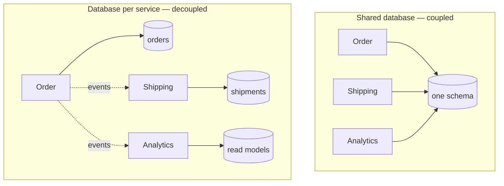

> The boundary that actually matters. Without it, services share a schema, share a release
> cadence, and are a monolith with extra network hops.

| | |
|---|---|
| **Module** | [08 — Microservice architecture](/modules/microservice-architecture/README) |
| **Prerequisites** | [08-01 Bounded contexts](/modules/microservice-architecture/01-decomposition-and-bounded-contexts), [04-02 Saga](/modules/data-and-consistency/02-saga) |
| **Also known as** | private data, shared-nothing data, data ownership |
| **Category** | Structure |

---

## 1. The problem

ShopFlow split into nine services. They all connect to the same PostgreSQL instance and the
same schema, because migrating the data seemed like a separate project.

The consequences arrive quickly:

- Adding a column to `orders` requires checking six codebases for `SELECT *`.
- The reporting service's 90-second query holds locks that make checkout time out.
- Nobody can change a table because nobody knows who reads it.
- A schema migration requires all nine services to deploy in a coordinated order.
- One service's connection leak exhausts the pool for everyone.

The services are independently deployable in principle and coupled through the schema in
practice. **The database is the integration point, and a shared integration point is a
monolith.**

## 2. In plain language

Two teams share one filing cabinet. Team A reorganises the folders to suit their workflow.
Team B's process breaks on Monday. Nobody did anything wrong; the cabinet was shared and its
layout was an implicit contract nobody wrote down.

Give each team their own cabinet and A can reorganise freely. When B needs something from A,
they *ask* — and A decides what to hand over and in what form. A's internal filing becomes A's
business.

The price is immediate and obvious: B now keeps a copy of the parts of A's records they use.
The copy can be out of date. And "give me everything about X across both cabinets, sorted by
date" is no longer one lookup — it is two requests and a manual merge.

**Where the analogy breaks down:** paper copies are obviously stale. Database copies look
authoritative, which is why staleness bugs in distributed data are so hard to spot.

## 3. How it works

**Each service owns its data exclusively. No other service may read or write it directly.
Access is only through the owning service's API or its published events.**



### Levels of separation

| Level | Isolation | Cost |
|---|---|---|
| Separate tables, one schema, enforced by convention | None in practice | Free, and it does not work |
| Separate schemas, per-service credentials with grants | Real: the database enforces it | Free, and it works |
| Separate database instances | Isolation of resources and failures too | Operational cost per instance |
| Separate database *technologies* | Right tool per job | N technologies to operate |

**Separate schemas with enforced grants is the pragmatic sweet spot.** One instance to operate,
and the database itself prevents cross-service access — which convention never does.

### What you give up

**Joins.** Order data and customer data can no longer be joined in SQL. Options:
[API composition](/modules/microservice-architecture/02-api-gateway-and-backend-for-frontend) (join at request time),
[CQRS read models](/modules/data-and-consistency/06-cqrs) (join asynchronously into a view),
or local replicas fed by events.

**Foreign keys.** No referential integrity across services. Orphans are possible and must be
prevented by application logic and detected by reconciliation.

**Transactions.** [Sagas](/modules/data-and-consistency/02-saga), not `BEGIN`.

**Ad-hoc queries and reporting.** The analyst who used to write one SQL query across everything
now needs a data warehouse fed by events or CDC. **Plan for this explicitly** — it is the
complaint that arrives loudest and soonest, and "we'll figure out reporting later" is how
shared-database access gets quietly reintroduced.

### Duplication is correct

Order Service holding a copy of `customer_name` is not a normalisation failure. It is:

- **A different model** — ordering needs four customer fields, not forty.
- **A point-in-time record** — the name on the invoice should be the name at purchase time, not
  today's name. Duplication is often *more* correct, not less.
- **An availability decision** — a local read cannot fail because another service is down.

## 4. Pseudo-code

**Before — shared schema.**

```
service OrderService:    uses db: Store<Any, Any> at "postgres://shared/shopflow"
service ShippingService: uses db: Store<Any, Any> at "postgres://shared/shopflow"

service ShippingService:
  handler get_pending() -> List<Shipment>:
    return db.query("""
      SELECT s.*, o.customer_id, o.total, c.email
      FROM shipments s
      JOIN orders o ON s.order_id = o.id       -- TRAP: reads another service's table
      JOIN customers c ON o.customer_id = c.id -- TRAP: and another
      WHERE s.status = 'PENDING'
    """)
    # Order Service can now never change `orders` without breaking Shipping,
    # and has no way to discover that Shipping depends on it.
```

**The pattern — private data, enforced by the database.**

```
# Enforced at the database level, not by convention.
#   CREATE SCHEMA orders;      GRANT ALL ON SCHEMA orders TO order_service;
#   CREATE SCHEMA shipping;    GRANT ALL ON SCHEMA shipping TO shipping_service;
#   REVOKE ALL ON SCHEMA orders FROM shipping_service;
# WHY enforced: "we agreed not to" survives about six months and one incident.

service OrderService:
  uses orders: Store<OrderId, Order> at schema "orders"

  handler place_order(ctx, cmd) -> Result<Order, OrderError>:
    order = Order(...)
    atomically:
      orders.put(order.id, order)
      outbox.append(OrderPlaced(
        order_id: order.id,
        customer_id: order.customer_id,
        customer_name: cmd.customer_name,     # carried IN the event, so consumers
        customer_email: cmd.customer_email,   # need not call back. Fat events (01-02).
        address: cmd.shipping_address,         # point-in-time delivery address
        lines: order.lines,
        total: order.total,
        occurred_at: now()))
    return Ok(order)


service ShippingService:
  uses shipments: Store<OrderId, Shipment> at schema "shipping"

  # Shipping's own model of an order. Six fields, not sixty. Owned by shipping.
  record ShippingOrder:
    order_id: OrderId
    customer_name: String        # a POINT-IN-TIME copy: the name on the label
    customer_email: String
    address: Address
    items: List<ShippingItem>    # sku, qty, weight — no prices, no descriptions

  @at_least_once
  on event OrderPlaced(e, meta):
    atomically:
      shipments.put_if_absent(e.order_id, Shipment(
        order_id: e.order_id, status: PENDING,
        order: ShippingOrder(e.order_id, e.customer_name, e.customer_email,
                             e.address, e.lines.map(to_shipping_item))))

  handler get_pending() -> List<Shipment>:
    # A local query against our own schema. No joins across services, no network,
    # and it works when Order Service is down.
    return shipments.query(status: PENDING)
```

**The three ways to answer a cross-service question.**

```
# --- 1. API composition: join at request time. Fresh, chatty, fragile. ---
service ReportingService:
  async fn order_with_shipment(id: OrderId) -> Result<CombinedView, Error>:
    parallel:
      o = orders_api.get(id) timeout 200ms
      s = shipping_api.for_order(id) timeout 200ms
    return Ok(combine(o?, s.unwrap_or(None)))
    # Good for: low volume, needs freshness, simple joins.
    # Bad for: "all orders over €500 last quarter with their shipment status" —
    #          that is a full scan across two services.

# --- 2. CQRS read model: join asynchronously. Fast, stale, more machinery. ---
service OrderShipmentView:
  uses view: Store<OrderId, CombinedView> at schema "reporting"
  on event OrderPlaced(e):   view.put_if_absent(e.order_id, CombinedView(order: e))
  on event OrderShipped(e):  view.update(e.order_id, {shipment_status: SHIPPED})
  # Good for: high volume, complex queries, arbitrary filters and sorts (04-06).

# --- 3. Analytics: everything into a warehouse, via CDC or events. ---
#   orders schema   --CDC-->  warehouse.orders
#   shipping schema --CDC-->  warehouse.shipments
#   Analysts write SQL across everything, against a copy nobody serves from.
#   This is what replaces the shared database for reporting, and it must exist
#   BEFORE you take the shared database away.
```

**Splitting an existing shared database — the order that works.**

```
# Phase 1: Find the real dependencies. Not the documented ones.
#   Enable query logging, group by (table, database user), and discover which
#   services actually read which tables. It is always more than anyone expected.
#
# Phase 2: Separate logically. Same instance, separate schemas, enforced grants.
#   Everything that breaks now was a hidden dependency, and it breaks in
#   staging rather than in a migration window.
#
# Phase 3: Replace cross-schema reads with APIs or events, one at a time.
#   Shipping stops joining `orders`; it consumes OrderPlaced and keeps its own copy.
#
# Phase 4: Move to separate instances, when the coupling is genuinely gone.
#
# TRAP: doing phase 4 first. Two instances with the application still trying to
# join across them gives you all the operational cost and none of the decoupling —
# plus a distributed query layer nobody asked for.
```

## 5. Knobs and variants

| Knob | Guidance | Failure if wrong |
|---|---|---|
| Separation level | Separate schemas + grants, minimum | Convention-only separation always erodes |
| Enforcement | Database permissions | "We agreed not to" is not enforcement |
| Cross-service reads | Events + local copy, by default | Synchronous callbacks recreate coupling |
| Event payload | Fat enough that consumers need not call back | Thin events cause callback storms on bursts |
| Reporting | Warehouse fed by CDC or events, built first | Otherwise analysts get shared-database access back |
| Referential integrity | Application-level + reconciliation job | Orphans accumulate silently |
| Split order | Logical separation before physical | Physical first gives cost without decoupling |

## 6. Challenges and failure modes

- **The reporting back door.** The most common way this pattern fails: someone grants read
  access "just for analytics", and within a year three dashboards depend on the internal
  schema, which can now never change.
- **Distributed joins in application code.** Fetch 1,000 orders, then fetch each customer — an
  N+1 across the network. Use a read model.
- **Stale duplicated data.** Order Service's copy of `customer_name` drifts. Sometimes correct
  (point-in-time), sometimes a bug. Decide which, per field, and write it down.
- **Orphaned records.** No foreign keys means a shipment can reference a deleted order.
  Reconciliation jobs are not optional.
- **Data migration between services.** Moving ownership of a table from one service to another
  is a real project with dual-writes and backfills.
- **Operational multiplication.** Nine databases to back up, patch, monitor and restore. And
  nine restore procedures that must actually have been tested.
- **Cross-service consistency.** Two databases means [sagas](/modules/data-and-consistency/02-saga)
  and eventual consistency, permanently.
- **GDPR deletion across services.** "Delete this customer" now fans out to nine services, each
  needing its own deletion path, with confirmation. Design it early.

## 7. Alternatives

- **Shared database, separate schemas, strict grants.** Most of the benefit at a fraction of the
  operational cost. **A legitimate long-term architecture**, not just a stepping stone.
- **Shared database, one schema, one service owns writes.** Others read. Weaker, still better
  than free-for-all, and it will erode.
- **Modular monolith.** One database, compile-time module boundaries. Correct for many systems.
- **Data virtualisation / federated query.** A layer that queries across services. Preserves
  ad-hoc querying and reintroduces coupling to internal structure.
- **A single distributed SQL database** with per-service schemas. Cross-service transactions
  remain possible — which is convenient and removes most of the decoupling you were buying.

## 8. Trade-offs

| Advantage | Disadvantage |
|---|---|
| Schema changes affect one service and one team | Joins, foreign keys and cross-service transactions are gone |
| Each service picks the right storage technology | N databases to operate, back up and restore |
| One service's load cannot starve another | Data is duplicated and can go stale |
| Independent deployment becomes real, not nominal | Reporting needs a whole separate solution |
| Failure of one datastore affects one capability | GDPR, migrations and audits fan out across services |

## 9. Complexity introduced

- **Operational.** N databases: backups, restores (tested), patching, monitoring, capacity.
  A data warehouse and its pipelines. Reconciliation jobs.
- **Cognitive.** "Where does this data live?" and "is this copy authoritative?" become constant
  questions.
- **Failure surface.** Stale copies, orphans, cross-service inconsistency, N+1 queries,
  reporting-driven coupling creeping back.
- **Testing.** Integration tests need multiple databases; consistency tests must compare copies
  against sources.

## 10. Related concepts

- **Builds on:** [08-01 Bounded contexts](/modules/microservice-architecture/01-decomposition-and-bounded-contexts)
- **Composes with:** [04-02 Saga](/modules/data-and-consistency/02-saga), [04-03 Outbox](/modules/data-and-consistency/03-transactional-outbox), [04-06 CQRS](/modules/data-and-consistency/06-cqrs)
- **Conflicts with / tension:** reporting, ad-hoc queries, and referential integrity
- **Contrast with:** [03-04 Partitioning](/modules/scalability/04-partitioning-and-sharding) — splitting one dataset for scale versus splitting different datasets for ownership
- **Leads to:** [08-04 Sidecar and service mesh](/modules/microservice-architecture/04-sidecar-and-service-mesh)

## 11. Exercises

1. **Trace it.** Shipping stops joining `orders` and consumes `OrderPlaced` instead. List every
   field it must now receive in the event, and identify one it needs that the event does not
   currently carry. How do you get it without a callback?
2. **Extend it.** Design GDPR deletion for ShopFlow: "delete customer 42" across nine services
   each holding copies. What is the flow, who confirms completion, and what happens if one
   service is down?
3. **Break it.** The analytics team is granted read-only access to the `orders` schema "just for
   the quarterly report". Describe, month by month, how this ends with Order Service unable to
   rename a column.

## 12. References

- Chris Richardson, *Microservices Patterns* — Ch. 2 and 5, Database per Service.
- Sam Newman, *Monolith to Microservices* — Ch. 4, the most thorough treatment of splitting a shared database.
- Martin Fowler, "IntegrationDatabase" vs "ApplicationDatabase".
- Eric Evans, *Domain-Driven Design* — context mapping.
- Debezium documentation — CDC as the bridge to a warehouse.

---

**Up:** [Module 08](/modules/microservice-architecture/README) · **Previous:** [← 08-02](/modules/microservice-architecture/02-api-gateway-and-backend-for-frontend) · **Next:** [08-04 Sidecar and service mesh →](/modules/microservice-architecture/04-sidecar-and-service-mesh)
