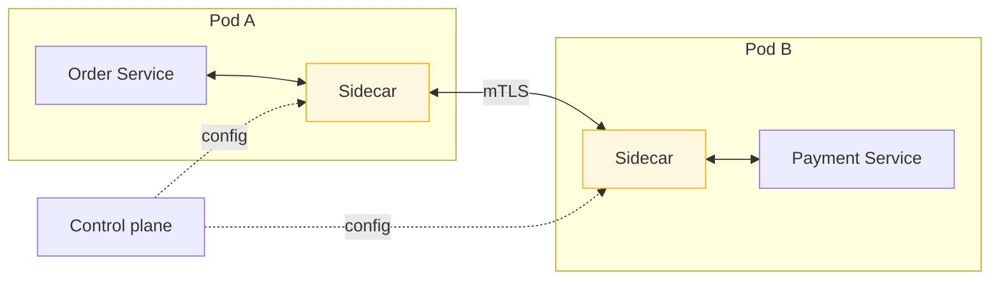

> Move retries, timeouts, mTLS and telemetry out of nine codebases and into the network. You
> gain uniformity and a large, opinionated new system to operate.

| | |
|---|---|
| **Module** | [08 — Microservice architecture](/modules/microservice-architecture/README) |
| **Prerequisites** | [Module 02](/modules/resilience/README), [01-05 Service discovery](/modules/communication/05-service-discovery) |
| **Also known as** | Envoy/Istio/Linkerd, ambassador pattern, data plane / control plane |
| **Category** | Structure |

---

## 1. The problem

ShopFlow has nine services in four languages. Every one of them needs timeouts, retries,
circuit breakers, service discovery, mTLS, and trace propagation.

So the Java services use Resilience4j, the Go services use a hand-rolled wrapper, the Node
services use whatever the HTTP client defaults to, and the Python service has no retries at
all because nobody got round to it. Each has different defaults, different metric names, and
different bugs.

Then security mandates mTLS between all services. That is four implementations, four
certificate rotation mechanisms, and four teams' sprint capacity — to deliver a feature with
no business value that must nonetheless be identical everywhere.

## 2. In plain language

A large office where every employee handles their own post: buying stamps, checking addresses,
deciding what to do with returned letters. Everyone does it slightly differently. When the
company adopts a new franking system, forty people must learn it.

Instead, give each employee a **personal assistant** who sits at the next desk and handles all
incoming and outgoing post. The employee hands over a letter; the assistant deals with stamps,
retries, registered delivery and the log book. Change the postal policy once, in the
assistants' handbook, and all forty desks comply tomorrow.

Two costs, both real. There are now forty assistants to pay — literal overhead per desk. And
when a letter goes missing, "was it the employee or the assistant?" becomes a question you must
ask every time, which makes every investigation slower.

**Where the analogy breaks down:** an assistant knows what the letter says and can use judgement.
A sidecar sees bytes and headers; it cannot know that this particular retry will double-charge
a customer.

## 3. How it works

A **sidecar** is a proxy deployed alongside every service instance, in the same pod, sharing
its network namespace. All traffic in and out is transparently redirected through it. The
application believes it is talking to `localhost`.

A **service mesh** is a fleet of sidecars (the *data plane*) plus a *control plane* that
configures them all from one policy.



### What moves to the mesh

| Concern | In the mesh? | Why |
|---|---|---|
| Service discovery, load balancing (P2C) | ✅ | Purely transport |
| Timeouts, retries, circuit breaking, outlier ejection | ✅ | Uniform policy, no code |
| mTLS and certificate rotation | ✅ | The strongest argument for a mesh |
| Traffic shifting (canary, blue/green) | ✅ | Percentage routing without deploys |
| Metrics, distributed trace headers | ✅ | Uniform golden signals for free |
| Authorisation policy (which service may call which) | ✅ | Zero-trust networking |
| **Idempotency** | ❌ | Requires knowing what the operation does |
| **Fallbacks and degradation** | ❌ | Requires domain knowledge |
| **Business rules** | ❌ | Obviously |

**The line is the same as for a gateway: transport and identity, never domain.** A mesh can
retry a call; only your code knows whether retrying is safe
([01-03](/modules/communication/03-delivery-guarantees-and-idempotency)).

### Sidecar vs sidecar-less

Every sidecar costs CPU, memory (typically 50–100MB) and latency (~0.5–1ms per hop, so ~2ms
round trip). At 500 pods that is real money.

Newer approaches reduce it: **ambient/sidecar-less meshes** put a shared per-node proxy in
place of per-pod sidecars, and **eBPF-based** approaches push some of it into the kernel. Both
trade isolation for efficiency.

### The honest cost

A service mesh is one of the most operationally heavy things in this course. Control plane
upgrades can break the data plane. Debugging gains a layer that intercepts everything. Failures
inside the mesh present as failures of your application.

**Adopt a mesh when you have enough services and languages that the duplication genuinely
hurts — realistically 15+ services or 3+ languages — or when mTLS everywhere is mandated.
Below that, libraries are cheaper.**

## 4. Pseudo-code

**Before — the same policy, four times, four ways.**

```
# Java service
uses payments: Client<PaymentService>
  with timeout(800ms), retry(max: 2), circuit_breaker(threshold: 5)

# Go service — different defaults, different metric names
uses payments: Client<PaymentService>
  with timeout(3s), retry(max: 5)          # nobody reviewed these

# Node service — library defaults, never configured
uses payments: Client<PaymentService>      # 60s timeout, no retries

# Python service
uses payments: Client<PaymentService>      # no resilience at all
# Four implementations, four sets of bugs, and mTLS would be four more projects.
```

**The pattern — policy as configuration, applied uniformly.**

```
# The application code becomes ignorant of transport concerns entirely.
service OrderService:
  uses payments: Client<PaymentService>    # no timeout, no retry, no breaker here
  handler place_order(ctx, cmd) -> Result<Order, OrderError>:
    receipt = await payments.charge(ctx, cmd)?     # the sidecar handles the rest
    ...

# --- Mesh policy: one definition, applied to every caller in every language ---
mesh_policy payment_service:
  timeout: 800ms
  retry:
    max_attempts: 2
    per_try_timeout: 300ms
    retry_on: [connect_failure, refused_stream, unavailable]
    # TRAP: `retry_on` must NOT include timeouts or 5xx for a non-idempotent
    # endpoint. The mesh cannot know that charging a card twice is a problem.
    # This single line is where mesh retries cause duplicate charges.
  outlier_detection:                        # per-INSTANCE circuit breaking (03-02)
    consecutive_5xx: 5
    interval: 10s
    base_ejection_time: 30s
    max_ejection_percent: 50                # panic threshold: never eject everything
  connection_pool:
    max_pending_requests: 100               # a bulkhead, enforced in the proxy (02-04)
    max_requests_per_connection: 1000
  load_balancer: LEAST_REQUEST              # power of two choices
  locality_lb: prefer_same_zone

mesh_policy default_mtls:
  mode: STRICT                              # plaintext between services is refused
  # Certificates issued, rotated and revoked by the control plane. Zero application
  # code, zero per-language implementation. This is usually the deciding argument.

mesh_policy authorization:
  # Zero trust: an explicit allow-list of who may call whom (fallacy 4).
  - from: order-service      to: payment-service   methods: [Charge, Refund]
  - from: order-service      to: inventory-service methods: [Reserve, Release]
  - from: "*"                to: payment-service   action: DENY
```

**Traffic shifting — the capability people adopt a mesh for and then use daily.**

```
mesh_policy catalog_rollout:
  # A canary with no deployment orchestration and no load balancer changes (11-02).
  traffic_split:
    - destination: catalog-service, subset: v1, weight: 95
    - destination: catalog-service, subset: v2, weight: 5

  # Header-based routing: internal staff hit v2, everyone else v1.
  match:
    - headers: {x-shopflow-staff: "true"}
      route: {destination: catalog-service, subset: v2, weight: 100}

  # Fault injection for chaos testing (09-04), without touching the application.
  fault_injection:
    delay: {percent: 1, fixed_delay: 3s}
    abort: {percent: 0.1, http_status: 503}
```

**What must stay in the application.**

```
service OrderService:
  # The mesh retried the call. Only WE know that a retry of `charge` needs a key.
  handler place_order(ctx, cmd) -> Result<Order, OrderError>:
    receipt = await payments.charge(ctx, cmd,
                idempotency_key: cmd.request_id)?    # 01-03 — not the mesh's job

    # The mesh can fail fast. Only WE know what a good degraded answer looks like.
    recs = match await recommender.similar(ctx, cmd.skus()):
      case Ok(r): r
      case Err(_): popular_fallback()                # 02-07 — not the mesh's job

    # The mesh gives us RED metrics per service. Only WE can emit
    # "orders.placed by tier" — the metric the business actually asks about.
    metrics.increment("orders.placed", tags: {tier: ctx.customer_tier})
```

## 5. Knobs and variants

| Knob | Guidance | Failure if wrong |
|---|---|---|
| Adopt at all | 15+ services or 3+ languages, or mandated mTLS | Below that, libraries are cheaper and simpler |
| mTLS mode | STRICT, after a PERMISSIVE migration period | STRICT before migration breaks every plaintext caller |
| Retry policy | Per route; never blanket-retry non-idempotent methods | Mesh retries on POST = duplicate side effects |
| Outlier ejection | With a max-ejection percentage | Without it, a bad deploy ejects the whole fleet |
| Sidecar resources | Measured, with limits | Unbounded sidecars evict application containers |
| Sidecar vs ambient | Ambient for large fleets | Sidecars cost ~75MB and ~2ms per hop, per pod |
| Control plane upgrades | Staged, with a tested rollback | A bad control plane push affects every service at once |

## 6. Challenges and failure modes

- **Mesh retries on non-idempotent endpoints.** The most dangerous default. A blanket
  `retry_on: 5xx` across all routes will eventually double-charge someone. Configure per route,
  and default to no retries.
- **Debugging gains a layer.** "Is this the app, the sidecar, or the mesh?" must be asked every
  time. Sidecar access logs and per-hop metrics are essential, not optional.
- **Control plane outage.** Existing sidecars usually keep their last config and keep working
  (fail static) — verify that your mesh does this, and test it.
- **Sidecar lifecycle races.** The application starts before the sidecar is ready and its first
  calls fail; or the sidecar exits before the application finishes draining and the last calls
  fail. Both are classic, and both need explicit lifecycle configuration.
- **Resource overhead at scale.** 500 pods × 75MB is 37GB of RAM doing no business work.
- **Latency added to every hop.** ~2ms round trip is negligible for one hop and significant for
  a chain of six.
- **Version skew.** Control plane and data plane at different versions during an upgrade, with
  subtly different behaviour.
- **The mesh becomes a policy monolith.** All routing, retry and authorisation policy in one
  repository owned by one team recreates the bottleneck microservices removed.
- **False confidence.** "The mesh handles resilience" is half true. It handles the transport
  half. Idempotency, degradation and business-aware timeouts remain yours.

## 7. Alternatives

- **Resilience libraries** (Resilience4j, Polly, Tenacity). No infrastructure, full control,
  domain-aware. Costs duplication across languages and drift between them. **The right answer
  below ~15 services.**
- **Smart client libraries** (gRPC's built-in retry, discovery and balancing). Most of the mesh's
  benefit with none of the sidecars — if all your services share a stack.
- **Gateway only.** Handle north-south traffic at the [gateway](/modules/microservice-architecture/02-api-gateway-and-backend-for-frontend)
  and leave east-west traffic to libraries. Covers a lot for much less.
- **Ambient / sidecar-less mesh.** Per-node proxies instead of per-pod. Much lower overhead,
  weaker isolation, newer.
- **Platform-provided networking.** Some managed platforms provide mTLS and retries without an
  explicit mesh. Take it if offered.

## 8. Trade-offs

| Advantage | Disadvantage |
|---|---|
| Uniform resilience policy across every language | Significant new infrastructure to run and upgrade |
| mTLS everywhere with zero application code | Sidecar CPU, memory and latency on every hop |
| Traffic shifting and canaries without deploys | Another layer between you and every bug |
| Consistent golden-signal metrics for free | Mesh retries can duplicate non-idempotent operations |
| Zero-trust authorisation between services | Policy can centralise into a new bottleneck |
| Fault injection for chaos testing, built in | Steep learning curve; expertise is scarce |

## 9. Complexity introduced

- **Operational.** A control plane to run, upgrade and monitor; certificate lifecycle; sidecar
  resource management; mesh-specific dashboards; staged upgrade procedures.
- **Cognitive.** Engineers must understand a second networking layer and where its configuration
  lives, which is usually a different repository.
- **Failure surface.** Control plane outages, config push errors, lifecycle races, version skew,
  over-aggressive ejection, unsafe retries.
- **Testing.** Mesh policy needs testing like code: does the retry policy actually apply? Does
  the authorisation rule actually deny? Both are easy to get silently wrong.

## 10. Related concepts

- **Builds on:** [Module 02](/modules/resilience/README), [01-05 Service discovery](/modules/communication/05-service-discovery), [03-02 Load balancing](/modules/scalability/02-load-balancing)
- **Composes with:** [11-02 Deployment strategies](/modules/operations-and-evolution/02-deployment-strategies) (traffic shifting), [11-01 Observability](/modules/operations-and-evolution/01-observability), [09-04 Chaos engineering](/modules/availability-and-dr/04-chaos-engineering)
- **Conflicts with / tension:** simplicity, latency, and per-pod cost
- **Contrast with:** [08-02 API gateway](/modules/microservice-architecture/02-api-gateway-and-backend-for-frontend) — north-south versus east-west traffic
- **Leads to:** [08-05 Strangler fig](/modules/microservice-architecture/05-strangler-fig)

## 11. Exercises

1. **Trace it.** The mesh retry policy includes `retry_on: [unavailable, 5xx]` for all routes.
   Payment Service returns 503 after successfully capturing a charge. Walk through what happens
   and what the customer's statement shows.
2. **Extend it.** Write the mesh policy for ShopFlow's payment path: which retries are safe,
   what timeout, what outlier detection, and which callers are authorised. Justify each line.
3. **Break it.** During a control plane upgrade, half the sidecars have the new config
   (STRICT mTLS) and half have the old (PERMISSIVE). Describe what breaks, and what you would
   have done differently.

## 12. References

- Istio and Linkerd documentation — traffic management, security, and the honest performance sections.
- Envoy documentation — the proxy underlying most meshes; outlier detection and retry semantics.
- William Morgan (Buoyant), "The Service Mesh: What Every Software Engineer Needs to Know".
- Brendan Burns & David Oppenheimer, "Design Patterns for Container-based Distributed Systems" (HotCloud 2016) — the sidecar and ambassador patterns.
- Istio ambient mesh documentation — the sidecar-less direction.

---

**Up:** [Module 08](/modules/microservice-architecture/README) · **Previous:** [← 08-03](/modules/microservice-architecture/03-database-per-service) · **Next:** [08-05 Strangler fig →](/modules/microservice-architecture/05-strangler-fig)
