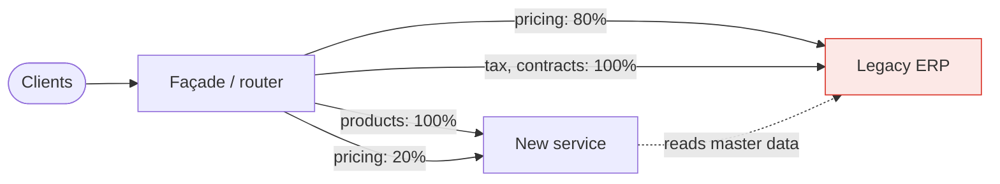

> Replace a legacy system by growing a new one around it and diverting traffic a slice at a
> time. The alternative — a big-bang rewrite — is the most reliably failed project in software.

| | |
|---|---|
| **Module** | [08 — Microservice architecture](/modules/microservice-architecture/README) |
| **Prerequisites** | [08-01 Bounded contexts](/modules/microservice-architecture/01-decomposition-and-bounded-contexts), [08-02 API gateway](/modules/microservice-architecture/02-api-gateway-and-backend-for-frontend) |
| **Also known as** | strangler application, incremental migration, branch by abstraction |
| **Category** | Structure |

---

## 1. The problem

ShopFlow's ERP is 20 years old, written in a language nobody hires for, has no tests, and owns
master product data, pricing rules, supplier contracts and tax logic that nobody fully
understands. It cannot be turned off — it processes every order — and it cannot be changed
fast enough for the business.

The proposal is a rewrite: build the replacement, then switch over on a weekend.

This fails, predictably, for reasons that are always the same:

- The old system's behaviour is not documented; it is *emergent*, including the bugs that
  downstream systems now depend on.
- While you rewrite for two years, the old system keeps changing, so you are chasing a moving
  target.
- There is no value delivered until the very end, so the project is cancelled at month 18 when
  budgets tighten.
- The switch-over is all-or-nothing, at 2am, with a rollback plan nobody has tested.

## 2. In plain language

The strangler fig grows on a host tree. It sends roots down around the trunk, gradually
thickening, taking more of the light and more of the nutrients. Eventually the fig supports
itself and the host rots away, leaving a hollow, self-supporting fig.

At no point is there a moment where the tree is cut down and replaced. The forest never has a
gap. If the fig fails in year three, the tree is still there.

The mechanism that makes this work in software is unglamorous: **something in front of the old
system decides, per request, whether to send it to the old system or the new one.** Everything
else — the sequencing, the data migration, the verification — hangs off that one switch.

**Where the analogy breaks down:** the fig does not need the tree's memories. Your new system
needs the old one's data, which is where most of the actual difficulty lives.

## 3. How it works



### The sequence

1. **Put a façade in front.** Nothing changes behaviour; all traffic still reaches the legacy
   system. This step alone is valuable: it gives you a place to measure, and a switch.
2. **Pick the first slice.** Not the hardest, not the most trivial. Choose something with real
   value, a clear boundary, and low data coupling. Verify the whole mechanism on it.
3. **Build the slice in the new system.**
4. **Divert traffic incrementally** — internal users, then 1%, then 10%, then 100 — with
   comparison running throughout.
5. **Migrate the slice's data**, or keep syncing it if the legacy system still needs it.
6. **Repeat.** Each slice reduces the legacy footprint.
7. **Remove the legacy system** when nothing routes to it. **This step must actually happen** —
   see §6.

### Where the façade goes

| Location | Good for | Constraint |
|---|---|---|
| HTTP reverse proxy / [gateway](/modules/microservice-architecture/02-api-gateway-and-backend-for-frontend) | Web and API traffic | Requires an HTTP boundary |
| Message router ([05-03](/modules/messaging-and-eip/03-message-router-and-filter)) | Event-driven and batch flows | Requires messaging |
| Branch by abstraction (in-process interface) | Splitting a monolith from inside | Needs source access |
| Database triggers / CDC | When the legacy system has no callable interface at all | Fragile, and sometimes the only option |
| Event interception | Legacy writes events; new system consumes them | Legacy must emit or be made to |

### Verification: comparison running

The highest-value technique in this lesson. Send a request to **both** systems, return the
legacy result to the user, and compare the two responses offline.

You discover the undocumented behaviours — the rounding rule, the special case for one
supplier, the bug from 2011 that three downstream systems now rely on — *before* the new system
serves anyone. Nothing else finds these.

Requirements: the request must be safe to duplicate (read-only, or the new path's writes go
somewhere discardable), and differences must be logged with enough context to diagnose.

### The data problem

Usually harder than the logic. Three approaches:

- **New system reads legacy data** (via an [ACL](/modules/microservice-architecture/06-anti-corruption-layer)). Fastest start;
  keeps you coupled.
- **Two-way sync during transition.** Both systems have the data, kept in step. Powerful, and
  conflict resolution is genuinely hard.
- **Migrate ownership per slice.** The new system becomes authoritative for that slice; the
  legacy system reads it back if needed. Cleanest end state, most work per slice.

## 4. Pseudo-code

**Before — the big bang.**

```
# Month 1–24: build NewErp with every feature of LegacyErp.
# Month 24: turn LegacyErp off over a weekend.
# TRAP: no value until month 24, requirements move for 24 months, the
# undocumented behaviours are discovered on the Saturday night, and the
# rollback plan has never been executed.
```

**The pattern — a façade with per-route, per-percentage routing.**

```
enum Target: LEGACY | NEW | BOTH_COMPARE

record MigrationRule:
  route: String
  target: Target
  new_percentage: Float
  compare: Bool
  cohort: Option<(String) => Bool>      # e.g. internal staff first

service ErpFacade:
  uses legacy: Client<LegacyErp>
  uses new_service: Client<CatalogService>
  uses rules: Store<String, MigrationRule>     # runtime config: no deploy to change
  uses differences: Store<UUID, Difference>

  @timeout(3s)
  handler handle(ctx: RequestContext, req: Request) -> Result<Response, Error>:
    rule = rules.get(req.route) ?? MigrationRule(req.route, LEGACY, 0, false, None)

    if rule.cohort is Some(f) and f(ctx.user_id):
      return await call_new(ctx, req)          # staff always get the new path

    # Sticky by a stable key: a user must not flip between systems mid-session.
    # WHY: inconsistent behaviour within one session is worse than either system
    # alone, and it makes bug reports impossible to reproduce.
    if hash(ctx.customer_id + req.route) mod 100 < rule.new_percentage:
      target = NEW
    else:
      target = LEGACY

    if rule.compare and req.is_read_only:
      return await compare_and_return(ctx, req)

    return target == NEW ? await call_new(ctx, req) : await call_legacy(ctx, req)

  # Comparison running: the legacy answer is authoritative; the new one is graded.
  async fn compare_and_return(ctx, req) -> Result<Response, Error>:
    parallel:
      legacy_r = call_legacy(ctx, req) timeout 2s
      new_r    = call_new(ctx, req) timeout 2s      # bounded: must not slow the user

    if legacy_r.is_ok() and new_r.is_ok() and not equivalent(legacy_r, new_r):
      differences.put(uuid(), Difference(
        route: req.route, request: redact(req),
        legacy: legacy_r.unwrap(), new: new_r.unwrap(),
        diff: structural_diff(legacy_r, new_r), at: now()))
      metrics.increment("migration.difference", tags: {route: req.route})

    if new_r.is_err() and legacy_r.is_ok():
      metrics.increment("migration.new_failed", tags: {route: req.route})

    return legacy_r        # the user always gets the legacy answer during comparison

  # The gate that decides when a slice is ready to cut over.
  every 1h:
    for route in rules.keys() where rules.get(route).compare:
      rate = difference_rate(route, window: 24h)
      metrics.gauge("migration.difference_rate", rate, tags: {route: route})
      if rate < 0.0001 and sample_size(route, 24h) > 10000:
        log.info("route ready to cut over", route: route)
      # WHY a sample-size floor: a 0% difference rate over 12 requests means
      # nothing. The threshold and the volume matter equally.
```

**Branch by abstraction — the same idea inside a monolith, no network.**

```
# Step 1: introduce an interface over the existing implementation. No behaviour change.
interface PricingEngine:
  fn price(order: Order) -> Money

class LegacyPricingEngine implements PricingEngine:
  fn price(order) -> Money: return legacy_pricing_code(order)

# Step 2: build the new implementation behind the same interface.
class NewPricingEngine implements PricingEngine:
  fn price(order) -> Money: return new_pricing_logic(order)

# Step 3: a switch, at runtime, with comparison.
class SwitchingPricingEngine implements PricingEngine:
  fn price(order) -> Money:
    legacy = legacy_engine.price(order)
    if flags.enabled("pricing.compare", order.customer_id):
      spawn compare(legacy, new_engine.price(order), order)    # async: no latency cost
    return flags.enabled("pricing.new", order.customer_id) ? new_engine.price(order)
                                                           : legacy
# Step 4: flip the flag per cohort. Step 5: delete LegacyPricingEngine.
# No network, no deploy per change, and rollback is a flag flip (11-03).
```

**Data migration for a slice.**

```
service ProductDataMigration:
  # Phase 1 — legacy authoritative, new system syncs from it (read-only).
  every 1m:
    for change in legacy_cdc.read_since(checkpoint):
      new_products.upsert(translate(change))     # via an ACL (08-06)

  # Phase 2 — dual write. New system authoritative for NEW products only.
  handler create_product(cmd) -> Result<Product, Error>:
    atomically:
      p = new_products.create(cmd)
      outbox.append(LegacyProductSync(p.id, to_legacy(p), idempotency_key: p.id))
    # An idempotent outbox publisher performs the legacy write and reconciles failures.
    return Ok(p)

  # Phase 3 — new system authoritative; legacy syncs FROM it. Arrows reversed.
  every 1m:
    for change in new_products.changes_since(checkpoint):
      await legacy.upsert_product(to_legacy(change))

  # Phase 4 — nothing reads legacy products. Stop syncing. Drop the table.
  #
  # TRAP: most migrations stop at phase 2 and stay there for years, paying for
  # both systems and the sync between them. Phase 3→4 must be scheduled work
  # with an owner, not "when we get time".
```

## 5. Knobs and variants

| Knob | Guidance | Failure if wrong |
|---|---|---|
| First slice | Real value, clear boundary, low data coupling | Starting with the hardest slice stalls the programme |
| Routing granularity | Per route, then per cohort, then per percentage | All-or-nothing routing is a big bang with extra steps |
| Stickiness | Sticky by a stable user key | Flipping mid-session produces irreproducible bugs |
| Comparison | On for every read-only route before cutover | Cutting over without it means finding differences in production |
| Difference threshold | < 0.01% over a meaningful sample | A clean rate over 12 requests proves nothing |
| Rollback | A config change, always available | If rollback needs a deploy, you will not use it in time |
| Decommissioning | Scheduled, owned, funded | Otherwise you run both systems forever |

## 6. Challenges and failure modes

- **The migration that never finishes.** The most common outcome. 70% migrated, the remaining
  30% is the hard part, and both systems run indefinitely — costing more than either alone.
  **Fund and schedule decommissioning as work, not as cleanup.**
- **The façade becomes permanent.** A temporary routing layer that is still there in 2032,
  now with business logic in it.
- **Undocumented behaviour discovered late.** Only comparison running finds these. Without it,
  cutover *is* the discovery process.
- **Bug-for-bug compatibility.** Downstream systems depend on a legacy bug. You must reproduce
  it, and document that you did so on purpose, or a well-meaning engineer will "fix" it.
- **Data divergence during dual-write.** Two systems, two truths, drifting. Reconciliation jobs
  and a documented conflict-resolution rule are mandatory.
- **Comparison affecting latency or state.** Comparison calls must be bounded, and must never
  write anything the user can observe.
- **Legacy keeps changing.** The team maintaining it keeps shipping. Freeze it if you can; if
  you cannot, expect to chase.
- **No rollback rehearsal.** A rollback path that has never been executed does not work.
  Exercise it deliberately, on a small cohort.
- **Cutting over on percentages without cohort stickiness.** A user seeing new behaviour, then
  old, then new is worse than either.

## 7. Alternatives

- **Big-bang rewrite.** Occasionally correct: a small system, well understood, with few
  consumers and a hard external deadline. Rare, and always more work than estimated.
- **Leave it alone.** A stable legacy system that meets its requirements and changes rarely is
  not a problem to be solved. "It's old" is not a business case.
- **Encapsulate and stop.** Wrap it in a good API ([08-06](/modules/microservice-architecture/06-anti-corruption-layer)) and
  stop there. New development happens outside; the legacy system becomes a stable component.
  **Frequently the best economic answer.**
- **Buy a replacement.** For commodity capabilities — payroll, CRM, ERP — configuring a product
  usually beats building one.
- **Parallel run to retirement.** Both systems fully live, outputs reconciled, until confidence
  is total. Expensive; used where correctness is regulated.

## 8. Trade-offs

| Advantage | Disadvantage |
|---|---|
| Value delivered continuously, not at the end | Both systems run simultaneously for a long time |
| Risk is bounded to one slice at a time | The façade is a component with its own failure modes |
| Rollback is a config change | Data must be synchronised or duplicated during transition |
| Comparison surfaces undocumented behaviour safely | Comparison doubles load on the legacy system |
| The project can be paused without losing everything | Migrations that lose sponsorship stall forever, half-done |

## 9. Complexity introduced

- **Operational.** A routing façade to run; difference dashboards per route; sync pipelines and
  reconciliation jobs; two systems to monitor and support.
- **Cognitive.** "Which system served this request?" must be answerable for every request, and
  engineers must hold two models in mind for the duration.
- **Failure surface.** Façade outage, routing misconfiguration, data divergence, comparison
  load, sticky-key bugs.
- **Testing.** Comparison running *is* the test, and it needs its own tests: does the comparator
  correctly identify equivalence given ordering differences, floating point, and timestamps?

## 10. Related concepts

- **Builds on:** [08-01 Bounded contexts](/modules/microservice-architecture/01-decomposition-and-bounded-contexts), [08-02 API gateway](/modules/microservice-architecture/02-api-gateway-and-backend-for-frontend)
- **Composes with:** [08-06 Anti-corruption layer](/modules/microservice-architecture/06-anti-corruption-layer) (how the new system talks to the old), [11-03 Feature flags](/modules/operations-and-evolution/03-configuration-and-feature-flags), [05-03 Message router](/modules/messaging-and-eip/03-message-router-and-filter)
- **Conflicts with / tension:** speed — incremental migration is slower than a rewrite would be *if the rewrite worked*
- **Contrast with:** big-bang replacement
- **Leads to:** [08-06 Anti-corruption layer](/modules/microservice-architecture/06-anti-corruption-layer)

## 11. Exercises

1. **Trace it.** Comparison running is enabled for product lookups. Over 24 hours, 0.3% of
   responses differ, all in the `tax_class` field for suppliers in one country. What do you do,
   and what does the difference most likely mean?
2. **Extend it.** Design the migration of ShopFlow's pricing logic out of the ERP. Which slice
   first, what does the façade route on, how do you verify, and how do you roll back?
3. **Break it.** Routing is by `hash(customer_id) mod 100 < percentage`. The percentage is
   raised from 10 to 20. Explain why some customers who were on the new system move back to the
   old one, and fix it.

## 12. References

- Martin Fowler, "StranglerFigApplication" (2004) — the original.
- Sam Newman, *Monolith to Microservices* (2019) — the most complete practical treatment.
- Martin Fowler, "BranchByAbstraction" — the in-process variant.
- GitHub Engineering, "Move Fast and Fix Things" — Scientist, a comparison-running library, and what it found.
- Michael Feathers, *Working Effectively with Legacy Code* — seams and characterisation tests.

---

**Up:** [Module 08](/modules/microservice-architecture/README) · **Previous:** [← 08-04](/modules/microservice-architecture/04-sidecar-and-service-mesh) · **Next:** [08-06 Anti-corruption layer →](/modules/microservice-architecture/06-anti-corruption-layer)
