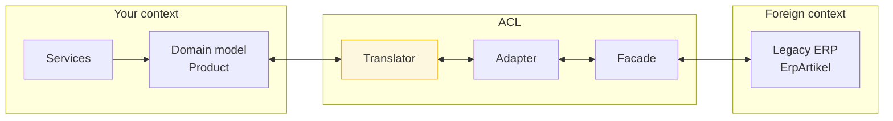

> A deliberate translation boundary that stops another system's model — and another system's
> assumptions — from leaking into your codebase.

| | |
|---|---|
| **Module** | [08 — Microservice architecture](/modules/microservice-architecture/README) |
| **Prerequisites** | [08-01 Bounded contexts](/modules/microservice-architecture/01-decomposition-and-bounded-contexts), [05-04 Message translator](/modules/messaging-and-eip/04-message-translator-and-canonical-data-model) |
| **Also known as** | ACL, adapter layer, corruption barrier |
| **Category** | Integration |

---

## 1. The problem

ShopFlow's new Catalog Service reads master data from the legacy ERP. The quickest path was to
use the ERP's generated client directly.

Two years later:

- `ErpArtikel` appears in 60 files, including the domain model and the HTTP responses.
- ShopFlow's code uses German field names because the ERP does.
- Business logic checks `if artikel.STATUS == "07"` because that is how the ERP encodes
  "discontinued", and the meaning of 07 is documented in a PDF from 2009.
- The ERP's null-means-zero convention has propagated into ShopFlow's pricing.
- The ERP replacement project stalls, because replacing it means rewriting 60 files across
  four services.

**The dependency was supposed to be at the edge. It is now structural.**

## 2. In plain language

An embassy. Your country and theirs have different laws, currencies, calendars and forms. The
embassy is where translation happens: their documents come in, get converted into your legal
concepts, and only then enter your system. Nobody in your interior ministry deals in their
forms.

That barrier costs something real. Every document is handled twice, and the embassy staff must
know both systems thoroughly. When their government changes a form, the embassy does extra work.

And that is the point: **the embassy absorbs the change so the interior ministry does not
notice it.** If their country is replaced by a different one entirely, you replace the embassy,
not the ministry.

**Where the analogy breaks down:** embassies negotiate. An ACL cannot ask the ERP to change
anything; it can only defend against what arrives.

## 3. How it works

An anti-corruption layer sits between your bounded context and a foreign one, translating in
both directions. **Nothing from the foreign model crosses it.**



Three components, each with a distinct job:

- **Façade** — a simplified interface over the foreign system's actual protocol. Hides SOAP,
  fixed-width files, session handling, pagination quirks.
- **Adapter** — makes the foreign interface conform to the shape *your* domain wants to call.
- **Translator** — converts data between the two models, including semantics and units.

Small integrations collapse these into one class. The distinction matters when the foreign
system's protocol is as awkward as its model.

### The rule

**Foreign types must not appear outside the ACL.** Not in your domain model, not in your
service signatures, not in your HTTP responses, not in your tests' fixtures. Enforce it with
architecture tests if your language allows — a build rule that fails if `com.legacy.*` is
imported outside `catalog.acl.*` is worth more than any amount of code review.

### ACL vs translator vs canonical model

| | Purpose |
|---|---|
| [Message translator](/modules/messaging-and-eip/04-message-translator-and-canonical-data-model) | Convert message formats — a mechanism |
| **Anti-corruption layer** | Protect a bounded context's integrity — an architectural boundary |
| Canonical data model | One shared model for many systems — an organisational agreement |

An ACL *contains* translators. Its distinguishing feature is that it is a **defensive** boundary
with an enforced rule about what may cross it.

### Where to put it

| Location | Consequence |
|---|---|
| **In your service, at the edge** | Simplest. Each consuming service writes its own. Duplication if several consume the same foreign system |
| **A dedicated ACL service** | One implementation, reusable, another deployable and another hop |
| **In the [gateway](/modules/microservice-architecture/02-api-gateway-and-backend-for-frontend) or an integration platform** | No application code; logic hidden in configuration |

Default to in-service. Promote to a dedicated service when three or more consumers need the
same translation.

## 4. Pseudo-code

**Before — the foreign model, everywhere.**

```
service CatalogService:
  uses erp: Client<LegacyErp>

  handler get_product(sku: Sku) -> ErpArtikel:      # TRAP: foreign type in the API
    return await erp.getArtikel(sku)

  handler search(q: Query) -> List<ErpArtikel>:
    results = await erp.sucheArtikel(q)
    return results.filter(a => a.STATUS != "07")     # TRAP: "07" means discontinued.
                                                     # This magic string is now in
                                                     # 12 files across 4 services.
```

**The pattern — a defended boundary.**

```
# ---------- Your domain. Clean. Knows nothing about any ERP. ----------
record Product:
  sku: Sku
  name: String
  net_price: Money
  status: ProductStatus
  weight_g: Int
  supplier: SupplierRef

enum ProductStatus: ACTIVE | DISCONTINUED | PENDING_LAUNCH | WITHDRAWN

interface ProductCatalog:                    # your domain's port, in your language
  async fn find(sku: Sku) -> Result<Product, CatalogError>
  async fn search(criteria: SearchCriteria) -> Result<List<Product>, CatalogError>


# ---------- The ACL. The only place ErpArtikel is allowed to exist. ----------
package catalog.acl:                         # architecture test: com.legacy.* may
                                             # ONLY be imported inside this package

  # --- Façade: hides the foreign protocol ---
  service ErpFacade:
    uses erp: SoapClient
    state session: Option<ErpSession>

    async fn get_artikel(nr: String, reauth_attempted: Bool = false) -> Result<ErpArtikel, ErpError>:
      s = await ensure_session()             # the ERP needs a session token that
                                             # expires every 20 minutes. Nobody
                                             # outside this file should ever know that.
      try:
        return Ok(await erp.call("getArtikel", {SESSION: s.token, ARTNR: pad(nr, 18)})
                    timeout 3s)
      catch SoapFault as f if f.code == "SESSION_EXPIRED":
        if reauth_attempted: return Err(ErpUnavailable("session renewal failed"))
        session = None
        return await get_artikel(nr, reauth_attempted: true)  # exactly one retry after re-auth
      catch SoapFault as f:
        return Err(map_fault(f))

  # --- Translator: model to model, including semantics ---
  service ErpTranslator:
    # Status mapping. The magic strings live HERE and only here.
    #   "01" active   "03" pending launch   "07" discontinued   "09" withdrawn
    fn status_of(code: String) -> Result<ProductStatus, TranslationError>:
      match code:
        case "01": return Ok(ACTIVE)
        case "03": return Ok(PENDING_LAUNCH)
        case "07": return Ok(DISCONTINUED)
        case "09": return Ok(WITHDRAWN)
        case other:
          # TRAP if you default to ACTIVE: a new ERP status code silently makes
          # withdrawn products purchasable. Unknown values must fail loudly.
          return Err(UnknownStatus(other))

    fn to_product(a: ErpArtikel) -> Result<Product, TranslationError>:
      return Ok(Product(
        sku: a.ARTNR.trim(),
        name: decode_latin1(a.BEZEICHNUNG).trim(),
        # The ERP quotes GROSS prices with a comma decimal separator.
        # Our domain stores NET in minor units. See 05-04.
        net_price: Money(round(parse_de_decimal(a.PREIS)? * 100 / 1.19), "EUR"),
        status: status_of(a.STATUS)?,
        weight_g: round(parse_de_decimal(a.GEWICHT)? * 1000),   # kg → g
        supplier: SupplierRef(a.LIEFNR.trim())))

  # --- Adapter: implements YOUR interface using the foreign system ---
  service ErpProductCatalog implements ProductCatalog:
    uses facade: ErpFacade
    uses translator: ErpTranslator
    uses cache: Cache<Sku, Product>

    async fn find(sku: Sku) -> Result<Product, CatalogError>:
      if p = cache.get(sku): return Ok(p)

      match await facade.get_artikel(sku):
        case Err(NotFound):  return Err(CatalogError.NotFound)
        case Err(e):         return Err(CatalogError.Unavailable)   # foreign errors
                                                                    # mapped to ours
        case Ok(artikel):
          match translator.to_product(artikel):
            case Ok(p):
              cache.put(sku, p, ttl: 5m + jitter(1m))
              return Ok(p)
            case Err(e):
              # A translation failure is OUR alert, not the user's problem.
              log.error("ERP translation failed", sku: sku, error: e)
              metrics.increment("acl.translation_failed", tags: {field: e.field})
              return Err(CatalogError.Unavailable)
```

**The payoff — replacing the foreign system.**

```
# The ERP is replaced by a SaaS PIM. One new adapter; zero changes elsewhere.
service PimProductCatalog implements ProductCatalog:
  uses pim: Client<PimApi>
  async fn find(sku: Sku) -> Result<Product, CatalogError>:
    return Ok(to_product(await pim.products.get(sku) timeout 1s))

# And during a strangler migration (08-05), both, behind the same interface:
service SwitchingProductCatalog implements ProductCatalog:
  async fn find(sku: Sku) -> Result<Product, CatalogError>:
    # lint: bound-by adapter — both are ProductCatalog implementations that
    # bound their own outbound calls; this layer only chooses between them.
    if flags.enabled("catalog.pim", sku): return await pim_catalog.find(sku)
    return await erp_catalog.find(sku)
# Because nothing outside the ACL ever saw ErpArtikel, this is a one-file change.
# In the "Before" version it would be a 60-file rewrite across four services.
```

## 5. Knobs and variants

| Knob | Guidance | Failure if wrong |
|---|---|---|
| Boundary enforcement | Architecture test on imports | Convention erodes within months |
| Location | In-service by default; dedicated at 3+ consumers | Premature ACL services add hops for nothing |
| Error mapping | Foreign errors → your error types | Leaking `SoapFault` leaks the dependency |
| Unknown values | Fail loudly | Defaulting silently corrupts domain state |
| Caching | Inside the ACL | Caching outside it caches foreign types |
| Resilience | Timeouts, breakers, fallbacks inside the ACL | Otherwise every caller reimplements them |
| Bidirectional | Translate outbound too | One-way ACLs leak your model into theirs |

## 6. Challenges and failure modes

- **Leakage.** One foreign field escapes "temporarily" and is in 30 files a year later. Only an
  automated import rule prevents this reliably.
- **Semantic translation errors.** Gross vs net, kg vs g, inclusive vs exclusive. The types
  match; the numbers are wrong. Only careful documentation and tests catch these
  ([05-04](/modules/messaging-and-eip/04-message-translator-and-canonical-data-model)).
- **Unknown enum values defaulted.** A new ERP status code silently mapped to `ACTIVE`. Fail.
- **The ACL becoming a bottleneck.** Every call to the foreign system passes through it, so it
  needs its own resilience, caching and capacity.
- **Lossy translation.** The foreign model has a field your domain has no concept of. Dropping
  it is correct *if deliberate* and a silent bug otherwise. Log unmapped fields once per field.
- **Over-engineering for a simple dependency.** A three-layer ACL for a REST API returning
  exactly your model is ceremony. Match the defence to the threat.
- **Under-engineering for a hostile one.** A mainframe with session tokens, EBCDIC, and status
  codes documented in a PDF genuinely needs all three layers.
- **ACL not covering the async path.** The synchronous API is defended and the event consumer
  deserialises the foreign event directly. Both directions need the boundary.

## 7. Alternatives

- **Use the foreign model directly.** Legitimate when: the integration is genuinely temporary,
  the foreign model is small and stable, or you own both sides. Rare and usually optimistic.
- **[Canonical data model](/modules/messaging-and-eip/04-message-translator-and-canonical-data-model).**
  Everyone translates to a shared model rather than pairwise. Better with many systems; needs
  organisational agreement.
- **Change the foreign system.** If you own it, fix the model instead of defending against it.
- **Conformist.** Deliberately adopt the foreign model, accepting the coupling, because
  translation is not worth it. A legitimate DDD relationship pattern — but it should be a
  *decision*, recorded, not an accident.
- **Shared kernel.** Both sides agree a shared model and co-own it. Requires real collaboration
  and gives real coupling.

## 8. Trade-offs

| Advantage | Disadvantage |
|---|---|
| Your domain model stays coherent | Every field needs an explicit mapping |
| Replacing the foreign system is a one-file change | Extra layer to write, test and maintain |
| Foreign quirks are documented in one place | Translation can be lossy or subtly wrong |
| A natural home for resilience and caching | Can become a bottleneck and a single point of failure |
| Makes a [strangler migration](/modules/microservice-architecture/05-strangler-fig) tractable | Over-engineering a simple dependency wastes effort |

## 9. Complexity introduced

- **Operational.** Translation failure metrics per field — an excellent early warning that the
  foreign system changed; ACL-specific latency and error dashboards.
- **Cognitive.** Two models to hold in mind at the boundary, and a rule about which may appear
  where.
- **Failure surface.** Translation errors, unknown values, ACL unavailability, lossy mapping.
- **Testing.** Golden-file tests using real foreign payloads, including the malformed ones.
  Architecture tests enforcing the import rule. Both are cheap and both are usually missing.

## 10. Related concepts

- **Builds on:** [08-01 Bounded contexts](/modules/microservice-architecture/01-decomposition-and-bounded-contexts), [05-04 Message translator](/modules/messaging-and-eip/04-message-translator-and-canonical-data-model)
- **Composes with:** [08-05 Strangler fig](/modules/microservice-architecture/05-strangler-fig) (the ACL is what makes it cheap), [02-03 Circuit breaker](/modules/resilience/03-circuit-breaker), [03-03 Caching](/modules/scalability/03-caching)
- **Conflicts with / tension:** speed of initial integration — using the foreign client directly is faster on day one
- **Contrast with:** the *conformist* relationship, where you deliberately adopt the foreign model
- **Leads to:** [Module 09 — Availability and disaster recovery](/modules/availability-and-dr/README)

## 11. Exercises

1. **Trace it.** The ERP adds status code `"11"` (seasonal). Walk through `status_of` and the
   adapter. What does a customer see, what does the team see, and how quickly?
2. **Extend it.** Add outbound translation: ShopFlow must push price changes *to* the ERP. What
   goes in the ACL, and what new failure mode does bidirectional translation create?
3. **Break it.** A developer, in a hurry, returns `ErpArtikel` from one internal endpoint "just
   for a debug page". Describe the eighteen-month path from that commit to a blocked ERP
   migration, and write the CI rule that prevents it.

## 12. References

- Eric Evans, *Domain-Driven Design* (2003) — Ch. 14, Anticorruption Layer and context mapping.
- Vaughn Vernon, *Implementing Domain-Driven Design* — practical ACL implementation.
- Alistair Cockburn, "Hexagonal Architecture" — ports and adapters, the same boundary idea.
- Microsoft Azure Architecture Center — Anti-Corruption Layer pattern.
- ArchUnit / NetArchTest — tools for enforcing import boundaries in CI.

---

**Up:** [Module 08](/modules/microservice-architecture/README) · **Previous:** [← 08-05](/modules/microservice-architecture/05-strangler-fig) · **Next:** [Module 09 — Availability and disaster recovery →](/modules/availability-and-dr/README)
