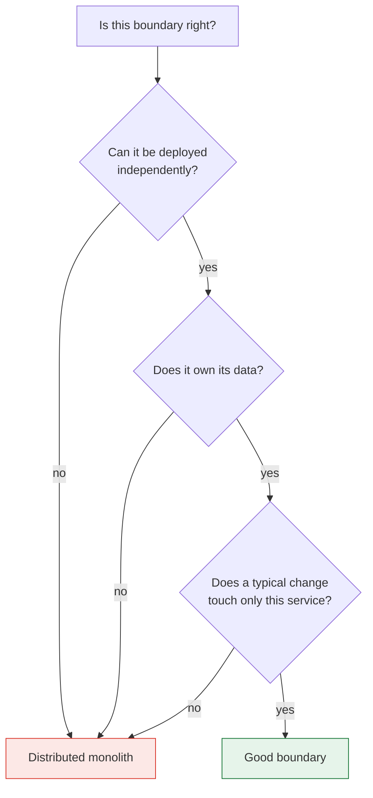

> Where to draw the lines, how to defend them, and how to move them later. The patterns here
> are structural: they change what your organisation can do, not what your code can do.

## What you will be able to do

- Cut a system along boundaries that survive contact with changing requirements.
- Recognise a distributed monolith before you have finished building one.
- Give clients one front door without creating a shared bottleneck.
- Keep another team's data model out of your codebase.
- Replace a legacy system that must stay in production throughout.

## Lessons

| # | Lesson | The structural question it answers |
|---|---|---|
| 08-01 | [Decomposition and bounded contexts](/modules/microservice-architecture/01-decomposition-and-bounded-contexts) | Where should the lines be? |
| 08-02 | [API gateway and backend-for-frontend](/modules/microservice-architecture/02-api-gateway-and-backend-for-frontend) | How do clients reach many services? |
| 08-03 | [Database per service](/modules/microservice-architecture/03-database-per-service) | Who owns which data? |
| 08-04 | [Sidecar and service mesh](/modules/microservice-architecture/04-sidecar-and-service-mesh) | Where does cross-cutting behaviour live? |
| 08-05 | [Strangler fig](/modules/microservice-architecture/05-strangler-fig) | How do we replace what we cannot stop? |
| 08-06 | [Anti-corruption layer](/modules/microservice-architecture/06-anti-corruption-layer) | How do we integrate without being infected? |

## The one idea

**A service boundary is a decision about who has to talk to whom before shipping.**

Everything else follows. If two services are always changed together, the boundary is wrong —
you have paid for a network and received nothing. If a service cannot be understood without
reading another service's code, the boundary is wrong. If deploying B requires coordinating
with the team that owns A, the boundary is wrong.

The technical tests are downstream of that one:

Boundaries are expensive to move once they cross a network, which is the argument for a
[modular monolith](/modules/foundations/01-why-distributed-systems) until the domain stops
shifting.

## ShopFlow at the end of this module

Services are aligned to bounded contexts rather than to database tables. Each owns its data.
Clients talk to a gateway, with a purpose-built BFF for the mobile app. Resilience and mTLS
live in a sidecar rather than in nine codebases. And 40% of the legacy ERP's traffic has been
quietly redirected to a replacement nobody had to switch on with a big red button.

---

**Up:** [Curriculum](/CURRICULUM) · **Previous:** [← Module 07](/modules/modular-monolith/README) · **Next:** [08-01 Decomposition and bounded contexts →](/modules/microservice-architecture/01-decomposition-and-bounded-contexts)
