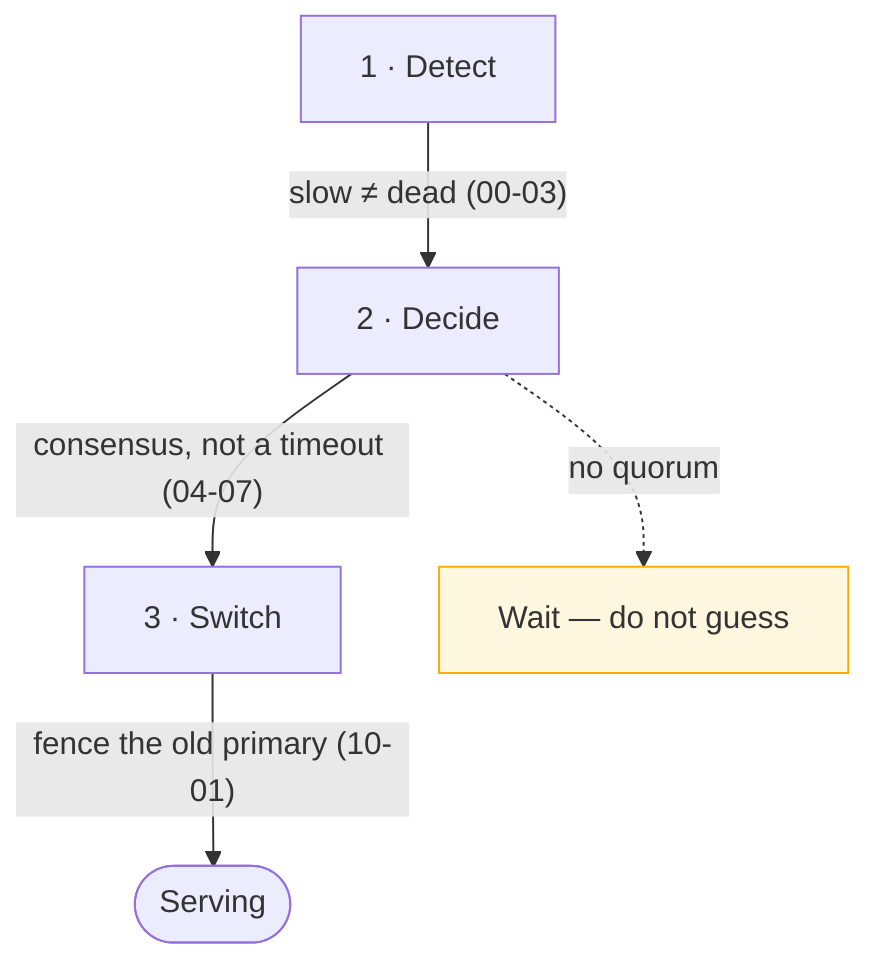

> Having two of something is easy. Switching to the second one, correctly, while the first is
> ambiguously broken, is the whole problem.

| | |
|---|---|
| **Module** | [09 — Availability and DR](/modules/availability-and-dr/README) |
| **Prerequisites** | [03-05 Replication](/modules/scalability/05-replication), [04-07 Consensus](/modules/data-and-consistency/07-consensus-and-leader-election) |
| **Also known as** | active-passive, active-active, hot standby, HA pairs |
| **Category** | Availability |

---

## 1. The problem

ShopFlow's order database has a standby replica. The primary's disk controller starts failing:
queries take 30 seconds, some succeed, some hang. The machine is not down.

- Monitoring is green — the host responds to pings and the process is running.
- Nothing triggers failover, because the automated check requires "unreachable" and the machine
  is reachable.
- An engineer eventually promotes the standby manually. The old primary, which never noticed
  anything, is still accepting writes from connections established before the switch. **Two
  primaries.**
- The standby was 40 seconds behind. Those 40 seconds of orders are gone, and nobody knows
  which ones.

Every part of this is normal. Redundancy was present throughout, and the system was down for
25 minutes and lost data.

## 2. In plain language

A theatre production with an understudy. Having one is not the hard part. The hard part is the
decision on the night: the lead actor is on stage, slurring their lines. Do you stop the show?

Stop too early and you have disrupted a performance that would have been fine. Stop too late
and the audience has watched fifteen minutes of a disaster. And the truly bad outcome is
sending the understudy on **while the lead is still there** — two Hamlets, arguing.

So real theatres have a protocol: one named person decides, the lead is escorted off before the
understudy enters, and everyone rehearses it. The rehearsal is not optional; it is the part
that makes the protocol real.

**Where the analogy breaks down:** the stage manager can see both actors. A failover controller
sees only a lack of response, which is the same signal for "dead" and "busy".

## 3. How it works

### The topologies

| Topology | Standby state | Failover time | Cost | Data loss risk |
|---|---|---|---|---|
| **Cold standby** | Not running | Minutes to hours | Low | High |
| **Warm standby** | Running, replicating, not serving | Seconds to minutes | Medium | Low with sync replication |
| **Hot standby / active-passive** | Running, ready to serve instantly | Seconds | Medium-high | Low |
| **Active-active** | Both serving | None — capacity just drops | High | None from failover itself |

**Active-active is the only topology with no failover event**, because there is nothing to
switch to. It requires either stateless services (easy —
[03-01](/modules/scalability/01-stateless-services-and-horizontal-scaling)) or multi-writer
data (hard — [09-02](/modules/availability-and-dr/02-multi-region-architecture)).

The usual arrangement: **active-active for the stateless tier, active-passive for the
database.**

### The three hard parts



**Detect.** A perfect failure detector does not exist. Use multiple independent signals —
health checks from several observers, replication position, actual error rates — and require
agreement. A single observer's timeout is not evidence.

**Decide.** The decision must be made by a quorum, not by whichever monitor noticed first.
Otherwise a network partition produces two monitors that each promote a different standby.

**Switch.** Cutting traffic over means updating DNS, a load balancer, or a proxy — each with
its own propagation delay. And crucially, the old primary must be **fenced**: prevented from
accepting writes, whether or not it has realised it lost.

### Capacity planning: N+1 and N+2

If losing a node means the survivors get overloaded, you have converted redundancy into a
cascading failure.

- **N+1** — survive one failure. Each node runs at ≤ `N/(N+1)` of capacity.
- **N+2** — survive one failure *while one node is in maintenance*. Necessary if you deploy
  during business hours.

Across three availability zones, losing one means the other two absorb 50% more traffic.
**Each zone must therefore run at ≤ 66% of capacity** — which is conveniently the same number
[00-04](/modules/foundations/04-latency-throughput-and-back-of-envelope) recommends for
latency reasons.

### Failback

The reverse switch, and the more dangerous one. The old primary returns with stale data; the
standby has been taking writes. Failing back naively **discards every write since the
failover**. Failback must be a deliberate, planned operation with a data reconciliation step —
never automatic.

## 4. Pseudo-code

**Before — timeout-driven failover, no fencing.**

```
service NaiveFailover:
  every 5s:
    if not await primary.ping() timeout 2s:
      standby.promote()          # TRAP 1: one observer, one timeout, no quorum
      dns.point_at(standby)      # TRAP 2: old primary still accepting writes
                                 # TRAP 3: DNS propagation is not instantaneous
                                 # TRAP 4: nobody checked how far behind the standby was
```

**The pattern — detect with multiple signals, decide by quorum, switch with fencing.**

```
record NodeHealth:
  reachable: Bool
  error_rate: Float
  p99_latency: Duration
  replication_lag: Duration
  observed_by: String
  at: Instant

service FailoverController:
  uses consensus: Client<ConsensusService>          # 04-07 — the decider
  uses observers: List<Client<HealthObserver>>      # 3+, in different zones
  max_acceptable_lag: Duration = 5s
  unhealthy_threshold: Int = 3

  state consecutive_unhealthy: Int = 0

  every 5s:
    # --- 1. DETECT: several independent observers, not one ---
    reports = parallel [o.check(primary) for o in observers] timeout 3s

    if reports.count() < majority(observers.size):
      # We cannot see enough observers. WE may be the partitioned one.
      log.warn("insufficient observers — declining to act")
      return                                        # TRAP if you act here: a
                                                    # partitioned controller
                                                    # triggers a false failover

    unhealthy = reports.count(r => not r.reachable
                                or r.error_rate > 0.5
                                or r.p99_latency > 10s)   # gray failure counts

    if unhealthy < majority(reports.count()):
      consecutive_unhealthy = 0
      return

    consecutive_unhealthy += 1
    if consecutive_unhealthy < unhealthy_threshold:
      return                                        # 15s of agreement before acting

    # --- 2. DECIDE: one controller acts, chosen by consensus ---
    lease = await consensus.campaign(role: "failover-controller") timeout 3s
    if lease is None: return                        # another controller owns this

    candidate = standbys.max_by(s => s.replication_position())
    lag = primary.last_known_position() - candidate.replication_position()

    if lag > max_acceptable_lag:
      # Failing over now loses `lag` worth of writes. That may still be the right
      # call — but it is a business decision, not an automated one.
      alert("failover would lose data", lag: lag, decision_required: true)
      if not AUTO_FAILOVER_DESPITE_LAG: return

    # --- 3. SWITCH: fence first, promote second, route third ---
    await storage.fence(primary, new_token: lease.token)
    # WHY fence before promote: the old primary may still be serving writes from
    # connections it already holds. Fencing makes the STORAGE reject them,
    # regardless of what the old primary believes (10-01).

    await candidate.promote(fencing_token: lease.token)
    await router.point_at(candidate)                # a proxy, not DNS: seconds not minutes

    log.error("failover completed", from: primary.id, to: candidate.id,
              estimated_lost_writes: lag, decided_by: reports.count())
    metrics.increment("failover.executed")
    page_human("failover executed — verify data integrity and plan failback")
    # Failback is NEVER automatic. See §3.
```

**Zone-aware capacity — redundancy that does not cascade.**

```
service CapacityPlanner:
  zones: List<Zone> = [eu-west-1a, eu-west-1b, eu-west-1c]

  fn required_instances(peak_rps: Float, per_instance_rps: Float) -> Int:
    base = ceil(peak_rps / per_instance_rps)

    # Survive losing one zone: the remaining zones must absorb everything.
    n = ceil(base * zones.size / (zones.size - 1))

    # Plus one for a rolling deploy or a node in maintenance (N+2).
    n = n + 1

    # And the latency cliff: never plan above ~65% utilisation (00-04).
    return ceil(n / 0.65)

  # ShopFlow catalogue: 12,000 rps, 800 rps/instance
  #   base = 15
  #   zone loss = 15 × 3/2 = 23
  #   +1 = 24
  #   /0.65 = 37 instances, ~12 per zone
  #
  # TRAP: sizing at `base` and calling three zones "redundant" means that losing
  # one zone overloads the other two, which then fail. Redundancy that cascades
  # is worse than no redundancy, because it fails all at once.
```

**Graceful degradation during failover — what users see.**

```
service OrderService:
  uses db: Store<OrderId, Order>

  on database_failover_detected:
    # 20–60 seconds where writes are impossible. Do not simply error.
    mode = READ_ONLY
    metrics.increment("service.readonly_mode")

  @timeout(2s)
  handler place_order(ctx, cmd) -> Result<Order, OrderError>:
    if mode == READ_ONLY:
      # TRAP if written as `pending_orders.send(cmd); return Ok(accepted)`:
      # that tells the customer their order is accepted on the strength of a
      # best-effort enqueue. If the send fails, or the process dies immediately
      # after it, the order exists only in a promise we made to a browser. The
      # customer has a confirmation and we have nothing.
      #
      # "Accepted" must rest on something durable. Two honest options:

      # ── Option A: durable admission log, separate from the failing primary.
      # The ACK from this write is what licenses the 202 — nothing earlier.
      match await admissions.append(AdmissionRecord(
              idempotency_key: cmd.request_id,        # 01-03 — the client's key
              payload: cmd, received_at: now())) timeout 500ms:
        case Ok(_):
          # Durable. A replay after failover turns this into a real order, and
          # the key makes that replay safe to run more than once.
          return Ok(accepted_pending(cmd))     # 202 "we're confirming your order"
        case Err(_):
          # ── Option B (fallback): we could not make it durable anywhere.
          # Say so. A retryable rejection is a far better outcome than a
          # confirmation we cannot honour.
          return Err(Unavailable(retry_after: 30s))   # 503 + Retry-After
    ...

  # The replay, once the new primary is writable. Idempotent by the client's
  # key, so re-running it after a crash mid-replay is safe.
  on database_writable_again:
    for rec in admissions.query(converted_at: None, order_by: received_at):
      atomically:
        if orders.put_if_absent(rec.payload.order_id, order_from(rec.payload)):
          outbox.append(OrderPlaced(rec.payload.order_id, ...))    # 04-03
        admissions.update(rec.idempotency_key, {converted_at: now()})

  handler get_order(ctx, id) -> Result<Order, Error>:
    # Reads keep working from a replica throughout. Most of the site stays up.
    return Ok(await replica.get(id)?)
```

## 5. Knobs and variants

| Knob | Guidance | Failure if wrong |
|---|---|---|
| Topology | Active-active stateless, active-passive stateful | Active-active data means multi-writer conflicts |
| Detection signals | ≥3 observers, multiple signal types | One observer's timeout causes false failovers |
| Threshold | 3 consecutive, 15–30s total | Too fast: flapping. Too slow: long outage |
| Decision authority | Consensus lease | Multiple deciders = split brain |
| Fencing | **Mandatory, before promotion** | Without it, two writers |
| Traffic switch | Proxy or LB, not DNS | DNS TTLs are honoured unreliably and slowly |
| Lag tolerance | Explicit threshold, alert above it | Silent data loss on failover |
| Failback | Manual, planned, reconciled | Automatic failback discards post-failover writes |
| Capacity | N+2 and ≤65% utilisation | Losing one zone cascades into losing all of them |

## 6. Challenges and failure modes

- **Gray failure defeats detection.** The machine responds, slowly and partially. Health checks
  pass. Include latency and error rate as failure signals, not just reachability
  ([00-03](/modules/foundations/03-failure-models-and-partial-failure)).
- **Split brain.** Two primaries. Only consensus plus fencing prevents it; timeouts never do.
- **The partitioned controller.** The monitor is the isolated one and fails over a perfectly
  healthy primary. Require a quorum of observers, and decline to act without one.
- **Failover cascade.** Standby takes over, is undersized, falls over, fails over again. Size
  standbys for full production load.
- **Untested failover.** The most common finding in post-incident reviews. The standby had a
  stale config, an expired certificate, a missing firewall rule, or a version mismatch — all
  discovered during the incident.
- **DNS-based switching.** TTLs are advisory; some resolvers and runtimes cache far longer.
  Minutes of traffic to a dead primary.
- **Automatic failback.** Discards writes taken by the promoted node. Never automate it.
- **Connection pools pinned to the old primary.** Clients keep using existing connections after
  the switch. Connections must be force-closed on failover.
- **Redundancy sharing a failure domain.** Two instances on the same host, two AZs on the same
  power feed, both replicas behind the same faulty switch. Verify at every layer.

## 7. Alternatives

- **Multi-writer / leaderless stores.** No failover event at all, because there is no leader.
  Costs conflict resolution ([03-05](/modules/scalability/05-replication)).
- **Consensus-replicated databases** (Spanner, CockroachDB, etcd). Failover is built in,
  automatic, and correct. **If you can adopt one, most of this lesson becomes their problem.**
- **Managed database failover.** Cloud providers implement all of this. Read their fine print
  on RPO and failover time; it is usually honest and usually worse than people assume.
- **Accept downtime.** For genuinely non-critical systems, a documented 4-hour restore is a
  legitimate choice and vastly cheaper.
- **[Degradation](/modules/resilience/07-fallback-and-graceful-degradation) instead of
  failover.** Read-only mode during a database problem keeps most of the product working
  without any switch at all.

## 8. Trade-offs

| Advantage | Disadvantage |
|---|---|
| Survives loss of an instance, host or zone | 2× infrastructure for the standby, mostly idle |
| Failover can be seconds rather than hours | Failover itself can fail, or fire falsely |
| Active-active has no failover event to get wrong | Active-active data requires conflict resolution |
| Enables maintenance without downtime | Capacity must be sized for the post-failure world |
| Well-supported by managed services | Untested failover is worse than none — it creates false confidence |

## 9. Complexity introduced

- **Operational.** Failover controllers and observers to run; replication lag as a paging
  metric; regular failover drills; a failback runbook with a reconciliation step.
- **Cognitive.** Engineers must understand fencing, quorum decisions, and why automatic failback
  is dangerous.
- **Failure surface.** Split brain, false failovers, flapping, undersized standbys, stale
  standby configuration, connection pinning.
- **Testing.** Failover must be exercised on a schedule, in production
  ([09-04](/modules/availability-and-dr/04-chaos-engineering)). A quarterly drill is the minimum that keeps it real.

## 10. Related concepts

- **Builds on:** [03-05 Replication](/modules/scalability/05-replication), [04-07 Consensus](/modules/data-and-consistency/07-consensus-and-leader-election), [00-03 Failure models](/modules/foundations/03-failure-models-and-partial-failure)
- **Composes with:** [10-01 Fencing tokens](/modules/performance-and-concurrency/01-concurrency-control), [02-08 Health checks](/modules/resilience/08-health-checks-and-self-healing), [02-07 Degradation](/modules/resilience/07-fallback-and-graceful-degradation)
- **Conflicts with / tension:** cost — idle standby capacity is money spent on nothing most days
- **Contrast with:** [09-03 Disaster recovery](/modules/availability-and-dr/03-disaster-recovery-rpo-and-rto) — failover handles component loss, DR handles data loss
- **Leads to:** [09-02 Multi-region architecture](/modules/availability-and-dr/02-multi-region-architecture)

## 11. Exercises

1. **Trace it.** The primary's disk controller degrades: 40% of queries take 30s, 60% succeed
   normally. Walk through the detection logic. Does failover trigger? Should it? What signal
   would you add?
2. **Extend it.** ShopFlow runs in three AZs at 12,000 rps. Compute the instance count for
   N+2 at 65% utilisation. Then compute what happens if you sized for N+0 and lose a zone at
   peak.
3. **Break it.** The failover controller requires a majority of observers. The controller and
   two of three observers are in zone A; zone A is partitioned from the rest. Describe what
   happens, and fix the observer placement.

## 12. References

- Google SRE Book — Ch. 22 and 23, and the discussion of failure detection.
- AWS Builders' Library, "Static stability using Availability Zones" and "Avoiding fallback in distributed systems".
- Martin Kleppmann, "How to do distributed locking" — fencing, again.
- PostgreSQL / Patroni documentation — a real, well-documented failover implementation.
- Kyle Kingsbury, *Jepsen* — failover correctness in practice, repeatedly disappointing.

---

**Up:** [Module 09](/modules/availability-and-dr/README) · **Previous:** [← Module 08](/modules/microservice-architecture/README) · **Next:** [09-02 Multi-region architecture →](/modules/availability-and-dr/02-multi-region-architecture)
