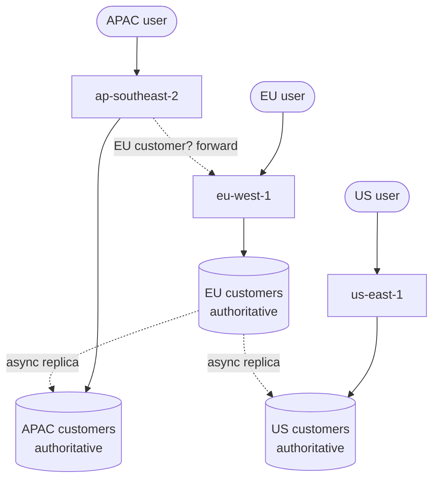

> Surviving the loss of a whole region, and serving users who are 150ms away. The physics is
> unforgiving and the cost is not mostly infrastructure — it is complexity.

| | |
|---|---|
| **Module** | [09 — Availability and DR](/modules/availability-and-dr/README) |
| **Prerequisites** | [09-01 Failover](/modules/availability-and-dr/01-redundancy-and-failover), [00-05 CAP](/modules/foundations/05-consistency-models-cap-and-pacelc) |
| **Also known as** | geo-distribution, multi-DC, global architecture, data residency |
| **Category** | Availability |

---

## 1. The problem

ShopFlow runs entirely in `eu-west-1`. Three things force the conversation:

- **Availability.** A region-wide outage — rare, but they happen — means ShopFlow is down for
  its duration, with no recourse.
- **Latency.** Australian customers are 280ms away. Every page load pays it, several times.
- **Regulation.** New EU and APAC contracts require certain personal data to remain within
  specific jurisdictions.

The instinct is "run in three regions". Then the physics arrives: the speed-of-light propagation
bound between Europe and Australia cannot be removed, though observed round trips vary with
routing and peering. A write that requires a cross-continent quorum adds at least one such
inter-region communication round — on every write.

## 2. In plain language

A company opening offices on three continents.

Simple version: the head office keeps all the records, and the branches phone in. Correct,
consistent, and every branch transaction takes a long-distance call.

Fast version: each branch keeps its own records. Instant locally. Then two branches sell the
same item, or a customer's address is updated in Sydney and in London on the same afternoon,
and there is no fact of the matter about which is right.

Middle version: each customer is *assigned* a home branch that owns their records. Their
transactions are local and fast; the rare cross-branch operation is slow. This is the answer
most real organisations land on, and it is the answer most multi-region systems land on too.

**Where the analogy breaks down:** branches can phone each other and agree. Regions get a
partition, and during it each must decide alone whether to serve or refuse.

## 3. How it works

### The patterns

| Pattern | Writes | Latency | Complexity | Use |
|---|---|---|---|---|
| **Single region** | One region | Poor for distant users | None | The correct default |
| **Read replicas abroad** | One region | Fast reads, slow writes | Low | Read-heavy global products |
| **Active-passive (DR region)** | Primary only | Same as single | Medium | Availability only, not latency |
| **Home region / partitioned** | Owner region per entity | Fast for local ops | Medium-high | **The usual answer** |
| **Active-active multi-master** | Any region | Fast everywhere | Very high | Requires conflict resolution |

**Home region partitioning is the pragmatic sweet spot.** Each customer, tenant or account has
an owning region. Their reads and writes are local. Cross-region operations exist and are
explicitly slower. No conflict resolution is needed, because there is only ever one writer per
entity.



### Data classification

Not all data needs the same treatment, and treating it uniformly is what makes multi-region
expensive.

| Class | Example | Strategy |
|---|---|---|
| **Global, read-mostly** | Product catalogue, config, feature flags | Replicate everywhere, eventually consistent |
| **Region-owned** | Customers, orders, payments | Home region, async replicas elsewhere |
| **Region-local** | Sessions, caches, rate limit counters | Never replicated |
| **Globally consistent** | Usernames, inventory of a scarce item | Consensus across regions. Slow. Minimise this set |

**The design work is shrinking the last row.** Every item in it costs a cross-region round trip
on every operation.

### Routing

- **GeoDNS / Anycast** — route users to the nearest region at the network layer. Coarse, cached,
  slow to change.
- **Global load balancer** — health-aware, fast to fail over, one vendor dependency.
- **Application-level forwarding** — the nearest region checks who owns this entity and forwards
  if it is not the owner. Precise; adds a hop for foreign users.

Most systems use both: geographic routing to get close, application forwarding for correctness.

### Data residency

Regulation may forbid data leaving a jurisdiction. This is *not* a replication setting — it
constrains the architecture:

- Personal data cannot be replicated to a region outside its jurisdiction, so the DR region for
  EU data must also be in the EU.
- Global aggregates must be computed from anonymised or aggregated data.
- "Delete this customer" must reach every region that holds a copy, provably.

## 4. Pseudo-code

**Before — one region, a passive copy, and a hope.**

```
# eu-west-1: everything.
# us-east-1: an async replica, never tested, no traffic.
# TRAP: failing over means promoting an untested replica, repointing DNS with a
# 300s TTL, and discovering that half the config references eu-west-1 by name.
```

**The pattern — home regions with explicit ownership and forwarding.**

```
record RegionAssignment:
  entity_id: String
  home_region: RegionId
  assigned_at: Instant
  residency_class: String        # "EU_ONLY", "US_ONLY", "GLOBAL"

service RegionRouter:
  uses assignments: Store<String, RegionAssignment>    # replicated globally,
                                                       # read-mostly, small
  state my_region: RegionId

  @timeout(2s)
  handler handle(ctx: RequestContext, req: Request) -> Result<Response, Error>:
    home = assignments.get(req.customer_id)?.home_region

    if home == my_region:
      return await handle_locally(ctx, req)            # the 95% case: fast

    if req.is_read_only and staleness_acceptable(req):
      # Local async replica: ~2s stale, 5ms away instead of 280ms.
      return await read_from_local_replica(ctx, req)

    # A write for a customer we do not own. Forward it, and be honest about the cost.
    metrics.increment("region.forwarded", tags: {from: my_region, to: home})
    return await regions[home].handle(ctx, req) timeout 1s
    # COST: ~280ms EU↔APAC, unavoidable. The user is a long way from their data.
    # This is why home region assignment should follow where the user actually is.
```

**Data classified, and treated accordingly.**

```
# --- Global, read-mostly: replicate everywhere, accept staleness ---
service CatalogService:
  uses products: Store<Sku, Product> with replication: ALL_REGIONS, consistency: EVENTUAL
  @eventually_consistent(lag: ~5s)
  handler get_product(sku) -> Product:
    return products.get(sku)         # always a local read, in every region

# --- Region-owned: one writer, async replicas elsewhere ---
service OrderService:
  uses orders: Store<OrderId, Order> with replication: ASYNC_TO_PEERS, writer: HOME_REGION
  handler place_order(ctx, cmd) -> Result<Order, OrderError>:
    assert_home_region(cmd.customer_id)      # forwarded here by the router
    ...                                       # a purely local transaction

# --- Region-local: never replicated ---
service SessionService:
  uses sessions: Store<SessionId, Session> with replication: NONE
  # WHY none: replicating sessions globally costs more than re-authenticating
  # the small number of users affected by a region failure.

# --- Globally consistent: the expensive set. Keep it tiny. ---
service UsernameRegistry:
  uses names: Store<String, CustomerId> with consistency: LINEARIZABLE_GLOBAL
  @timeout(2s)
  handler claim(name: String, id: CustomerId) -> Result<Unit, Error>:
    # COST: a cross-region consensus round trip. ~300ms, unavoidable.
    # ACCEPTED because: it happens once per customer, ever, and a duplicate
    # username is a genuine correctness problem.
    if not names.compare_and_swap(name, expected: None, value: id):
      return Err(NameTaken)
    return Ok(unit)
```

**Region failover — and the decision nobody wants to make at 3am.**

```
service RegionFailover:
  uses consensus: Client<GlobalConsensus>       # deliberately NOT in any one region

  fn on_region_unreachable(failed: RegionId):
    lease = await consensus.campaign(role: "region-failover") timeout 10s
    if lease is None: return

    for entity in assignments.query(home_region: failed):
      target = nearest_healthy_region(entity, respecting: entity.residency_class)
      # TRAP: residency. Moving EU customers to us-east-1 during an outage may
      # be illegal. The DR target must be pre-approved per residency class,
      # not chosen dynamically for convenience.
      if target is None:
        # No legal target. These customers cannot be served. Say so.
        mark_unavailable(entity)
        continue

      lag = replication_lag(failed, target)
      log.error("failing over region", entity: entity.id, to: target,
                estimated_data_loss: lag)
      assignments.put(entity.id, entity with { home_region: target })

    # Failback is manual: writes accepted in the new home must be reconciled
    # with anything the failed region had accepted but not replicated (09-01).
    page_human("region failover complete — plan reconciliation and failback")
```

**Conflict resolution, if you insist on multi-master.**

```
service MultiMasterProfile:
  # Only for data where conflicts are genuinely resolvable.
  fn merge(a: Profile, b: Profile) -> Profile:
    return Profile(
      # Last-writer-wins on scalars. TRAP: "last" depends on clocks that differ
      # across continents. Use logical clocks, or accept silent write loss.
      display_name: a.updated_at > b.updated_at ? a.display_name : b.display_name,

      # Set union — a CRDT. Order-independent, conflict-free, always correct.
      # Prefer this shape wherever the domain allows it.
      tags: a.tags union b.tags,

      # Some fields cannot be merged automatically. Escalate rather than guess.
      billing_address: a == b ? a.billing_address : ESCALATE)
```

## 5. Knobs and variants

| Knob | Guidance | Failure if wrong |
|---|---|---|
| Pattern | Home region partitioning by default | Multi-master without a conflict story corrupts data |
| Data classification | Classify every dataset explicitly | Treating everything as globally consistent is ruinously slow |
| Globally consistent set | Minimise ruthlessly | Each item costs a cross-region round trip per operation |
| Home assignment | By user location, revisable | Assignment by signup IP ages badly |
| Routing | GeoDNS + application forwarding | DNS alone cannot enforce ownership |
| DR target | Pre-approved per residency class | Dynamic targets can breach regulation |
| Replication | Async between regions | Sync cross-region writes pay 280ms every time |
| Failback | Manual, reconciled | Automatic failback loses writes |

## 6. Challenges and failure modes

- **Cross-region latency is physics.** No amount of engineering removes 280ms. Architect around
  it; do not optimise it.
- **Cost.** Cross-region data transfer is billed per gigabyte and is frequently the largest
  line on a multi-region bill. Full active-active can be 3× the single-region cost before any
  engineering time.
- **The untested DR region.** A standby region that has never taken production traffic has
  stale config, missing secrets, unscaled capacity and untested code paths. **Send it real
  traffic continuously** or accept that it does not work.
- **Split brain between regions.** During a partition, both regions believe the other is gone.
  Global consensus must live somewhere that cannot be lost with either.
- **Residency violations during failover.** Moving data to an unapproved region is a regulatory
  incident on top of an availability incident.
- **Clock skew across continents.** Last-writer-wins with wall clocks silently loses writes.
- **Global config as a global outage.** A bad configuration push reaches all regions in
  seconds, so multi-region redundancy provides no protection at all. Stage config rollouts by
  region ([11-03](/modules/operations-and-evolution/03-configuration-and-feature-flags)).
- **Partial region failure.** A region is not up or down; one AZ or one service in it is
  degraded. Failing over the whole region is often an overreaction.
- **Session and cache locality.** Users failed over to another region arrive with cold caches
  and no sessions, so the surviving region takes a load spike at exactly the wrong moment.

## 7. Alternatives

- **Single region done well.** Multi-AZ within one region survives most real failures at a
  fraction of the cost. **The right answer for the large majority of systems.**
- **CDN and edge caching.** Solves the latency problem for read-heavy content without touching
  the data architecture. Try this before multi-region.
- **Multi-region for DR only.** A warm standby region with async replication and an honest,
  documented RTO. Much simpler than active-active.
- **Regional silos.** Fully independent deployments per region with no shared data at all.
  Simplest possible multi-region, no cross-region consistency, and users cannot move between
  regions.
- **Globally distributed databases** (Spanner, CockroachDB, DynamoDB Global Tables). They solve
  the data problem for you, with either high write latency or documented conflict semantics.

## 8. Trade-offs

| Advantage | Disadvantage |
|---|---|
| Survives losing an entire region | 2–3× infrastructure and significant egress cost |
| Local latency for geographically spread users | Cross-region operations are irreducibly slow |
| Satisfies data residency requirements | Residency constrains failover targets |
| Home region partitioning avoids conflicts entirely | Cross-region entity moves become a project |
| Regional isolation contains many failures | Global config and global consensus remain shared risks |

## 9. Complexity introduced

- **Operational.** N regional deployments; cross-region replication monitoring; region failover
  drills; residency compliance evidence; a much larger and more confusing cost model.
- **Cognitive.** Every dataset needs a classification, and every engineer must know which class
  they are touching.
- **Failure surface.** Cross-region partitions, replication lag, conflict resolution errors,
  residency violations, clock skew, global config blast radius.
- **Testing.** Region failover must be exercised regularly. Testing across real inter-region
  latency requires a real multi-region test environment, which is itself expensive.

## 10. Related concepts

- **Builds on:** [09-01 Failover](/modules/availability-and-dr/01-redundancy-and-failover), [00-05 CAP](/modules/foundations/05-consistency-models-cap-and-pacelc), [03-05 Replication](/modules/scalability/05-replication)
- **Composes with:** [03-04 Partitioning](/modules/scalability/04-partitioning-and-sharding) (home region is a partition key), [09-03 DR](/modules/availability-and-dr/03-disaster-recovery-rpo-and-rto), [11-03 Config](/modules/operations-and-evolution/03-configuration-and-feature-flags)
- **Conflicts with / tension:** simplicity, cost, and write latency
- **Contrast with:** multi-AZ within one region — most of the availability, a fraction of the complexity
- **Leads to:** [09-03 Disaster recovery: RPO and RTO](/modules/availability-and-dr/03-disaster-recovery-rpo-and-rto)

## 11. Exercises

1. **Trace it.** An APAC customer whose home region is `eu-west-1` places an order. Walk through
   `RegionRouter` and total the latency. Then reassign their home region and recompute. What
   makes reassignment hard?
2. **Extend it.** Classify every ShopFlow dataset from
   [the running example](/domain/RUNNING-EXAMPLE) into the four data classes, and
   justify each. Which ones did you want to put in "globally consistent", and can you avoid it?
3. **Break it.** Global consensus for the username registry runs in three nodes, all in
   `eu-west-1`. Describe what happens to APAC signups during a `eu-west-1` outage, and fix the
   placement.

## 12. References

- Corbett et al., "Spanner: Google's Globally-Distributed Database" (OSDI 2012).
- AWS Builders' Library, "Static stability" and the multi-region architecture guidance.
- Netflix Tech Blog, "Active-Active for Multi-Regional Resiliency" (2013).
- Shopify Engineering, "Pods" — regional partitioning of a large commerce platform.
- Daniel Abadi, "Consistency Tradeoffs in Modern Distributed Database System Design" (PACELC).

---

**Up:** [Module 09](/modules/availability-and-dr/README) · **Previous:** [← 09-01](/modules/availability-and-dr/01-redundancy-and-failover) · **Next:** [09-03 Disaster recovery: RPO and RTO →](/modules/availability-and-dr/03-disaster-recovery-rpo-and-rto)
