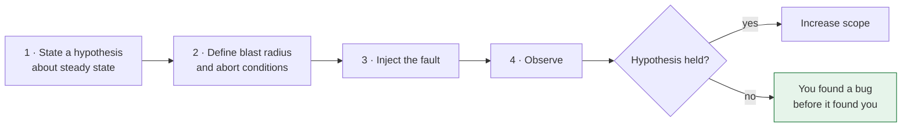

> Every resilience pattern in this course has a failure path that runs for minutes per year.
> Chaos engineering is how you find out whether those paths work, before an incident does.

| | |
|---|---|
| **Module** | [09 — Availability and DR](/modules/availability-and-dr/README) |
| **Prerequisites** | [Module 02](/modules/resilience/README), [09-01 Failover](/modules/availability-and-dr/01-redundancy-and-failover) |
| **Also known as** | fault injection, game days, resilience testing, Chaos Monkey |
| **Category** | Availability |

---

## 1. The problem

ShopFlow has timeouts, retries, circuit breakers, bulkheads, fallbacks, failover and backups.
Every one is implemented, code-reviewed and unit tested.

None of them has ever executed against a real failure in production.

During the next incident the team discovers:

- The circuit breaker opens, and the fallback path calls a service that shares the same
  connection pool — so the fallback fails too.
- Retries are enabled on a `POST` at three layers, producing 27× amplification.
- The database standby has a certificate that expired in April.
- The "degraded mode" flag was renamed six months ago and the code reads a flag that no longer
  exists, so it silently reads `false`.
- The runbook references a dashboard that was deleted.

Nothing here is exotic. **Failure-handling code is the least-executed code in the system, and
therefore the most likely to be broken.**

## 2. In plain language

Fire drills.

No organisation believes a fire drill is the same as a fire. They do them anyway, because the
drill reveals things a plan on paper cannot: the fire door that is locked, the stairwell that
is full of boxes, the assembly point that nobody can find, the person whose job it is to check
the toilets and who left the company in March.

The crucial detail: **drills happen in the real building, during working hours, with real
people.** A drill in an empty building at midnight proves the alarm makes noise and nothing
else. And the point is never the fire — it is discovering the locked door on a day when
nothing is burning.

**Where the analogy breaks down:** a fire drill inconveniences people for ten minutes. A chaos
experiment can cost real money if you do it carelessly, which is why blast radius control is
half the discipline.

## 3. How it works

Chaos engineering is not "break things randomly". It is an experimental method:



1. **Define steady state** as a measurable business metric — orders per minute, checkout
   success rate — not CPU. If the metric does not move, the system tolerated the fault.
2. **Hypothesise.** "If the payment provider returns 503 for 5 minutes, checkout success stays
   above 95% because orders are accepted in PENDING state."
3. **Inject** the smallest fault that tests the hypothesis.
4. **Observe** the steady-state metric, and everything the hypothesis assumed.
5. **Abort automatically** if the metric degrades past a threshold.

**A disproved hypothesis is a success.** You found the bug on a Tuesday with an abort switch,
rather than on Black Friday without one.

### The faults worth injecting

Ordered by value per unit of risk:

| Fault | Tests | Notes |
|---|---|---|
| **Latency injection** | Timeouts, bulkheads, deadlines | **Highest value.** Slow is more common and more damaging than down |
| Error injection (5xx) | Retries, breakers, fallbacks | Easy, safe, revealing |
| Instance termination | Health checks, LB ejection, statelessness | The original Chaos Monkey |
| Dependency blackhole | Breakers, degradation | Full outage of one dependency |
| Resource exhaustion (CPU, memory, disk) | Autoscaling, shedding, health checks | Finds gray-failure handling |
| Zone failure | Capacity planning, zone-aware routing | Needs real N+1 headroom |
| Region failure | The whole of [09-02](/modules/availability-and-dr/02-multi-region-architecture) | Quarterly at most, heavily prepared |
| Data restore drill | [09-03](/modules/availability-and-dr/03-disaster-recovery-rpo-and-rto) | The most commonly skipped and most valuable |

**Latency is the most under-tested and most important.** Most teams test "the dependency
returns 500". Almost none test "the dependency takes 8 seconds", which is what actually
happens and what actually exhausts thread pools.

### Blast radius control

Non-negotiable, in this order:

1. **Automatic abort** on the steady-state metric. Must be automatic; a human watching a
   dashboard is not a control.
2. **Scope** — one instance, then one cohort, then one zone. Never start broad.
3. **Time-boxed** — the experiment ends on its own, even if the tooling crashes.
4. **Business hours, with the team present.** Chaos at 3am on a Saturday is not an experiment;
   it is an incident you caused.
5. **Announced first, then unannounced** — once announced experiments consistently pass.
   Surprise exercises require explicit authority, a pre-agreed safe scope and abort controls;
   otherwise simulate the fault rather than injecting it into production.

### Game days

The human counterpart. A scripted scenario, run by the team, exercising detection, diagnosis,
communication and the runbooks. It finds the failures that fault injection cannot: the alert
that goes to a team that no longer exists, the runbook that references a deleted dashboard, the
escalation path that dead-ends.

**Start with game days, not with automated chaos.** They are cheaper, safer, and the findings
are usually more embarrassing.

## 4. Pseudo-code

**The experiment.**

```
record ChaosExperiment:
  name: String
  hypothesis: String
  steady_state: Metric
  steady_state_threshold: Float
  fault: Fault
  blast_radius: Selector
  duration: Duration
  abort_conditions: List<Condition>

service ChaosController:
  async fn run(e: ChaosExperiment) -> ExperimentResult:
    # 1. Establish the baseline. A system already degraded is not an experiment.
    baseline = await measure(e.steady_state, window: 10m)
    if baseline < e.steady_state_threshold:
      return Aborted("system not in steady state before injection")

    # 2. Announce, so an unrelated incident is not mistaken for the experiment
    #    and vice versa. The second direction matters more than people expect.
    announce(channel: "#ops", experiment: e.name, duration: e.duration)

    # 3. Inject, into a bounded set of targets.
    targets = e.blast_radius.resolve()
    if targets.size > MAX_BLAST_RADIUS:
      return Aborted("blast radius too large: " + targets.size)
    await inject(e.fault, targets)

    # 4. Watch continuously. Abort automatically — never rely on a human watching.
    deadline = now() + e.duration
    result = HOLDS
    while now() < deadline:
      current = await measure(e.steady_state, window: 1m)
      if current < e.steady_state_threshold or any_condition_met(e.abort_conditions):
        result = HYPOTHESIS_DISPROVED
        break
      sleep(10s)

    # 5. Always clean up, on every path.
    await remove(e.fault, targets)
    await verify_recovery(e.steady_state, e.steady_state_threshold, within: 5m)

    return ExperimentResult(e, result, observations: collect_evidence())
```

**A real ShopFlow experiment — latency, not errors.**

```
experiment "payment provider brownout":
  hypothesis: """
    If the payment provider's p50 latency rises to 5s for 10 minutes, then:
      - checkout success rate stays above 95% (orders accepted as PENDING)
      - catalogue latency p99 is unaffected (bulkhead isolation holds)
      - the payment circuit breaker opens within 60 seconds
      - no Order Service instance exceeds 80% of its thread pool
  """
  steady_state: metric("checkout.success_rate", window: 1m)
  steady_state_threshold: 0.95

  fault: Latency(target: "payment-service → psp", added: 5s, percent: 100)
         # NOT an error. Errors are easy; slow is what kills you.

  blast_radius: instances(service: "order-service", percentage: 10)   # start at 10%
  duration: 10m

  abort_conditions:
    - metric("checkout.success_rate") < 0.90
    - metric("catalog.latency_p99") > 200ms      # isolation must hold
    - metric("orders.thread_pool_utilisation") > 0.95

# Findings from the first run of this experiment, ShopFlow, week 1:
#   ✗ The breaker did not open: it counted only errors, not slow calls (02-03 §6).
#   ✗ The catalogue slowed too: both used one shared connection pool (02-04 §6).
#   ✓ Checkout degraded to PENDING correctly, once the breaker was fixed.
# Three hours of work, two real bugs, zero customer impact.
```

**A game day script — testing humans and process, not just code.**

```
game_day "region failure":
  scenario: "eu-west-1 becomes unreachable at 10:00 on a Tuesday"
  participants: [on-call, order team, platform team, incident commander]
  observers: [note-taker]

  # A surprise game day only runs with explicit approval, tested abort controls and a scope
  # that cannot create customer impact. Otherwise announce it or simulate the blackhole.
  # Deliberately NOT told to the participants in advance.
  injected: blackhole(region: "eu-west-1", from: "load-balancer")

  what_we_are_actually_testing:
    - Does anyone get paged, and how quickly?
    - Can the on-call engineer find the region failover runbook?
    - Does the runbook still match reality?
    - Does the failover procedure work when executed by someone who has not
      practised it, under time pressure?
    - Do the customer communication and status page steps happen at all?
    - Does anyone remember the residency constraint on failover targets?

  # Findings, ShopFlow's first region game day:
  #   - The page went to a rotation retired in March. 11 minutes to detection.
  #   - The runbook referenced a dashboard deleted in a migration.
  #   - Failover worked, in 4 minutes. Nobody had known that number before.
  #   - Nobody updated the status page. It was not in anyone's runbook.
  # None of these are findable by fault injection alone.
```

**Maturity progression — where to actually start.**

```
# Level 0 — do this first, this week:
#   Read your incident history. The last three postmortems are a list of
#   experiments you already know will fail. Start there.
#
# Level 1 — game days in staging. Free, safe, embarrassing.
# Level 2 — fault injection in staging, automated in CI for critical paths.
# Level 3 — announced experiments in production, tiny blast radius, business hours.
# Level 4 — unannounced experiments in production, automated, continuous.
# Level 5 — chaos as a gate: a service cannot go to production until it has
#           survived a defined suite of faults.
#
# TRAP: starting at level 4 because a conference talk described it. Netflix
# reached level 4 after years of building the observability and the automated
# remediation that make it safe. Without those, level 4 is just outages.
```

## 5. Knobs and variants

| Knob | Guidance | Failure if wrong |
|---|---|---|
| Where to start | Your last three postmortems | Random faults test random things |
| Fault type | Latency first, then errors | Error-only testing misses the common case |
| Blast radius | 1 instance → 10% → cohort → zone | Starting broad turns an experiment into an incident |
| Abort | Automatic, on a business metric | Human-watched aborts are too slow |
| Timing | Business hours, team present | Out-of-hours chaos is self-inflicted incident response |
| Announcement | Announced until consistently passing | Unannounced too early destroys trust in the practice |
| Environment | Staging → production | Staging-only proves very little; production is where the config is real |
| Steady state | A business metric | CPU and error rate miss "orders stopped but nothing errored" |

## 6. Challenges and failure modes

- **Chaos without observability.** If you cannot see the steady state, you cannot run an
  experiment — you can only cause an outage. [11-01](/modules/operations-and-evolution/01-observability)
  is a hard prerequisite.
- **Insufficient blast radius control.** An experiment that cannot be stopped is an incident.
  Automatic abort, always.
- **Testing what you already know.** Killing an instance in a well-run stateless service proves
  nothing after the first time. Move to the untested paths.
- **Only injecting errors.** Latency is more common, more damaging, and much less tested.
- **Cultural rejection.** "You want to deliberately break production?" Start with game days in
  staging, share the findings, and let the findings make the argument.
- **No follow-through.** Experiments that find bugs nobody fixes are theatre. Every disproved
  hypothesis needs a ticket with an owner.
- **Chaos during an incident.** Automated experiments must be suspended when an incident is
  open, automatically.
- **Real customer impact.** Sometimes an experiment does hurt. Be prepared to say so publicly,
  and account for it against your error budget.
- **Cargo-culting Netflix.** Their practice rests on a decade of platform investment. Copy the
  method, not the maturity level.

## 7. Alternatives

- **Integration tests with fault injection.** Cheap, fast, in CI, and they only test what you
  thought to simulate — not the shared connection pool nobody knew about.
- **Load and stress testing.** Finds capacity limits and overload behaviour. Complementary:
  chaos tests *failure*, load tests *volume*, and the interesting bugs are at the intersection.
- **Formal verification / TLA+.** Proves protocol correctness. Excellent for consensus and
  replication logic; says nothing about your configuration or your runbooks.
- **Careful review.** Necessary, insufficient. Every bug in §1 survived code review.
- **Learning from real incidents.** Free, involuntary, and unscheduled. Chaos engineering is
  the version where you choose the timing.

## 8. Trade-offs

| Advantage | Disadvantage |
|---|---|
| Failure paths are exercised on your schedule, not the universe's | Experiments can cause real customer impact |
| Finds emergent problems no unit test can | Requires mature observability first |
| Builds genuine confidence in resilience claims | Ongoing engineering time, indefinitely |
| Game days test people and process, not just code | Cultural resistance is real and rational |
| Turns "we think it fails over" into a measured number | Findings must be fixed, or the practice is theatre |

## 9. Complexity introduced

- **Operational.** Fault injection tooling; experiment scheduling and suspension during
  incidents; a findings backlog with owners; game day coordination.
- **Cognitive.** Teams must learn experimental discipline — hypothesis first, blast radius
  second, injection third.
- **Failure surface.** Experiments that cannot be aborted, faults left injected after a
  controller crash, experiments colliding with real incidents.
- **Testing.** The chaos tooling itself needs testing. A fault injector that fails to *remove*
  a fault is a novel and unpleasant outage.

## 10. Related concepts

- **Builds on:** [Module 02](/modules/resilience/README), [09-01 Failover](/modules/availability-and-dr/01-redundancy-and-failover), [09-03 DR](/modules/availability-and-dr/03-disaster-recovery-rpo-and-rto)
- **Composes with:** [11-01 Observability](/modules/operations-and-evolution/01-observability) (a hard prerequisite), [08-04 Service mesh](/modules/microservice-architecture/04-sidecar-and-service-mesh) (fault injection with no application changes)
- **Conflicts with / tension:** risk aversion, and the natural desire not to break things
- **Contrast with:** load testing — volume versus failure
- **Leads to:** [Module 10 — Performance and concurrency](/modules/performance-and-concurrency/README)

## 11. Exercises

1. **Trace it.** Write the full experiment definition for "the ERP's SFTP server becomes
   unreachable for 2 hours": hypothesis, steady state, blast radius, abort conditions. What do
   you expect to break?
2. **Extend it.** Take one resilience pattern you have implemented at work. Write the experiment
   that would prove it works, and predict — honestly — whether it would pass.
3. **Break it.** An automated chaos experiment is scheduled at 10:00. At 09:55 a real incident
   begins in the same service. Describe what happens without an interlock, and write the
   interlock.

## 12. References

- Basiri et al., "Chaos Engineering" (IEEE Software, 2016) — the Netflix formulation.
- Rosenthal, Jones et al., *Chaos Engineering: System Resiliency in Practice* (O'Reilly, 2020).
- principlesofchaos.org — the short, precise statement of the method.
- AWS Fault Injection Simulator, Gremlin, Chaos Mesh, LitmusChaos — tooling.
- Google SRE Book — Ch. 15 on postmortems; DiRT (Disaster Recovery Testing) game days.
- Casey Rosenthal, "Chaos Engineering: the history and the misconceptions".

---

**Up:** [Module 09](/modules/availability-and-dr/README) · **Previous:** [← 09-03](/modules/availability-and-dr/03-disaster-recovery-rpo-and-rto) · **Next:** [Module 10 — Performance and concurrency →](/modules/performance-and-concurrency/README)
