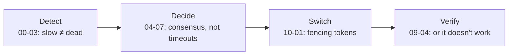

> Everything so far assumed the machines mostly stay up. This module is about losing a
> machine, a rack, a region, or a database — on purpose, and then for real.

## What you will be able to do

- Design redundancy that actually fails over, rather than redundancy that exists on a diagram.
- Decide between active-passive and active-active with the cost in front of you.
- State your RPO and RTO as numbers, and prove them by restoring.
- Run a region loss without turning it into a data-loss incident.
- Verify all of the above before an incident does it for you.

## Lessons

| # | Lesson | The failure it survives |
|---|---|---|
| 09-01 | [Redundancy and failover](/modules/availability-and-dr/01-redundancy-and-failover) | Losing an instance, a node, a zone |
| 09-02 | [Multi-region architecture](/modules/availability-and-dr/02-multi-region-architecture) | Losing a region — and serving users far from it |
| 09-03 | [Disaster recovery: RPO and RTO](/modules/availability-and-dr/03-disaster-recovery-rpo-and-rto) | Losing the data itself |
| 09-04 | [Chaos engineering](/modules/availability-and-dr/04-chaos-engineering) | Discovering all of the above at 3am |

## The one idea

**Redundancy is not availability. Failover is availability, and failover is a distributed
algorithm that can fail.**

Two of everything gives you nothing unless something detects the failure, decides correctly
who takes over, and cuts traffic across without losing writes or creating two writers. Each
of those three steps is a lesson from earlier modules arriving in a new context:

The corollary is the theme of the module: **an untested failover is not a failover.** The
single most common finding in post-incident reviews is that the redundancy worked exactly as
designed and the switch-over did not.

## ShopFlow at the end of this module

Losing any single instance is invisible. Losing an availability zone costs a brief latency
bump. Losing an entire region means a 4-minute degradation and up to 30 seconds of
unreplicated writes — a number that is written down, agreed with the business, and verified
monthly by deliberately failing a region in production.

---

**Up:** [Curriculum](/CURRICULUM) · **Previous:** [← Module 08](/modules/microservice-architecture/README) · **Next:** [09-01 Redundancy and failover →](/modules/availability-and-dr/01-redundancy-and-failover)
