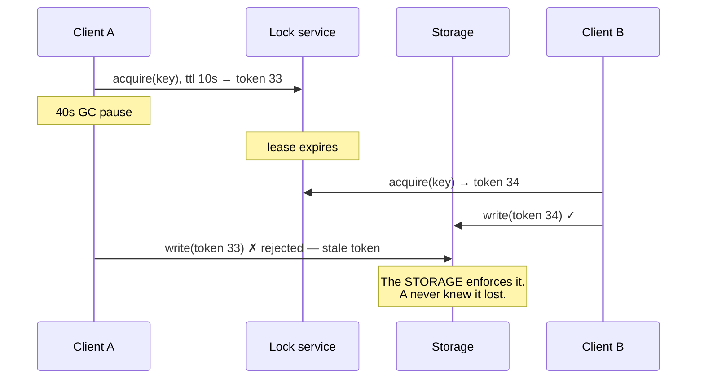

> Two writers, one record. Optimistic control detects the collision; pessimistic control
> prevents it; and across a network, only one of them is safe without a fencing token.

| | |
|---|---|
| **Module** | [10 — Performance and concurrency](/modules/performance-and-concurrency/README) |
| **Prerequisites** | [00-05 Consistency models](/modules/foundations/05-consistency-models-cap-and-pacelc), [04-07 Consensus](/modules/data-and-consistency/07-consensus-and-leader-election) |
| **Also known as** | optimistic/pessimistic locking, OCC, leases, fencing tokens |
| **Category** | Consistency |

---

## 1. The problem

Two ShopFlow support agents open the same order. Both see `notes: "customer called"`. Agent A
adds a line and saves. Agent B, whose page was loaded before A saved, adds a different line
and saves. **A's note is gone**, silently. Nobody was told.

The same shape, with money: one unit of SKU-42 remains. Two checkouts read `available: 1` at
the same millisecond, both find it sufficient, both write `available: 0`. Two customers are
sold one unit.

```
read (1) → check (ok) → write (0)
     read (1) → check (ok) → write (0)
```

The read-modify-write cycle is not atomic, and across a network there is no `synchronized`
keyword that helps.

## 2. In plain language

A shared shopping list on the fridge.

**Optimistic:** everyone writes freely. When you go to update it, you check whether the list
still looks the way it did when you started. If someone else has written since, you re-read and
redo your change. Most of the time nobody has, so this costs nothing. If everyone edits the
list constantly, you spend all day re-reading.

**Pessimistic:** you take the list off the fridge while you edit it. Nobody else can touch it —
guaranteed correct, and everyone else stands in the kitchen waiting. And if you take the list
to your desk and then go to lunch, the list is unavailable until someone decides you have been
gone long enough.

That last sentence is the whole difficulty of distributed locking. **Deciding someone has "been
gone long enough" is a guess, and if you guess wrong there are two lists.** The fix is not a
better guess; it is writing a number on the list that increases each time it is taken, so the
fridge itself refuses a list with a stale number.

**Where the analogy breaks down:** you would notice the list had changed. Software overwrites
silently, which is why lost updates are so hard to detect after the fact.

## 3. How it works

### Optimistic concurrency control

Read a version with the data; include it in the write; the write fails if the version has
changed.

```
UPDATE orders SET notes = ?, version = 4 WHERE id = ? AND version = 3
-- 0 rows updated → someone else won → re-read, re-apply, retry
```

Cost: near zero when conflicts are rare. **Correct by construction** — the database's own
atomicity does the work, and there is no lock to leak, expire or fence.

Use when: conflicts are rare (< ~10%), the operation is retryable, and the user can be told to
retry.

### Pessimistic concurrency control

Acquire an exclusive lock, do the work, release.

```
SELECT * FROM stock WHERE sku = ? FOR UPDATE   -- others block here
```

Cost: throughput drops to `1/hold_time` per key, and holding a lock across a network call is
catastrophic ([00-04](/modules/foundations/04-latency-throughput-and-back-of-envelope)).

Use when: conflicts are common, retrying is expensive, or the operation genuinely cannot be
redone.

### Distributed locks and why leases are not locks

A lock in a database transaction is released when the transaction ends — the database knows.
A *distributed* lock held by a process has no such guarantee: the process can be paused by GC,
descheduled or partitioned, and there is no way for the lock service to distinguish that from
slow work.

So distributed locks are **leases**: they expire. Which means:

**A lease holder may lose the lease without knowing it, and continue working.**



**Fencing tokens are what make a lease safe.** The lease carries a monotonically increasing
number; every write includes it; the storage rejects any token lower than the highest seen.
Without fencing, a distributed lock is a latency optimisation with a correctness-shaped hole.

### Avoiding the problem entirely

The best options are the ones that need neither:

- **Atomic operations.** `UPDATE stock SET qty = qty - 1 WHERE sku = ? AND qty >= 1`. One
  statement, atomic, no read-modify-write, no lock, no version. **Always look for this first.**
- **Commutative operations / CRDTs.** Increments and set-unions can be applied in any order.
- **Single writer per key.** Partition so one consumer owns a key
  ([05-02](/modules/messaging-and-eip/02-point-to-point-and-publish-subscribe)). Concurrency
  disappears by construction.
- **Reservations with expiry.** Convert contention into leasing — ShopFlow's `Reservation` is
  exactly this.

## 4. Pseudo-code

**Before — the lost update, and the oversell.**

```
handler update_notes(id: OrderId, notes: String) -> Result<Unit, Error>:
  o = orders.get(id)                       # agent A and agent B both read v3
  orders.put(id, o with { notes: notes })  # TRAP: last writer silently wins
  return Ok(unit)

handler reserve(sku: Sku, qty: Int) -> Result<Unit, StockError>:
  s = stock.get(sku)                       # both read available: 1
  if s.available < qty: return Err(OutOfStock)
  stock.put(sku, s with { available: s.available - qty })   # both write 0
  return Ok(unit)                          # TRAP: one unit sold twice
```

**Optimistic — the default answer.**

```
record Order:
  id: OrderId
  notes: String
  version: Int

handler update_notes(id: OrderId, notes: String, expected_version: Int)
    -> Result<Order, Error>:
  for attempt in 1..3:
    o = orders.get(id)?

    # The client tells us what it saw. If it saw something older, it is editing
    # a stale view and must be told — not silently overwritten.
    if o.version != expected_version:
      return Err(Conflict(current: o, your_version: expected_version))
      # WHY surface it: the agent can see A's note and merge deliberately.
      # Auto-retrying here would just reintroduce the lost update.

    updated = o with { notes: notes, version: o.version + 1 }
    if orders.compare_and_swap(id, expected: o, value: updated):
      return Ok(updated)
    # CAS failed: someone wrote between our read and our write. Re-read and retry.
  return Err(Contended)
```

**The atomic alternative — no versions, no locks, no retries.**

```
handler reserve(sku: Sku, qty: Int) -> Result<Unit, StockError>:
  # One atomic statement. The condition and the decrement happen together.
  # This is strictly better than any locking scheme and is available far more
  # often than people assume. Reach for it first, every time.
  rows = stock.update_where(sku: sku, available_gte: qty,
                            set: {available: expr("available - " + qty)})
  return rows == 1 ? Ok(unit) : Err(OutOfStock)
```

**Pessimistic with fencing — for when you genuinely need a lock across services.**

```
service ReservationCoordinator:
  uses locks: Client<LockService>
  uses stock: FencedStore<Sku, StockLevel>

  async fn reserve_batch(order_id: OrderId, lines: List<OrderLine>)
      -> Result<Reservation, StockError>:

    # Canonicalise first: duplicate SKU lines need one lock and one decrement.
    requested = Map<Sku, Int>()
    for line in lines:
      requested[line.sku] = (requested.get(line.sku) ?? 0) + line.qty
    # TRAP: locking multiple keys in arbitrary order deadlocks. Sort them.
    keys = requested.keys().sorted()
    held = Map<Sku, Lease>()

    try:
      for k in keys:
        lease = await locks.acquire("stock:" + k, ttl: 5s) timeout 200ms
        if lease is None:
          return Err(Contended)              # fail fast; do not queue behind a lock
        held.put(k, lease)

      for sku in keys:
        lease = held.get(sku).unwrap()
        qty = requested.get(sku).unwrap()
        s = stock.get(sku)
        if s.available < qty: return Err(OutOfStock(sku))

        # The fencing token travels with the write. If our lease expired during
        # a GC pause and someone else took it, THIS call fails — the storage
        # rejects a token lower than the highest it has seen (04-07).
        if not stock.write_fenced(sku,
                                  s with { available: s.available - qty },
                                  token: lease.token):
          return Err(LeaseLost)              # we were the zombie. Correct outcome.

      return Ok(Reservation(...))
    finally:
      for lease in held.values(): lease.release()  # leaked leases expire, but slowly

    # COST: this holds up to 5 locks across a network for the duration. Throughput
    # on a hot SKU is now 1/hold_time. Use only when the atomic update above
    # genuinely cannot express the operation.
```

**Reservations — turning contention into leasing.**

```
service InventoryService:
  uses stock: Store<Sku, StockLevel>
  uses reservations: Store<UUID, Reservation>

  handler reserve(cmd: ReserveStock) -> Result<Reservation, StockError>:
    r = Reservation(id: uuid(), order_id: cmd.order_id,
                    sku: cmd.sku, qty: cmd.qty,
                    expires_at: now() + 15m)
    atomically:
      rows = stock.update_where(sku: cmd.sku, available_gte: cmd.qty,
                                set: {available: expr("available - " + cmd.qty),
                                      reserved:  expr("reserved + " + cmd.qty)})
      if rows == 0: return Err(OutOfStock)
      reservations.put(r.id, r)
    return Ok(r)

  # The expiry is what makes this safe without any lock at all: an abandoned
  # checkout returns stock automatically, and no coordinator has to notice.
  every 1m:
    if lease = election.campaign(role: "reservation-sweeper"):
      for r in reservations.query(expires_at < now()):
        atomically:
          stock.update(r.sku, {available: expr("available + " + r.qty),
                               reserved:  expr("reserved - " + r.qty)})
          reservations.delete(r.id)
```

## 5. Knobs and variants

| Knob | Guidance | Failure if wrong |
|---|---|---|
| Strategy | Atomic > optimistic > pessimistic | Reaching for locks first is the common mistake |
| Conflict rate threshold | Optimistic below ~10% conflicts | High-conflict optimistic loops burn CPU and never converge |
| Retry on conflict | Auto-retry machine writes; surface human edits | Auto-retrying a human edit silently loses their work |
| Lock scope | The narrowest key possible | Coarse locks serialise unrelated work |
| Lock hold time | Never across a network call | A remote call inside a lock caps throughput at 1/RTT |
| Lease TTL | 2–10× expected hold time | Short: spurious expiry. Long: slow recovery from a crash |
| Fencing | **Mandatory for distributed locks** | Without it, the lock is decorative |
| Multi-key locking | Always in a globally sorted order | Unsorted acquisition deadlocks |

## 6. Challenges and failure modes

- **Silent lost updates.** The default behaviour of a naive read-modify-write, and it produces
  no error and no log line. Versioning is what turns it into a visible conflict.
- **Leases without fencing.** Covered above. The most common distributed-locking bug, and the
  one most likely to be defended as "we set a short TTL".
- **Locks held across network calls.** A 200ms remote call inside a lock caps that key at 5
  operations per second, permanently.
- **Deadlock from unordered multi-key acquisition.** Sort keys, always.
- **Optimistic livelock under high contention.** Every attempt loses to another; nobody
  progresses. Cap the retries and fail with a clear error.
- **Version stored but not checked.** A `version` column exists and every query ignores it.
  Common, and it looks like the pattern is implemented.
- **Client-supplied versions that are trusted blindly.** A client sending `version: 0` overwrites
  anything. Validate.
- **Lock service as a critical dependency.** If acquiring a lock requires a service that is down,
  the operation fails. Decide whether to fail open or closed, per operation.
- **Clock skew and lease expiry.** Two nodes disagree about whether a lease has expired. Only
  fencing resolves this.

## 7. Alternatives

- **Atomic conditional updates.** The best answer whenever the operation can be expressed as
  one statement.
- **Single writer per key.** Partition work so one consumer owns each key. Removes concurrency
  entirely ([03-04](/modules/scalability/04-partitioning-and-sharding)).
- **CRDTs.** Data types that merge deterministically. No conflicts to resolve by definition;
  constrained data model.
- **[Event sourcing](/modules/data-and-consistency/05-event-sourcing).** Append with an
  expected stream version — optimistic concurrency built into the storage model.
- **Serialisable transactions.** Let the database detect conflicts. Correct, and it moves the
  contention rather than removing it.
- **Accept the conflict commercially.** Airlines oversell deliberately and compensate.
  Sometimes the cheapest correct answer.

## 8. Trade-offs

| Advantage | Disadvantage |
|---|---|
| Optimistic: no locks, no coordination, near-zero cost when conflicts are rare | Wasted work and retries when they are not |
| Optimistic: conflicts become visible and resolvable by a human | Every write path needs a version, checked |
| Pessimistic: guaranteed, no retry logic | Throughput on a hot key collapses to 1/hold_time |
| Pessimistic: simple to reason about locally | Distributed locks need leases, fencing and a lock service |
| Atomic updates: correct with no machinery at all | Only expressible for some operations |

## 9. Complexity introduced

- **Operational.** Conflict-rate and lock-wait metrics; lock service availability; sweeper jobs
  for expired reservations; alerts on livelock.
- **Cognitive.** Engineers must distinguish "same operation twice" (idempotency,
  [01-03](/modules/communication/03-delivery-guarantees-and-idempotency)) from "different
  operations colliding" (this lesson). They are constantly confused.
- **Failure surface.** Lost updates, livelock, deadlock, zombie lease holders, lock service
  outages.
- **Testing.** Requires deliberately concurrent tests: two writers, same key, same instant. Most
  suites are sequential and would pass against completely broken code.

## 10. Related concepts

- **Builds on:** [00-05 Consistency models](/modules/foundations/05-consistency-models-cap-and-pacelc), [04-07 Consensus](/modules/data-and-consistency/07-consensus-and-leader-election)
- **Composes with:** [04-05 Event sourcing](/modules/data-and-consistency/05-event-sourcing), [03-04 Partitioning](/modules/scalability/04-partitioning-and-sharding), [09-01 Failover](/modules/availability-and-dr/01-redundancy-and-failover)
- **Conflicts with / tension:** throughput — every correctness mechanism here costs concurrency
- **Contrast with:** [01-03 Idempotency](/modules/communication/03-delivery-guarantees-and-idempotency) — the *same* operation repeated versus *different* operations colliding
- **Leads to:** [10-02 Asynchronous processing and work queues](/modules/performance-and-concurrency/02-asynchronous-processing-and-work-queues)

## 11. Exercises

1. **Trace it.** Two agents edit order notes concurrently under the optimistic version. Walk
   through both. What does the second agent see, and why is that better than an automatic retry?
2. **Extend it.** ShopFlow sells a limited-edition item: 100 units, 5,000 concurrent buyers.
   Compare the atomic update, optimistic retry and pessimistic lock approaches. Which survives,
   and what does the losing 98% experience?
3. **Break it.** A lease has a 30-second TTL and the holder does a 25-second batch job. Construct
   the timeline where two holders write concurrently, then show that raising the TTL to 5 minutes
   does not fix it.

## 12. References

- Martin Kleppmann, "How to do distributed locking" (2016) — the definitive fencing-token argument.
- Martin Kleppmann, *Designing Data-Intensive Applications* — Ch. 7, concurrency and isolation.
- Bernstein, Hadzilacos, Goodman, *Concurrency Control and Recovery in Database Systems* (1987).
- Redis documentation on Redlock — and the debate about it, which is more instructive than either position.
- Shapiro et al., "Conflict-free Replicated Data Types" (2011).

---

**Up:** [Module 10](/modules/performance-and-concurrency/README) · **Previous:** [← Module 09](/modules/availability-and-dr/README) · **Next:** [10-02 Asynchronous processing and work queues →](/modules/performance-and-concurrency/02-asynchronous-processing-and-work-queues)
