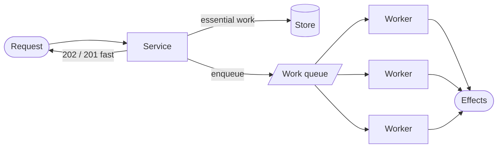

> The cheapest way to make a request fast is to stop doing the work during the request. What
> you buy with latency is paid for in eventual consistency and a queue to operate.

| | |
|---|---|
| **Module** | [10 — Performance and concurrency](/modules/performance-and-concurrency/README) |
| **Prerequisites** | [01-02 Asynchronous messaging](/modules/communication/02-asynchronous-messaging), [02-06 Backpressure](/modules/resilience/06-load-shedding-and-backpressure) |
| **Also known as** | background jobs, task queues, deferred processing, batch processing |
| **Category** | Performance |

---

## 1. The problem

ShopFlow's checkout takes 1,355ms. The breakdown:

| Step | Time | Does the customer need it before seeing "order confirmed"? |
|---|---|---|
| Reserve stock | 50ms | Yes |
| Charge card | 800ms | Yes |
| Save order | 5ms | Yes |
| Send confirmation email | 300ms | **No** |
| Index for search | 120ms | **No** |
| Update analytics | 80ms | **No** |

500ms of the customer's wait — 37% — is spent on work whose result they will never observe.
Worse, the email provider having a bad hour makes checkout fail, so a mail server outage stops
people buying shoes.

And on sale days: 600 orders/s hits a warehouse system that accepts 50/s. Synchronously, 92%
of requests fail.

## 2. In plain language

A restaurant that seats you, takes your order, and hands you the bill — while the dishwasher
runs, the receipt is filed, and the loyalty points are calculated. All of those must happen.
None needs to happen while you stand at the till.

The in-tray on the manager's desk is the queue. Work goes in; it comes out when there is
capacity. During the lunch rush the tray gets deep and everything still gets done, later.

Two things follow. **The tray absorbs a rush**, which is why a restaurant can serve 200 covers
an hour with staff who cannot file 200 receipts an hour. And **you must be able to tell the
customer something honest** — "your receipt will be emailed" rather than pretending it has
already happened.

**Where the analogy breaks down:** the manager can see the tray is deep. A queue's depth is
invisible unless someone instrumented it, which is why a stuck consumer can go unnoticed for
days.

## 3. How it works



### What may be deferred

The test: **would the user notice, before their next interaction, if this had not happened
yet?**

| Defer | Do not defer |
|---|---|
| Emails, SMS, push notifications | Anything shown in the response |
| Search indexing | Payment authorisation |
| Analytics and reporting | Stock reservation for the item being bought |
| Thumbnail generation, transcoding | Anything the user will immediately re-read |
| Webhook delivery to partners | Authorisation checks |
| Recalculating recommendations | |

**The trap is "the user will immediately re-read it."** Deferring the write that populates the
page the user is redirected to produces a blank page and a support ticket. Defer the *effect*,
not the *state the user just created*.

### Enqueue reliably

The work item and the state change must commit together, or the work is lost. This is exactly
the [outbox](/modules/data-and-consistency/03-transactional-outbox) problem, and it has the
same solution — put the job in a table in the same transaction, not in a broker outside it.

### Batching

Processing 1,000 items in one operation is dramatically cheaper than 1,000 operations, because
per-operation overhead (round trip, transaction, index update) dominates. Batching trades
latency for throughput; size the batch by the latency you can afford, and always flush on a
timer as well as on size, or a partial batch waits forever for traffic that never comes.

### Priority and isolation

One queue for everything means a 40,000-item bulk export delays a password reset email. Either
separate queues per class of work, or a priority queue — with **anti-starvation**, so low
priority work eventually runs rather than never running.

### Scheduled and recurring work

Needs [leader election](/modules/data-and-consistency/07-consensus-and-leader-election), or
every instance runs the nightly job. And it needs the same idempotency as everything else,
because a retried scheduled job is a re-run.

## 4. Pseudo-code

**Before — everything on the request path.**

```
handler place_order(cmd) -> Result<Order, OrderError>:
  order = charge_and_save(cmd)?
  await email.send_confirmation(order)      # 300ms, and its outage fails checkout
  await search.index(order)                 # 120ms
  await analytics.record(order)             # 80ms
  await warehouse.create_pick_list(order)   # caps at 50/s; we do 600/s
  return Ok(order)
```

**The pattern — enqueue transactionally, respond immediately.**

```
record Job:
  id: UUID
  type: String
  payload: Bytes
  priority: Priority
  run_after: Instant
  attempts: Int = 0
  max_attempts: Int = 10
  idempotency_key: String

service OrderService:
  uses orders: Store<OrderId, Order>
  uses jobs: Store<UUID, Job>              # SAME database as orders. Non-negotiable.

  @timeout(2s)
  handler place_order(ctx, cmd) -> Result<Order, OrderError>:
    order = await charge_and_save(ctx, cmd)?

    # The state change and the jobs commit together. A crash here loses neither.
    # Enqueuing to an external broker instead would be the dual-write bug (04-03).
    atomically:
      orders.put(order.id, order)
      jobs.put(uuid(), Job(type: "send_confirmation", payload: serialize(order),
                           priority: HIGH, run_after: now(),
                           idempotency_key: "confirm:" + order.id))
      jobs.put(uuid(), Job(type: "index_order", ..., priority: NORMAL))
      jobs.put(uuid(), Job(type: "record_analytics", ..., priority: LOW))
      jobs.put(uuid(), Job(type: "create_pick_list", ..., priority: HIGH))

    return Ok(order)      # ~855ms instead of 1355ms, and the email provider's
                          # outage can no longer stop anyone buying anything.
```

**The worker — with the details that matter.**

```
service JobWorker:
  uses jobs: Store<UUID, Job>
  state handlers: Map<String, (Job) => Result<Unit, Error>>

  every 100ms:
    # Claim atomically: N workers must not process the same job.
    batch = jobs.claim(worker_id: MY_ID, lease: 5m, limit: 10,
                       where: "run_after <= now() AND attempts < max_attempts",
                       order_by: "priority DESC, run_after ASC")

    for job in batch:
      # Jobs are retried, so handlers must be idempotent (04-04). The key is
      # deterministic, so a retry of "confirm order 42" dedupes against the first.
      if processed.get(job.idempotency_key) is Some:
        jobs.delete(job.id); continue

      try:
        handlers[job.type](job)
        atomically:
          processed.put(job.idempotency_key, now())
          jobs.delete(job.id)

      catch TransientError as e:
        jobs.update(job.id, {attempts: job.attempts + 1,
                             run_after: now() + backoff(job.attempts),
                             lease: None})
        if job.attempts + 1 >= job.max_attempts:
          dead_letter(job, e)                 # 05-06

      catch PermanentError as e:
        dead_letter(job, e)                   # do not waste 10 attempts on the certain

  # Reclaim jobs from workers that died mid-job. Without this they are stuck
  # "in progress" forever and the effect never happens.
  every 1m:
    jobs.release_expired_leases()

  # The alert that matters. Queue depth alone is misleading — a deep queue
  # draining fast is fine; a shallow queue that is not moving is not.
  every 30s:
    metrics.gauge("jobs.depth", jobs.count(where: "run_after <= now()"))
    oldest = jobs.oldest_pending()
    if oldest is Some:
      age = now() - oldest.run_after
      metrics.gauge("jobs.oldest_age_s", age, tags: {priority: oldest.priority})
      if age > sla_for(oldest.priority):
        alert("job queue behind SLA", priority: oldest.priority, age: age)
```

**Batching and rate matching — absorbing a burst the downstream cannot take.**

```
service WarehouseWorker:
  uses jobs: Queue<PickList>
  uses warehouse: Client<LegacyWarehouse>    # hard cap: 50 req/s
  state limiter: RateLimiter(rate: 45/s)     # 10% headroom for retries
  state batch: List<PickList> = []

  every 50ms:
    batch.append_all(jobs.receive_up_to(100 - batch.size))

    # Flush on size OR on time. Time matters: without it, a partial batch waits
    # forever during a quiet period and the last few orders never ship.
    if batch.size >= 100 or oldest_in(batch) > 2s:
      limiter.acquire()
      await warehouse.submit_batch(batch) timeout 10s    # 100 items, 1 call
      batch.clear()
    # 600 orders/s arriving, 45 batches/s × 100 = 4500/s capacity when needed,
    # and the queue absorbs the difference during the burst.
```

**Telling the user the truth.**

```
handler get_order(ctx, id) -> OrderView:
  order = orders.get(id)?
  pending = jobs.count(where: "idempotency_key LIKE '%:" + id + "'")
  return OrderView(order,
                   # Surfacing this turns "where is my confirmation email?" from
                   # a support ticket into a visible, self-explaining state.
                   confirmation_sent: pending == 0,
                   processing: pending > 0)
```

## 5. Knobs and variants

| Knob | Guidance | Failure if wrong |
|---|---|---|
| What to defer | Effects, never state the user just created | Deferring the state produces a blank page after redirect |
| Enqueue | Same transaction as the state change | External enqueue loses jobs on a crash |
| Queue backing | DB table (simple) → broker (scale) | Premature broker adoption adds ops for nothing |
| Priority | Separate queues per class | One queue means bulk work delays urgent work |
| Anti-starvation | Age-based promotion | Strict priority starves low-priority work forever |
| Batch size | Bounded by acceptable latency | Large batches trade p99 for throughput |
| Batch flush | Size **or** timer | Size-only means a partial batch never flushes |
| Lease reclaim | Every minute | Without it, jobs from dead workers are stuck forever |
| Alerting | Oldest-job age, per priority | Depth alone misses a stalled queue that is small |

## 6. Challenges and failure modes

- **Deferring something the user immediately reads.** The redirect lands on a page whose data
  has not been written yet. Defer effects, not the user's own state.
- **Queue backlog with no error rate.** Everything reports success while jobs are six hours
  behind. Alert on the age of the oldest pending job, per priority.
- **Jobs stuck in progress.** A worker died holding a lease. Without reclaim, the job never
  runs and never errors.
- **Non-idempotent handlers.** Retries and lease reclaim both re-run jobs. A non-idempotent
  handler sends four emails.
- **Priority inversion / starvation.** Strict priority means low-priority work never runs during
  a sustained busy period.
- **Unbounded queue growth.** Producers outpace consumers indefinitely. Needs
  [backpressure or shedding](/modules/resilience/06-load-shedding-and-backpressure) at the
  producer, not just more workers.
- **Poison jobs.** One job that always fails, retried forever. Attempt limits and a
  [DLQ](/modules/messaging-and-eip/06-dead-letter-channel-and-poison-messages).
- **Thundering herd on recovery.** After an outage, 400,000 queued jobs execute at once against
  a downstream that just came back. Rate-limit the drain.
- **Losing observability across the boundary.** The trace ends at the enqueue. Propagate
  `trace_id` into the job so the async half is visible
  ([11-01](/modules/operations-and-evolution/01-observability)).

## 7. Alternatives

- **Do it synchronously but faster.** If the work is 20ms, the queue's complexity is not worth
  it.
- **Fire-and-forget in-process** (`spawn`). Zero infrastructure; the work is lost on restart or
  crash. Acceptable only for genuinely disposable effects.
- **Client-side polling / webhooks.** Return `202` with a status URL. Honest, and it pushes work
  to the client.
- **Streaming** ([01-02](/modules/communication/02-asynchronous-messaging)). For continuous
  rather than discrete work, a log and stream processors fit better than a job queue.
- **Scheduled batch.** For work with no latency requirement at all — nightly reconciliation,
  monthly invoicing — a batch job is simpler than a queue.

## 8. Trade-offs

| Advantage | Disadvantage |
|---|---|
| Request latency drops to the essential work only | The effect is eventually consistent, and the UI must say so |
| A failing non-essential dependency cannot fail the request | Queue, workers and monitoring to operate |
| Queues absorb bursts the downstream cannot take | Backlogs are invisible without deliberate instrumentation |
| Retries become cheap and patient (minutes, not milliseconds) | Every handler must be idempotent |
| Batching multiplies throughput | Batching increases per-item latency |

## 9. Complexity introduced

- **Operational.** Worker fleet to size and scale; queue depth and oldest-age dashboards per
  priority; DLQ and replay; lease reclaim; drain rate-limiting after outages.
- **Cognitive.** "When does this actually happen?" becomes a real question, and the answer is
  "later, usually".
- **Failure surface.** Backlogs, stuck leases, poison jobs, starvation, herd on recovery, lost
  traces.
- **Testing.** Must cover: job retried, job run twice, worker dies mid-job, queue backed up.

## 10. Related concepts

- **Builds on:** [01-02 Asynchronous messaging](/modules/communication/02-asynchronous-messaging), [04-03 Outbox](/modules/data-and-consistency/03-transactional-outbox)
- **Composes with:** [04-04 Idempotent consumer](/modules/data-and-consistency/04-idempotent-consumer-and-inbox), [02-06 Backpressure](/modules/resilience/06-load-shedding-and-backpressure), [05-06 Dead letter channel](/modules/messaging-and-eip/06-dead-letter-channel-and-poison-messages)
- **Conflicts with / tension:** immediate consistency and the user's mental model
- **Contrast with:** [05-02 Publish/subscribe](/modules/messaging-and-eip/02-point-to-point-and-publish-subscribe) — work distribution versus event distribution
- **Leads to:** [10-03 Resource pooling](/modules/performance-and-concurrency/03-resource-pooling)

## 11. Exercises

1. **Trace it.** ShopFlow moves four steps off the request path. Compute the new p50 and the new
   checkout availability given the email provider is 99.5% available. Which number improved more?
2. **Extend it.** The warehouse is down for 3 hours during a sale (600 orders/s). Compute the
   backlog, the drain time at 45/s, and what you would tell customers. What would you change?
3. **Break it.** Priority is strict: HIGH before NORMAL before LOW. A bulk export enqueues
   200,000 HIGH-priority jobs by mistake. Describe the next six hours, and add anti-starvation.

## 12. References

- Hohpe & Woolf, *Enterprise Integration Patterns* — Competing Consumers, Message Dispatcher.
- Sidekiq / Celery / Que documentation — mature job queue design, especially around idempotency and reclaim.
- Brandur Leach, "Transactionally Staged Job Drains in Postgres" — the transactional enqueue pattern, done well.
- Google SRE Book — Ch. 25, data processing pipelines.
- Little's Law, again: [00-04](/modules/foundations/04-latency-throughput-and-back-of-envelope).

---

**Up:** [Module 10](/modules/performance-and-concurrency/README) · **Previous:** [← 10-01](/modules/performance-and-concurrency/01-concurrency-control) · **Next:** [10-03 Resource pooling →](/modules/performance-and-concurrency/03-resource-pooling)
