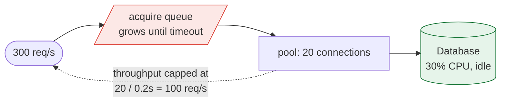

> Connection pools are the bulkhead you already have and probably sized by copying a default.
> They are also the most common invisible ceiling on a system's throughput.

| | |
|---|---|
| **Module** | [10 — Performance and concurrency](/modules/performance-and-concurrency/README) |
| **Prerequisites** | [00-04 Little's Law](/modules/foundations/04-latency-throughput-and-back-of-envelope), [02-04 Bulkhead](/modules/resilience/04-bulkhead) |
| **Also known as** | connection pooling, object pools, thread pools |
| **Category** | Performance |

---

## 1. The problem

ShopFlow's Order Service is at 25% CPU, its database is at 30% CPU, and requests are taking 4
seconds. Nothing is saturated. Everything is slow.

The connection pool has 20 connections. Queries take 200ms. Its steady-state service capacity is
`20 / 0.2 = 100 requests per second`, assuming the database can sustain those queries. Traffic
is 300 req/s, so arrivals exceed capacity by 200 req/s: the acquire queue grows until requests
time out or load is shed.

Meanwhile the opposite failure, one team over: 40 instances × 100 connections = 4,000
connections to a database configured for 500. Connections are refused, the application retries,
and the database spends its CPU on connection handshakes rather than queries.

**Both teams "just used the default."**

## 2. In plain language

A bank branch with a fixed number of tellers.

Too few and a queue forms out the door, even though the tellers are only busy half the time —
the constraint is the number of counters, not the speed of the staff. Too many and the branch
is crowded, the manager cannot supervise, and the shared systems everyone queries slow down for
everyone.

The number that matters is not the number of customers or the speed of a transaction. It is
**customers per hour × hours per transaction**, which is exactly how many counters you need
open. Everyone knows this intuitively about banks and almost nobody applies it to connection
pools.

**Where the analogy breaks down:** a customer who waits too long leaves. A request waits until
its timeout, holding a thread the whole time, making everything worse.

## 3. How it works

### Why pool at all

Establishing a database connection costs a TCP handshake, a TLS handshake, and authentication —
typically 5–50ms, and server-side memory. Doing that per request is unaffordable. So
connections are created once and reused.

The same applies to HTTP connections (which is why keep-alive exists), threads, and any
expensive-to-create object.

### Sizing

Little's Law, from [00-04](/modules/foundations/04-latency-throughput-and-back-of-envelope):

```
pool_size = arrival_rate × service_time × headroom
```

ShopFlow orders: 300 req/s × 0.2s × 1.5 = **90 connections** across the fleet. With 10
instances, 9 each — not 20 each, and not 100 each.

Two constraints bound this from above:

1. **The database's connection limit**, divided by the number of instances, *including* those
   present during a rolling deploy (briefly N+1) and any batch jobs or admin tools.
2. **The database's useful concurrency.** More connections than the database can usefully
   execute in parallel makes it *slower*, not faster — context switching and lock contention
   rise. A common heuristic for a spinning-disk-era database is `(2 × cores) + effective_spindles`;
   for modern SSD-backed instances, somewhere between 2× and 4× cores is a reasonable starting
   point. It is almost always a smaller number than people expect.

**If the required pool size exceeds what the database can support, adding application instances
will not help.** You need a proxy-level pooler, faster queries, or fewer of them.

### The three timeouts

Every pool has three, and they do different things:

| Timeout | Meaning | Typical |
|---|---|---|
| **Acquire / wait** | How long to wait for a free connection | 1–5s, and it must fit the request budget |
| **Connect** | How long to establish a new connection | 1–5s |
| **Idle / max lifetime** | When to close a connection proactively | 10–30 min |

**Max lifetime matters more than it looks.** Without it, connections live forever and never
rebalance across database replicas after a failover, and they accumulate server-side state and
memory. With it, connections are recycled gradually — and jitter it, or they all recycle at
once.

### Pool exhaustion

The characteristic signature, and it is unmistakable once you have seen it:

- Application CPU low.
- Database CPU low.
- Latency high, dominated by *acquire wait* rather than query time.
- Throughput flat regardless of load.

**Instrumenting acquire-wait time is what makes this diagnosable in one glance instead of one
week.** It is the single most valuable metric in this lesson and it is almost never collected.



Note where the queue is, and where it is not. The database is healthy and underused; the
constraint is a number in a config file. Adding application instances makes this *worse*,
because each brings its own pool and the database's connection limit is fixed.

## 4. Pseudo-code

**Before — the default.**

```
service OrderService:
  uses db: Store<OrderId, Order> with pool(size: 20)   # the framework default
  # 300 req/s × 200ms → needs 60. We have 20. Throughput caps at 100/s and
  # the acquire queue grows until the acquire timeout sheds excess load.
```

**The pattern — sized, bounded, instrumented, and partitioned.**

```
service ConnectionPool:
  min_size: Int
  max_size: Int
  acquire_timeout: Duration
  max_lifetime: Duration
  idle_timeout: Duration

  state available: Channel<Connection>
  state in_use: Int = 0
  state waiting: Int = 0

  async fn acquire(ctx: RequestContext) -> Result<Connection, PoolError>:
    started = now()
    waiting += 1
    try:
      # Never wait longer than the request has left. Acquiring a connection at
      # t+1.9s for a request that dies at t+2.0s is pure waste.
      budget = min(acquire_timeout, remaining(ctx))
      c = await available.receive() timeout budget

      if now() - c.created_at > max_lifetime:
        c.close(); c = await create_connection()      # recycle gradually
      in_use += 1
      return Ok(c)

    catch TimeoutError:
      # This metric is the diagnosis. Without it, pool exhaustion looks
      # identical to "the database is slow", and teams spend days on the wrong one.
      metrics.increment("pool.acquire_timeout", tags: {pool: name})
      return Err(PoolExhausted)
    finally:
      waiting -= 1
      metrics.histogram("pool.acquire_wait_ms", now() - started, tags: {pool: name})

  fn release(c: Connection):
    in_use -= 1
    if c.is_broken() or now() - c.created_at > max_lifetime:
      c.close()
    else:
      available.send(c)

  every 10s:
    metrics.gauge("pool.in_use", in_use, tags: {pool: name})
    metrics.gauge("pool.waiting", waiting, tags: {pool: name})
    metrics.gauge("pool.utilisation", in_use / max_size, tags: {pool: name})
    # Sustained utilisation > 0.8 means the pool is the constraint.
```

**Sizing, derived rather than guessed.**

```
service PoolSizer:
  fn size_for(peak_rps: Float, service_time: Duration,
              instances: Int, db_max_connections: Int) -> Int:
    # 1. What Little's Law says we need, fleet-wide.
    needed_total = peak_rps * service_time.seconds * 1.5      # 1.5 = headroom
    per_instance = ceil(needed_total / instances)

    # 2. What the database can give us. Reserve capacity for:
    #    +1 instance during a rolling deploy, admin tools, batch jobs, monitoring.
    db_budget = floor(db_max_connections * 0.8 / (instances + 1))

    if per_instance > db_budget:
      # This is a real architectural finding, not a tuning problem. Adding
      # instances will make it WORSE, because each brings its own pool.
      log.error("pool requirement exceeds database capacity",
                needed: per_instance, available: db_budget,
                remedy: "reduce query time, add a proxy pooler, or shard")
    return min(per_instance, db_budget)

  # ShopFlow orders: 300 rps, 200ms, 10 instances, db_max = 500
  #   needed_total = 90 → per_instance = 9
  #   db_budget    = 500 × 0.8 / 11 = 36
  #   → 9 per instance. Not the default 20, and nowhere near 100.
```

**Partitioned pools — a bulkhead you get for free.**

```
service OrderService:
  # Same physical database, different pools. A slow analytics query cannot
  # consume the connections checkout needs. This is 02-04, at the pool layer,
  # and it costs nothing to arrange.
  uses checkout_db: Store<OrderId, Order> with pool(size: 30, acquire_timeout: 500ms)
  uses reporting_db: Store<Any, Any>      with pool(size: 5,  acquire_timeout: 5s)
  uses admin_db: Store<Any, Any>          with pool(size: 2,  acquire_timeout: 30s)

  # HTTP pools need the same treatment, and are more often forgotten.
  uses payments: Client<PaymentService>
    with pool(max_connections: 50, max_per_host: 50,
              keep_alive: 60s, max_connection_age: 5m + jitter(1m))
    # max_connection_age: without it, HTTP/2 connections pin to instances forever
    # and new backends receive no traffic after a scale-out (03-02).
```

**Detecting exhaustion, unambiguously.**

```
service PoolMonitor:
  every 30s:
    for p in all_pools():
      wait_p99 = metrics.percentile("pool.acquire_wait_ms", 99, pool: p.name)
      query_p99 = metrics.percentile("db.query_ms", 99, pool: p.name)

      # The diagnostic that separates two very different problems:
      if wait_p99 > query_p99:
        # Requests spend longer waiting for a connection than using one.
        alert("POOL IS THE BOTTLENECK — not the database",
              pool: p.name, wait_p99: wait_p99, query_p99: query_p99,
              remedy: "increase pool size, or reduce query time")
      elif query_p99 > p.expected_query_p99:
        alert("database is slow — increasing the pool will make it worse",
              pool: p.name, query_p99: query_p99)
      # These two conditions have OPPOSITE remedies. Distinguishing them is the
      # entire value of measuring acquire wait separately from query time.
```

## 5. Knobs and variants

| Knob | Guidance | Failure if wrong |
|---|---|---|
| Pool size | `rps × service_time × 1.5`, capped by DB budget | Too small: throughput ceiling. Too large: DB thrashing |
| Min size | Enough to serve baseline without creating connections | Cold pools add handshake latency to the first requests |
| Acquire timeout | ≤ remaining request budget | Long waits burn the deadline before any work starts |
| Max lifetime | 10–30 min, jittered | Never: connections pin to one replica forever |
| Partitioning | Separate pools per workload | One pool means a slow report starves checkout |
| Total connections | ≤ 80% of DB limit ÷ (instances + 1) | Rolling deploys exhaust the database's limit |
| Validation | Test on borrow, cheaply | Stale connections surface as random query failures |
| HTTP `max_connection_age` | 5–15 min, jittered | HTTP/2 pinning defeats load balancing entirely |

## 6. Challenges and failure modes

- **Pool exhaustion misdiagnosed as database slowness.** The remedies are opposite. Measure
  acquire wait separately from query time; the comparison answers it immediately.
- **Scaling out making it worse.** More instances means more pools means more total
  connections. Past the database's limit, adding capacity reduces throughput.
- **Connection leaks.** A code path that fails to release. The pool shrinks to zero and the
  service dies slowly. Always release in a `finally` or a scoped block, and alert on a pool
  whose `in_use` never returns to baseline.
- **Long transactions holding connections.** A 30-second transaction holds a connection for 30
  seconds. `pool_size / 30` transactions per second, maximum.
- **Holding a connection across a network call.** Fetch from the database, call a service, write
  back — while holding the connection throughout. Restructure so the remote call happens outside.
- **All connections recycling simultaneously.** Unjittered `max_lifetime` creates a reconnection
  storm every N minutes.
- **HTTP/2 connection pinning.** One long-lived connection carries all requests to one backend.
  Scale-out does nothing until connections age out.
- **Pools sized in staging.** Staging has one instance and no traffic. The numbers do not
  transfer.
- **Forgetting the non-request consumers.** Migrations, cron jobs, admin tools, monitoring
  agents and a developer's psql session all take from the same database limit.

## 7. Alternatives

- **External connection pooler** (PgBouncer, ProxySQL, RDS Proxy). Thousands of client
  connections multiplexed onto a small number of server connections. **The right answer when
  instance count × pool size exceeds the database limit**, which happens sooner than expected.
- **Serverless / per-request connections.** Simple and unaffordable at any real request rate,
  unless a proxy pooler sits in front.
- **Reduce the need.** Faster queries, [caching](/modules/scalability/03-caching), or
  [async processing](/modules/performance-and-concurrency/02-asynchronous-processing-and-work-queues) all reduce required
  concurrency directly. Usually better than tuning the pool.
- **Async I/O without pooling threads.** An event-loop runtime removes the *thread* pool
  constraint. The connection pool constraint remains, unchanged.
- **[Bulkheads at the application layer](/modules/resilience/04-bulkhead).** Limit concurrency
  before the pool, so requests are refused quickly rather than queueing for a connection.

## 8. Trade-offs

| Advantage | Disadvantage |
|---|---|
| Amortises expensive connection setup | Fixed size becomes a hard throughput ceiling |
| Bounds load on the downstream resource | Sizing requires measurement most teams do not have |
| Partitioned pools give free bulkheading | More pools to size, monitor and reason about |
| Acquire-wait metrics make saturation obvious | Only if you actually collect them |
| Max lifetime enables rebalancing after failover | Unjittered recycling causes reconnection storms |

## 9. Complexity introduced

- **Operational.** Per-pool utilisation, wait-time and timeout metrics; alerts distinguishing
  pool saturation from downstream slowness; total-connection accounting across the fleet.
- **Cognitive.** Engineers must understand that pool size is derived from rate and latency, not
  chosen, and that it interacts with instance count.
- **Failure surface.** Exhaustion, leaks, stale connections, recycling storms, HTTP/2 pinning,
  exceeding the database's limit during deploys.
- **Testing.** Load tests must run with production-like pool sizes and instance counts, or they
  measure nothing relevant.

## 10. Related concepts

- **Builds on:** [00-04 Little's Law](/modules/foundations/04-latency-throughput-and-back-of-envelope), [02-04 Bulkhead](/modules/resilience/04-bulkhead)
- **Composes with:** [02-01 Timeouts](/modules/resilience/01-timeouts-and-deadlines), [03-01 Horizontal scaling](/modules/scalability/01-stateless-services-and-horizontal-scaling), [03-02 Load balancing](/modules/scalability/02-load-balancing)
- **Conflicts with / tension:** horizontal scaling — more instances means more connections, and the database has a fixed budget
- **Contrast with:** [02-04 Bulkhead](/modules/resilience/04-bulkhead) — a bulkhead limits concurrency to *protect*; a pool limits it to *amortise*. They are the same mechanism used for different reasons
- **Leads to:** [10-04 Tail latency and hedged requests](/modules/performance-and-concurrency/04-tail-latency-and-hedged-requests)

## 11. Exercises

1. **Trace it.** 300 req/s, 200ms queries, 10 instances, pool of 20 each. Compute maximum
   throughput, acquire wait at 300 req/s, and total latency. Then resize using the formula and
   recompute.
2. **Extend it.** ShopFlow scales from 10 to 60 instances for Black Friday. The database allows
   500 connections. What pool size per instance? Is that workable? If not, what changes?
3. **Break it.** A handler acquires a connection, calls the payment provider (800ms), then
   writes the result. Compute maximum throughput with a 30-connection pool. Restructure it and
   recompute.

## 12. References

- HikariCP documentation, "About Pool Sizing" — the best short treatment available, with the arithmetic.
- PgBouncer documentation — transaction vs session pooling modes, and when each applies.
- Brandur Leach, "Managing Postgres connections" — the practical constraints at scale.
- Little's Law: [00-04](/modules/foundations/04-latency-throughput-and-back-of-envelope).
- AWS RDS Proxy documentation — managed pooling for serverless and high-instance-count fleets.

---

**Up:** [Module 10](/modules/performance-and-concurrency/README) · **Previous:** [← 10-02](/modules/performance-and-concurrency/02-asynchronous-processing-and-work-queues) · **Next:** [10-04 Tail latency and hedged requests →](/modules/performance-and-concurrency/04-tail-latency-and-hedged-requests)
