> Every service in the chain has a good p99. The user experiences a terrible one. That is not
> a contradiction — it is arithmetic, and there are specific countermeasures.

| | |
|---|---|
| **Module** | [10 — Performance and concurrency](/modules/performance-and-concurrency/README) |
| **Prerequisites** | [00-04 Percentiles and fan-out](/modules/foundations/04-latency-throughput-and-back-of-envelope), [02-02 Retries](/modules/resilience/02-retries-backoff-and-jitter) |
| **Also known as** | the tail at scale, hedging, backup requests, tied requests |
| **Category** | Performance |

---

## 1. The problem

ShopFlow's product page calls six services. Each reports a p99 of 100ms and a p50 of 20ms.
The page's p99 is 400ms and nobody can find which service is responsible — because none of them
is.

The arithmetic: if a request needs all six responses, the slowest one determines the total. The
chance that *at least one* of six independent calls hits its own p99 is `1 - 0.99⁶ ≈ 6%`. So
roughly 6% of page loads contain a 100ms+ call, and the page's p99 is closer to each service's
p99.9 than to its p99.

At 12,000 req/s, "only p99.9" is **12 users every second** getting a bad experience — and it is
never the same users, so everyone sees it occasionally.

## 2. In plain language

You need six documents signed by six different offices before you can leave. Each office is
usually quick — two minutes — but one time in a hundred there is a queue and it takes ten.

You cannot leave until you have all six. So the chance that *your* trip takes ten minutes is
not one in a hundred; it is roughly six in a hundred. Add more offices and it gets worse fast.
With a hundred offices, almost every trip contains at least one bad queue.

Two things help, and both are slightly wasteful on purpose. **Join two queues at once and take
whichever moves first** — you do twice the work but almost never wait. Or **decide in advance
that if an office takes more than three minutes you leave without that document**, and accept a
slightly incomplete outcome.

**Where the analogy breaks down:** joining two queues in an office is obvious to everyone.
Sending a second request is invisible, and can quietly double the load on a system that is slow
precisely because it is overloaded.

## 3. How it works

### Why the tail dominates

```
P(request is slow) = 1 - (1 - p)^N
```

| Fan-out N | Chance of hitting a p99 |
|---|---|
| 1 | 1% |
| 6 | 6% |
| 10 | 10% |
| 100 | 63% |

**In a fan-out architecture, the p99 of the whole is roughly the p99.9 of the parts.** Which
means improving a service's *median* does nothing for the user, and improving its p99.9 does a
great deal. Most performance work optimises the median.

### Where tail latency comes from

Almost never the code. Almost always one of:

| Cause | Fix |
|---|---|
| Queueing at high utilisation | Run at ≤65% ([00-04](/modules/foundations/04-latency-throughput-and-back-of-envelope)) |
| GC pauses | Tuning, or hedge around them |
| A slow or degraded instance | [Outlier ejection](/modules/scalability/02-load-balancing) |
| Cold caches after a deploy | Warm before [readiness](/modules/resilience/08-health-checks-and-self-healing) |
| Lock or connection-pool contention | [10-01](/modules/performance-and-concurrency/01-concurrency-control), [10-03](/modules/performance-and-concurrency/03-resource-pooling) |
| Noisy neighbours / CPU steal | Isolation, or hedge |
| Background work: compaction, backups, rebalancing | Schedule and rate-limit it |

**Hedging is a countermeasure for causes you cannot eliminate** — GC pauses, noisy neighbours,
a momentarily unlucky instance. It is not a substitute for fixing queueing.

### Hedged requests

Send the request. If no answer has arrived by roughly the p95, send a **second** request to a
different replica. Take whichever answers first; cancel the other.

```mermaid
gantt
  dateFormat SSS
  axisFormat %L
  section Without hedging
  request to replica A (slow) :0, 340
  section With hedging
  request to replica A :0, 340
  hedge to replica B at p95 :crit, 40, 65
```



Because you hedge only after p95, the extra load is ~5% — a small, bounded cost for removing
most of the tail.

**Tied requests** are the refinement: send both immediately, each carrying the identity of the
other, and have whichever starts work first tell the other to cancel. Lower latency, slightly
more complexity, and it needs cooperation from the server.

### The absolute constraint

**Hedge only idempotent operations.** A hedged `charge_card` is a duplicate charge. In practice
this means reads, or writes with an
[idempotency key](/modules/communication/03-delivery-guarantees-and-idempotency) that the
downstream actually honours.

### The other countermeasures

- **Request the answer from fewer places.** The cheapest fix is to reduce N.
- **Return partial results.** Answer with five of six responses
  ([02-07](/modules/resilience/07-fallback-and-graceful-degradation)). Often better than
  hedging and always cheaper.
- **Micro-partition and rebalance.** Many small partitions let work move away from a slow node
  quickly (Dean & Barroso's approach at Google).
- **Fix the queueing.** Run below the knee of the utilisation curve. Nothing else helps as much.

## 4. Pseudo-code

**Before — fan-out with no tail management.**

```
handler product_page(sku: Sku) -> PageView:
  parallel:
    product = catalog.get(sku)        # p50 20ms, p99 100ms
    stock   = inventory.level(sku)    # p50 15ms, p99 90ms
    price   = pricing.for_sku(sku)    # p50 10ms, p99 80ms
    reviews = reviews.for_sku(sku)    # p50 30ms, p99 200ms
    recs    = recommender.similar(sku)# p50 40ms, p99 300ms
    promos  = promotions.for_sku(sku) # p50 15ms, p99 120ms
  return PageView(...)
  # p50 is roughly the slowest median. Assuming independent calls, about 5.9% of
  # requests contain at least one dependency at or beyond its own p99. The page's
  # p99 cannot be calculated from these six p99s alone: measure the joint latency.
```

**The pattern — hedge the idempotent reads.**

```
service HedgedClient<T>:
  hedge_after: Duration              # ≈ p95 of the operation
  max_hedges: Int = 1
  state latency: RollingHistogram

  # `op` takes the context, so BOTH the primary and the hedge inherit the same
  # caller deadline. A hedge that outlives the request it was sent for is just
  # extra load on a replica for an answer nobody will read.
  async fn call(ctx: RequestContext, op: async (Replica, RequestContext) => Result<T, Error>)
      -> Result<T, Error>:
    # Adaptive: the threshold tracks reality rather than a constant that rots.
    threshold = max(latency.percentile(95), 10ms)

    replicas = discovery.healthy_replicas()
    primary = pick_two_choices(replicas)                     # 03-02

    first = spawn timed(op, primary, ctx)

    match await first with timeout min(threshold, remaining(ctx)):
      case Ready(r): record(r); return r                     # the 95% case: no hedge

      case NotReady:
        # Only now do we spend extra load — on the 5% that are already slow.
        if not hedge_budget.try_acquire():
          # TRAP without a budget: when EVERYTHING is slow, every request
          # hedges, load rises 2x, everything gets slower, and hedging becomes
          # the cause of the outage it was meant to prevent.
          #
          # TRAP if this were a bare `await first`: the no-hedge path would wait
          # without a bound and outlive the caller's deadline. Same budget as
          # every other path.
          return await first timeout remaining(ctx)

        backup = spawn timed(op, pick_two_choices(replicas - primary), ctx)
        winner = await race(first, backup) timeout remaining(ctx)
        cancel(loser_of(first, backup))
        record(winner)
        return winner

  # The wrapper the two spawns share. It does two things, and the second is the
  # one people omit.
  async fn timed(op, replica: Replica, ctx: RequestContext) -> Timed<Result<T, Error>>:
    started = now()
    try:
      # 1. Bound by what is LEFT of the caller's budget (02-01), not by a fresh
      #    per-attempt timeout — two attempts must not cost two full budgets.
      r = await op(replica, ctx) timeout remaining(ctx)
      return Timed(r, elapsed: now() - started)
    finally:
      metrics.histogram("hedge.attempt_ms", now() - started)

# COST of `cancel`: it must reach the SERVER, not merely drop the response here.
# Over gRPC or HTTP/2 that is a real cancellation the replica observes; over
# HTTP/1.1 it means closing the connection and hoping. A "cancelled" hedge that
# the replica keeps executing is a hedge that doubled your load and saved
# nothing (02-01 §6).

# Budget: hedges may be at most 5% of the primary requests THIS process sees.
# `state` is process-local, so — exactly as with the retry budget in 02-02 —
# this is an approximate per-instance limit, not a fleet-wide one. Every
# instance observes the same dependency and converges on the same decision;
# a genuinely global limit would put a coordination call on the slow path,
# which is the last place it belongs.
state hedge_budget: TokenBucket(rate: 0.05 * observed_request_rate, burst: 50)
```

**In use — and the rule about what may be hedged.**

```
service ProductPageService:
  # Idempotent reads: hedge freely.
  uses catalog: HedgedClient<CatalogService>     with hedge_after: adaptive_p95
  uses reviews: HedgedClient<ReviewService>      with hedge_after: adaptive_p95

  # NOT hedged. A second charge is a second charge.
  uses payments: Client<PaymentService>          with retry(max: 0)

  @timeout(500ms)
  handler product_page(ctx, sku: Sku) -> Result<PageView, Error>:
    with deadline(now() + 400ms):
      parallel:
        product = catalog.get(ctx, sku)              # hedged
        stock   = inventory.level(ctx, sku)
        price   = pricing.for_sku(ctx, sku)
        reviews = reviews.for_sku(ctx, sku)          # hedged
        recs    = recommender.similar(ctx, sku) timeout 80ms   # tight: it's tier 3
        promos  = promotions.for_sku(ctx, sku) timeout 100ms

    # Partial results: cheaper than hedging, and it removes the two worst
    # contributors from the critical path entirely. Do this FIRST, then hedge
    # whatever tail remains.
    return Ok(PageView(
      product: product?,                              # tier 0: required
      stock:   stock.unwrap_or(StockDisplay("Usually in stock")),
      price:   price?,                                # tier 0: required
      reviews: reviews.unwrap_or(None),
      recs:    recs.unwrap_or(popular_fallback()),
      promos:  promos.unwrap_or([])))
    # p99 ≈ 120ms: the two tier-0 calls are hedged, and the four optional ones
    # are bounded by tight timeouts rather than by their own p99.
```

**Measuring the tail properly.**

```
service TailAnalysis:
  # Record the whole distribution, not summary statistics: percentiles of
  # percentiles are mathematically meaningless when aggregated across instances.
  fn record(op: String, latency: Duration, hedged: Bool, instance: String):
    metrics.histogram("call.latency_ms", latency, tags: {op: op, hedged: hedged})

  every 1m:
    for op in operations():
      p50 = percentile(op, 50); p99 = percentile(op, 99); p999 = percentile(op, 99.9)

      # A high p99/p50 ratio means variance, and variance is what fan-out
      # amplifies. It is a better early warning than p99 alone.
      metrics.gauge("call.tail_ratio", p99 / p50, tags: {op: op})
      if p99 / p50 > 10:
        alert("high latency variance — will amplify under fan-out", op: op)

      # Per-instance percentiles find the single bad host that a service-level
      # aggregate hides completely.
      for i in instances(op):
        if percentile(op, 99, instance: i) > 3 * p99:
          alert("outlier instance", op: op, instance: i)   # eject it (03-02)

      metrics.gauge("hedge.rate", hedged_fraction(op))
      if hedged_fraction(op) > 0.15:
        # Hedging 15% of requests means the p95 threshold is wrong, or the
        # service is genuinely degraded. Either way, hedging is now the problem.
        alert("excessive hedging", op: op)
```

## 5. Knobs and variants

| Knob | Guidance | Failure if wrong |
|---|---|---|
| Hedge threshold | Adaptive p95 | A fixed threshold rots; too low means constant duplicate load |
| Hedge budget | ≤5% of request rate | Unbudgeted hedging doubles load exactly when overloaded |
| Max hedges | 1 | More adds load for diminishing benefit |
| Cancellation | Cancel the loser | Without it, hedging costs the full duplicate work |
| What to hedge | Idempotent reads only | Hedging a write duplicates the effect |
| Reduce N first | Always | Hedging six calls is worse than needing four |
| Partial results | Prefer over hedging where possible | Cheaper, simpler, no extra load |
| Utilisation | ≤65% | Above the knee, no technique here saves you |

## 6. Challenges and failure modes

- **Hedging under systemic slowness.** When everything is slow, every request hedges, load
  doubles, and hedging causes the outage. The budget is not optional.
- **Hedging non-idempotent operations.** Duplicate charges, duplicate orders. The rule is
  absolute.
- **No cancellation.** The loser keeps running and consuming a replica. Hedging then costs 2×
  the work rather than 5% extra.
- **Fixed thresholds that rot.** A 50ms threshold set last year, when p95 is now 90ms, means
  every request hedges.
- **Aggregating percentiles across instances.** The average of ten instances' p99s is not the
  fleet p99. Aggregate the histograms, not the summaries.
- **Coordinated omission in measurement.** Closed-loop load generators under-report the tail
  catastrophically ([00-04](/modules/foundations/04-latency-throughput-and-back-of-envelope)).
- **Optimising the median.** Most performance work targets p50, which under fan-out is nearly
  irrelevant to what users experience.
- **One bad instance invisible in aggregates.** Service-level p99 looks fine; one host is
  serving 3× slower. Per-instance percentiles plus
  [outlier ejection](/modules/scalability/02-load-balancing).
- **Hedging masking a real problem.** The tail is hidden, the underlying degradation is not
  fixed, and the extra 5% load is permanent.

## 7. Alternatives

- **Reduce fan-out.** [CQRS read models](/modules/data-and-consistency/06-cqrs) pre-join the
  data so one read replaces six. Usually the largest single improvement available.
- **[Partial results and degradation](/modules/resilience/07-fallback-and-graceful-degradation).**
  Cheaper than hedging and often better for the user.
- **[Caching](/modules/scalability/03-caching).** A cache hit has no tail.
- **[Outlier ejection](/modules/scalability/02-load-balancing).** Remove the slow instance
  instead of racing it. Fixes the cause rather than the symptom.
- **Lower utilisation.** The single most effective tail reduction available, and the least
  fashionable.
- **Micro-partitioning.** Many small shards, rebalanced away from slow nodes quickly.

## 8. Trade-offs

| Advantage | Disadvantage |
|---|---|
| Removes most of the tail for ~5% extra load | Only valid for idempotent operations |
| Tolerates causes you cannot eliminate (GC, noisy neighbours) | Can amplify a systemic slowdown into an outage |
| Adaptive thresholds need no tuning | Requires per-operation latency histograms |
| Composes with load balancing and ejection | Adds a second failure path per call to reason about |
| Cancellation keeps the cost genuinely small | Cancellation is unreliable over some protocols |

## 9. Complexity introduced

- **Operational.** Latency histograms per operation *and* per instance; hedge-rate metrics;
  budget monitoring; alerts on tail ratio.
- **Cognitive.** Engineers must think in distributions rather than averages, and understand
  that a call may now be in flight twice.
- **Failure surface.** Hedge storms, duplicate effects if the idempotency rule is broken,
  wasted work without cancellation.
- **Testing.** Requires injecting latency into a *fraction* of requests
  ([09-04](/modules/availability-and-dr/04-chaos-engineering)) and measuring with an
  open-loop generator.

## 10. Related concepts

- **Builds on:** [00-04 Percentiles and fan-out](/modules/foundations/04-latency-throughput-and-back-of-envelope)
- **Composes with:** [03-02 Load balancing and outlier ejection](/modules/scalability/02-load-balancing), [02-07 Degradation](/modules/resilience/07-fallback-and-graceful-degradation), [05-05 Scatter-gather](/modules/messaging-and-eip/05-splitter-aggregator-and-scatter-gather)
- **Conflicts with / tension:** [02-06 Load shedding](/modules/resilience/06-load-shedding-and-backpressure) — hedging adds load, shedding removes it. The budget is where they are reconciled
- **Contrast with:** [02-02 Retries](/modules/resilience/02-retries-backoff-and-jitter) — a retry is reactive, after failure; a hedge is proactive, before it
- **Leads to:** [Module 11 — Operations and evolution](/modules/operations-and-evolution/README)

## 11. Exercises

1. **Trace it.** Six services, each p50 20ms and p99 100ms. Compute the probability that a page
   load contains at least one p99 call, and identify the component percentile that maps to the
   page's p99. Explain why the page's p99 latency itself cannot be derived from just these two
   component percentiles. Then remove two calls via a read model and recompute.
2. **Extend it.** Add tied requests to `HedgedClient`: both sent immediately, the first to start
   work cancels the other. What must the server support, and what does it buy over hedging?
3. **Break it.** The catalogue degrades so that p50 rises from 20ms to 200ms. The adaptive hedge
   threshold is p95. Walk through the next 60 seconds. Which mechanism stops the death spiral,
   and what happens without it?

## 12. References

- Dean & Barroso, "The Tail at Scale" (CACM, 2013). The essential paper; read it in full.
- Gil Tene, "How NOT to Measure Latency" — coordinated omission, and why your numbers are wrong.
- gRPC documentation — hedging policy and its configuration.
- Google SRE Book — Ch. 19–20 on load balancing and latency.
- Marc Brooker (AWS), "Latency, tail latency and hedging" — practical caveats.

---

**Up:** [Module 10](/modules/performance-and-concurrency/README) · **Previous:** [← 10-03](/modules/performance-and-concurrency/03-resource-pooling) · **Next:** [Module 11 — Operations and evolution →](/modules/operations-and-evolution/README)
