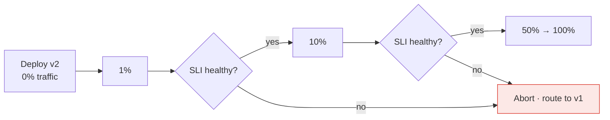

> In a distributed system there is no moment when "the new version is live". Two versions
> always coexist. Deployment strategy is the discipline of making that a feature.

| | |
|---|---|
| **Module** | [11 — Operations and evolution](/modules/operations-and-evolution/README) |
| **Prerequisites** | [01-04 Schema evolution](/modules/communication/04-serialization-and-schema-evolution), [11-01 Observability](/modules/operations-and-evolution/01-observability) |
| **Also known as** | rolling update, blue/green, canary, expand-contract migration |
| **Category** | Operations |

---

## 1. The problem

ShopFlow deploys Order Service v2. Within minutes:

- v1 and v2 run simultaneously during the rollout, and v2 writes a field v1 cannot read. v1
  instances crash on those rows.
- The deploy included a migration renaming `total` to `total_amount`. Every v1 instance breaks
  instantly ([01-04](/modules/communication/04-serialization-and-schema-evolution)).
- A bug affects 3% of orders. It reaches 100% of users in the four minutes the rollout takes,
  before anyone reads a dashboard.
- Rolling back the code does not roll back the migration.
- Old instances are terminated with requests in flight, producing a burst of errors that gets
  written off as "normal deploy noise".

Every one of these is a *coexistence* problem. Not one of them would exist in a single-process
application restarted in place.

## 2. In plain language

Replacing the tyres on a moving lorry.

You cannot stop, so you replace one wheel at a time. Which means that for a while the lorry
runs on a mixture of old and new tyres — and they had better be compatible. Fitting a new wheel
that requires a different axle means the lorry only works once *all* wheels are changed, and
that is a moment of maximum risk with no way back.

The safe method is boring: make every change work with both axles. Fit the new wheels one at a
time, watch how the lorry handles after each, and stop if it pulls to one side. And crucially,
**change the axle in a separate, later operation** — never in the same step as the wheels.

**Where the analogy breaks down:** the lorry has four wheels. Your fleet has forty instances,
nine services, and a database that all of them share.

## 3. How it works

### The strategies

| Strategy | Mechanism | Rollback | Cost | Coexistence |
|---|---|---|---|---|
| **Recreate** | Stop all, start all | Redeploy old | Downtime | None |
| **Rolling** | Replace N at a time | Roll forward or back, slowly | Low | v1 + v2 during rollout |
| **Blue/green** | Two full environments, switch traffic | Instant — flip back | 2× infrastructure | Brief, at the switch |
| **Canary** | Small % to the new version, ramp on evidence | Instant — route away | Low | Extended and deliberate |
| **Shadow / dark launch** | New version receives copied traffic, responses discarded | Nothing to roll back | Extra compute | No user exposure at all |

**Canary is the default for anything user-facing.** It is the only strategy where the blast
radius during the risky period is a controlled fraction, and it composes with everything else in
this module.

### Canary, properly



The parts people omit:

- **Automated analysis.** Compare the canary's error rate and latency *against the baseline
  running at the same time*, not against yesterday. Traffic patterns change hourly.
- **Enough traffic and time.** 1% for 30 seconds detects nothing. The canary must see enough
  requests for a difference to be statistically visible.
- **Automated abort.** A human watching a dashboard is not a control.
- **Sticky assignment.** A user must not flip between versions mid-session.

### Expand and contract for schemas

The rule that prevents most deploy disasters. **Never change a schema in one step**; make three
deployments:

| Phase | Database | Code | Safe with old code? |
|---|---|---|---|
| **Expand** | Add the new column, nullable | Write both, read old | ✅ |
| **Migrate** | Backfill the new column | Write both, read new | ✅ |
| **Contract** | Drop the old column | Write new, read new | ✅ (nothing reads old) |

Each phase is independently deployable. Code can be rolled back while both schema versions
exist; destructive schema changes are deliberately irreversible once new-only code has shipped.
A rename becomes an add, a backfill, and a drop — three boring deploys instead of one exciting
one.

**Migrations must be backward compatible with the currently running code, always**, because
during any rolling deploy the old code is still running.

### Graceful shutdown, again

Half of "deploy noise" is a missing `sleep`. The sequence from
[01-05](/modules/communication/05-service-discovery) and
[02-08](/modules/resilience/08-health-checks-and-self-healing):

deregister → fail readiness → **wait out the load balancer's propagation** → stop accepting →
drain in-flight → exit.

Skipping the wait means the load balancer sends requests to a socket that is already closing.

## 4. Pseudo-code

**Before — the deploy that breaks everything.**

```
# One step:
#   1. run migration: ALTER TABLE orders RENAME total TO total_amount
#   2. deploy v2 to all instances
#
# TRAP 1: between (1) and the last instance updating, every v1 instance is broken.
# TRAP 2: rolling back the code does not undo the rename.
# TRAP 3: the bug in v2 reaches 100% of users in four minutes.
```

**The pattern — an automated canary judged against a live baseline.**

```
record CanaryConfig:
  steps: List<(Float, Duration)> = [(1, 10m), (10, 15m), (50, 15m), (100, 0m)]
  metrics: List<CanaryMetric>
  abort_on_failure: Bool = true

record CanaryMetric:
  name: String
  comparison: BETTER_OR_EQUAL | WITHIN_TOLERANCE
  tolerance: Float

service CanaryDeployment:
  async fn deploy(service: String, version: String, cfg: CanaryConfig)
      -> DeployResult:
    await provision(service, version, replicas: 1)      # 0% traffic yet

    for (percentage, soak) in cfg.steps:
      await router.split(service, {stable: 100 - percentage, canary: percentage})
      log.info("canary step", percentage: percentage, soak: soak)

      # Enough traffic AND enough time. Both, or the comparison is noise.
      deadline = now() + soak
      while now() < deadline:
        sleep(30s)
        if canary_request_count() < MIN_SAMPLES: continue

        analysis = compare_metrics(cfg.metrics, canary: version, baseline: "stable")
        # WHY compare against the CONCURRENT baseline: an 09:00 traffic spike
        # affects both versions. Comparing the canary to yesterday's numbers
        # produces false aborts every morning.

        if analysis.failed:
          await router.split(service, {stable: 100, canary: 0})   # instant
          await teardown(service, version)
          return Failed(analysis.reason)

      metrics.increment("canary.step_passed", tags: {pct: percentage})

    await scale_to_full(service, version)
    await retire_previous(service)
    return Succeeded()

# The metrics that decide. Business signals, not just technical ones.
canary_metrics:
  - {name: "http.error_rate",        comparison: BETTER_OR_EQUAL}
  - {name: "http.latency_p99",       comparison: WITHIN_TOLERANCE, tolerance: 1.2}
  - {name: "checkout.success_rate",  comparison: BETTER_OR_EQUAL}
  - {name: "orders.placed_per_user", comparison: WITHIN_TOLERANCE, tolerance: 0.95}
    # WHY this last one: a version that returns 200 for every request while
    # silently failing to create orders passes every technical check.
```

**Expand–migrate–contract, in full.**

```
# ===== Release 1: EXPAND. Additive only. Safe with v1 running. =====
migration "add total_amount":
  up:   ALTER TABLE orders ADD COLUMN total_amount BIGINT NULL
  down: NO-OP  # v2 may already write this column; retain it for a safe code rollback
  # Nullable, no default on a large table (a default rewrites every row and
  # locks it). Old code ignores the column entirely.

service OrderService:      # v2
  fn save(o: Order):
    db.write({total: o.total, total_amount: o.total})   # write BOTH
  fn load(row) -> Order:
    return Order(total: row.total)                       # read OLD

# ===== Release 2: MIGRATE. Backfill, then switch reads. =====
job "backfill total_amount":
  # Batched and throttled: a single UPDATE over 40M rows locks the table
  # and takes production down more reliably than any bug.
  for batch in orders.scan(where: "total_amount IS NULL", limit: 1000):
    db.update(batch, set: {total_amount: expr("total")})
    sleep(100ms)

service OrderService:      # v3
  fn save(o: Order):
    db.write({total: o.total, total_amount: o.total})   # still BOTH
  fn load(row) -> Order:
    return Order(total: row.total_amount ?? row.total)   # read NEW, fall back

# ===== Release 3: CONTRACT. Only when nothing reads the old column. =====
service OrderService:      # v4
  fn save(o: Order): db.write({total_amount: o.total})
  fn load(row) -> Order: return Order(total: row.total_amount)

migration "drop total":
  up: ALTER TABLE orders DROP COLUMN total
  # Run this only after v4 has been stable long enough that rolling back to
  # v3 is no longer plausible. Dropping a column is not reversible.
```

**Graceful shutdown — the fix for "deploy noise".**

```
service AnyService:
  on shutdown_signal:                    # SIGTERM from the orchestrator
    log.info("shutdown initiated")
    ready = false                        # 1. readiness fails
    registry.deregister(INSTANCE_ID)     # 2. leave the registry
    sleep(15s)                           # 3. THE STEP EVERYONE SKIPS.
                                         #    The LB and every client cache still
                                         #    hold our address. Keep serving.
    stop_accepting_connections()         # 4. close the door
    await drain_inflight(max: 30s)       # 5. finish what we started
    await flush_telemetry()              # 6. don't lose the last traces
    exit(0)
  # The orchestrator's termination grace period must exceed 15 + 30 + flush,
  # or it SIGKILLs you mid-drain and you get the error burst anyway.
```

**Shadow traffic — verification with zero user exposure.**

```
service ShadowRouter:
  handler handle(req) -> Response:
    real = await stable.handle(req)

    if sampling.should_shadow(req) and req.is_read_only:
      # Fire and forget. The response is compared, never returned.
      # This is comparison running (08-05) applied to versions rather than systems.
      spawn compare_async(req, real, canary.handle(req) timeout 2s)

    return real
    # TRAP: shadowing writes. The canary must not send emails, charge cards or
    # publish events. Either restrict to reads, or run the canary against
    # sandboxed dependencies.
```

## 5. Knobs and variants

| Knob | Guidance | Failure if wrong |
|---|---|---|
| Strategy | Canary for user-facing; rolling for internal | Big-bang rollout exposes 100% to a new bug |
| Canary steps | 1% → 10% → 50% → 100% | Jumping to 50% defeats the purpose |
| Soak per step | Long enough for statistical significance | 30-second soaks detect nothing |
| Baseline | Concurrent stable version | Comparing to yesterday produces false aborts daily |
| Canary metrics | Business signals, not just technical | 200-with-no-order passes every technical check |
| Abort | Automatic | Human-in-the-loop abort is too slow |
| Schema changes | Expand/contract, always, three releases | One-step changes break the running version |
| Backfills | Batched and throttled | A single large UPDATE locks the table |
| Drain wait | ≥ LB propagation, then in-flight | Skipping it produces errors on every deploy |

## 6. Challenges and failure modes

- **Migrations that break running code.** The most common deploy outage. Expand/contract, no
  exceptions.
- **Irreversible migrations.** Dropping a column or table cannot be rolled back. Contract only
  after the rollback window has genuinely closed.
- **Canaries with no traffic.** 1% of a low-traffic endpoint is a handful of requests an hour.
  Either raise the percentage or route specific cohorts.
- **Canary metrics that miss business failures.** Technically perfect, commercially broken.
  Always include a business signal.
- **Version skew in events.** v2 publishes a new event shape that v1 consumers cannot read.
  This is [01-04](/modules/communication/04-serialization-and-schema-evolution), and it
  applies during every rollout.
- **No graceful shutdown.** Errors on every deploy, accepted as normal, quietly eroding the
  error budget.
- **Rollback that has never been tested.** Discovered mid-incident. Rehearse it.
- **Coordinated deploys.** "Deploy A, then B, then C, in order" means you have a distributed
  monolith ([08-01](/modules/microservice-architecture/01-decomposition-and-bounded-contexts)).
- **Stateful services.** Rolling a database or broker is a different and much more careful
  operation than rolling a stateless service.
- **Config deployed with code.** A configuration mistake then requires a full rollback
  ([11-03](/modules/operations-and-evolution/03-configuration-and-feature-flags)).

## 7. Alternatives

- **[Feature flags](/modules/operations-and-evolution/03-configuration-and-feature-flags).** Deploy dormant code, release by
  flag. Faster to undo than any deployment strategy, and it composes with all of them. **Often
  the better primary control.**
- **Blue/green.** Instant rollback, 2× infrastructure, and it does not solve schema changes.
- **Progressive delivery platforms** (Argo Rollouts, Flagger, Spinnaker). Canary analysis as a
  product; less to build.
- **[Service mesh traffic shifting](/modules/microservice-architecture/04-sidecar-and-service-mesh).**
  Percentage routing with no deployment orchestration at all.
- **Trunk-based development with small changes.** The most effective risk reduction available:
  a small change is easier to canary, easier to diagnose and easier to revert.

## 8. Trade-offs

| Advantage | Disadvantage |
|---|---|
| A bug reaches 1% of users, not 100% | Rollouts take hours instead of minutes |
| Rollback is a routing change, not a rebuild | Two versions must coexist correctly, always |
| Expand/contract makes schema changes reversible | Three releases for what feels like one change |
| Automated analysis removes human judgement from the loop | Canary analysis needs good SLIs first |
| Graceful shutdown eliminates deploy-time errors | Longer termination grace periods, slower rollouts |

## 9. Complexity introduced

- **Operational.** Deployment tooling with canary analysis; migration tracking across three
  phases; rollback rehearsal; longer, more monitored rollouts.
- **Cognitive.** Engineers must design every change to work alongside the previous version,
  including database and message schemas.
- **Failure surface.** Stuck rollouts, false canary aborts, half-completed migrations,
  irreversible contracts, version skew.
- **Testing.** Needs explicit cross-version tests: v1 code against v2 schema, and v2 code
  against v1 schema. Both directions, because rollback exists.

## 10. Related concepts

- **Builds on:** [01-04 Schema evolution](/modules/communication/04-serialization-and-schema-evolution), [11-01 Observability](/modules/operations-and-evolution/01-observability)
- **Composes with:** [11-03 Feature flags](/modules/operations-and-evolution/03-configuration-and-feature-flags), [08-04 Service mesh](/modules/microservice-architecture/04-sidecar-and-service-mesh), [02-08 Health checks](/modules/resilience/08-health-checks-and-self-healing)
- **Conflicts with / tension:** deployment speed — safety costs time
- **Contrast with:** [08-05 Strangler fig](/modules/microservice-architecture/05-strangler-fig) — the same incremental idea applied to systems rather than versions
- **Leads to:** [11-03 Configuration and feature flags](/modules/operations-and-evolution/03-configuration-and-feature-flags)

## 11. Exercises

1. **Trace it.** ShopFlow renames `total` to `total_amount` in one migration plus one rolling
   deploy. Write the timeline minute by minute: which instances break, what customers see, and
   what happens when someone rolls back.
2. **Extend it.** Write the full expand/migrate/contract plan for splitting `Order.address` into
   five columns. How many releases, and what does each backfill do to a 40M-row table?
3. **Break it.** A canary runs at 1% for 10 minutes on an endpoint receiving 2 req/s. The new
   version fails 5% of requests. Compute the probability the canary detects it, and fix the
   configuration.

## 12. References

- Humble & Farley, *Continuous Delivery* (2010) — blue/green, canary, and the expand/contract pattern.
- Google SRE Book — Ch. 8, release engineering; *The Site Reliability Workbook* on canarying.
- Forsgren, Humble, Kim, *Accelerate* — deployment frequency, lead time, and change failure rate.
- Argo Rollouts / Flagger documentation — automated canary analysis in practice.
- Martin Fowler, "ParallelChange" (expand/contract) and "BlueGreenDeployment".

---

**Up:** [Module 11](/modules/operations-and-evolution/README) · **Previous:** [← 11-01](/modules/operations-and-evolution/01-observability) · **Next:** [11-03 Configuration and feature flags →](/modules/operations-and-evolution/03-configuration-and-feature-flags)
