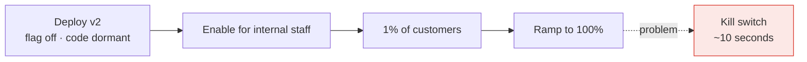

> Separating deploy from release. A kill switch that works in ten seconds is a resilience
> pattern, and configuration that reaches every instance in ten seconds is an outage waiting
> to happen.

| | |
|---|---|
| **Module** | [11 — Operations and evolution](/modules/operations-and-evolution/README) |
| **Prerequisites** | [11-02 Deployment strategies](/modules/operations-and-evolution/02-deployment-strategies) |
| **Also known as** | feature toggles, dynamic config, kill switches, dark launches |
| **Category** | Operations |

---

## 1. The problem

ShopFlow's new recommendation engine is causing 3-second product page loads. The fix is to turn
it off. That takes a revert commit, a build, a test run, and a canary rollout: 40 minutes,
during which every customer has a slow site.

Separately, the payment provider's timeout needs to go from 800ms to 1.5s during their
degradation. It is a constant in the code. Same 40 minutes.

And in the other direction: a configuration change that *is* dynamic — a routing rule — is
pushed to all instances in all regions simultaneously, is wrong, and takes the whole system
down in eight seconds. Multi-region redundancy provided no protection whatsoever, because the
config reached every region at once.

## 2. In plain language

The difference between the wiring in a building and the light switches.

Rewiring is slow, skilled, disruptive work. Flicking a switch is instant and anyone can do it.
Good buildings put a switch on everything that might need turning off, so that turning off a
light does not require an electrician.

Two things follow, and they are the two halves of this lesson. **You want switches on the things
that might go wrong** — a kill switch is not a feature, it is safety equipment. And **the main
breaker is not a switch you flick casually**, because it turns off the whole building at once.
Some switches should be per-room.

**Where the analogy breaks down:** a building's switches are visible on the wall. Feature flags
accumulate invisibly in code, and after two years nobody knows which ones still do anything.

## 3. How it works

### Deploy ≠ release

Deploying puts code on machines. Releasing exposes behaviour to users. A flag separates them:



Rollback becomes a flag flip rather than a rebuild — seconds instead of tens of minutes.

### The kinds of flag

They have very different lifetimes, and treating them alike is the source of most flag debt.

| Kind | Purpose | Lifetime | Owner |
|---|---|---|---|
| **Release toggle** | Hide unfinished work | Days–weeks. **Delete after release** | The developer |
| **Kill switch / ops toggle** | Disable a feature under load or failure | Permanent | On-call |
| **Experiment** | A/B test | The experiment's duration | Product |
| **Permission** | Entitlements by plan or tier | Permanent | Product |

**Kill switches are a resilience pattern**, not a delivery convenience. Every non-essential
feature should have one, wired to the tier ranking from
[02-07](/modules/resilience/07-fallback-and-graceful-degradation), so that shedding a feature
is a decision someone can make in seconds at 3am.

### Configuration tiers

Not all configuration deserves the same mechanism:

| Tier | Examples | Change mechanism | Speed |
|---|---|---|---|
| **Build-time** | Language version, dependencies | Rebuild | Hours |
| **Deploy-time** | Service names, resource limits | Redeploy | Minutes |
| **Runtime** | Timeouts, limits, flags | Config service | Seconds |
| **Per-request** | A/B assignment, tenant overrides | Evaluated per request | Instant |

**Secrets are a separate category**, never in any of these. Dedicated secret storage, rotation,
audit, and never in a flag service.

### Config as a global blast radius

The hard-won lesson: **a bad configuration push reaches every instance in every region within
seconds, defeating every redundancy mechanism in [Module 09](/modules/availability-and-dr/README).**
Several of the largest cloud outages on record were configuration pushes, not code.

So configuration must be treated as code, and deployed like code:

- Versioned, reviewed, and validated against a schema before acceptance.
- **Rolled out progressively** — canary instances, then one zone, then one region, then global.
- Automatically rolled back on SLI degradation.
- With an audit trail: who changed what, when, and why.

### Evaluating flags safely

- **Fail to a safe default.** If the flag service is unreachable, use the last known value, then
  a compiled-in default. A flag service outage must never be a service outage.
- **Consistent assignment.** `hash(flag_name + user_id) % 100 < percentage` — stable for a user
  across requests and instances, so nobody flips mid-session.
- **Evaluate once per request** and pass the result down, or different parts of one request will
  disagree.

## 4. Pseudo-code

**Before — configuration compiled in.**

```
service ProductPageService:
  RECOMMENDER_ENABLED = true          # a revert, a build, a canary: ~40 minutes
  PAYMENT_TIMEOUT = 800ms             # same
```

**The pattern — a flag client that cannot take the service down.**

```
record Flag:
  key: String
  default: Any
  rules: List<Rule>          # first match wins
  updated_at: Instant
  updated_by: String

record Rule:
  condition: (Context) => Bool        # tier == GOLD, region == "eu", ...
  percentage: Float                   # 0–100, of users matching the condition
  value: Any

service FlagClient:
  uses config: Client<ConfigService>
  state cache: Map<String, Flag> = {}
  state last_sync: Instant

  # Streamed or polled in the background. NEVER fetched on the request path.
  every 10s:
    try:
      updates = await config.changed_since(last_sync) timeout 2s
      for f in updates: cache.put(f.key, f)
      last_sync = now()
    catch Error:
      # WHY not fail: a flag service outage must not become a product outage.
      # Serve the last known values indefinitely; alert on staleness instead.
      age = now() - last_sync
      metrics.gauge("flags.staleness_s", age)
      if age > 10m: alert("flag config stale", age: age)

  fn value(key: String, ctx: Context, fallback: Any) -> Any:
    f = cache.get(key)
    if f is None: return fallback        # compiled-in default: the last line of defence

    for rule in f.rules:
      if not rule.condition(ctx): continue
      # Stable per user: the same user gets the same answer on every instance,
      # on every request. Random assignment flips mid-session and produces
      # bug reports nobody can reproduce.
      if hash(key + ctx.user_id) mod 100 < rule.percentage:
        return rule.value
      return f.default
    return f.default

  fn enabled(key: String, ctx: Context) -> Bool:
    return value(key, ctx, fallback: false) == true
```

**Kill switches as resilience — wired to the degradation tiers.**

```
service ProductPageService:
  @timeout(800ms)
  handler product_page(ctx, sku: Sku) -> Result<PageView, Error>:
    # Evaluate once, at the top. Passing the evaluated set down means every part
    # of this request agrees about what is enabled.
    flags = FlagSet(
      recommendations: flags.enabled("feature.recommendations", ctx),
      reviews:         flags.enabled("feature.reviews", ctx),
      personalisation: flags.enabled("feature.personalised_pricing", ctx))

    # The 800ms budget, allocated. Concurrent calls do not sum, so the tightest
    # useful bound on each is what it is worth waiting for — not the whole budget.
    with deadline(now() + 600ms):            # 200ms reserved for assembly + slack
      parallel:
        product = await catalog.get(ctx, sku) timeout 300ms        # tier 0
        recs    = flags.recommendations
                    ? await recommender.similar(ctx, sku) timeout 120ms   # tier 3
                    : Skipped
        reviews = flags.reviews
                    ? await reviews.for_sku(ctx, sku) timeout 250ms       # tier 2
                    : Skipped

    # A flag that is OFF costs nothing; a flag that is ON is still bounded. The
    # kill switch removes the call, the timeout bounds it — they are different
    # controls and you want both (02-01, 02-07).
    return Ok(PageView(product?, recs.or_default([]), reviews.or_default(None)))

# The tier ranking from 02-07, made operable. During overload, on-call disables
# from the bottom up — a decision that takes ten seconds instead of a deploy.
kill_switches:
  - {key: "feature.recommendations",      tier: 3, default_on: true}
  - {key: "feature.reviews",              tier: 2, default_on: true}
  - {key: "feature.personalised_pricing", tier: 2, default_on: true}
  - {key: "feature.stock_levels",         tier: 1, default_on: true}
  # checkout and payment have NO kill switch. Tier 0 is not optional.
```

**Operational parameters as configuration.**

```
service OrderService:
  uses payments: Client<PaymentService>
    with timeout(config.duration("payments.timeout", default: 800ms)),
         retry(max: config.int("payments.max_retries", default: 2)),
         circuit_breaker(threshold: config.int("payments.breaker_threshold", default: 5))
  # These are changeable in seconds, without a deploy, with an audit trail. That
  # is the point of putting them in configuration.
  #
  # But raising a timeout during a degradation is NOT routine incident guidance,
  # and 02-01 explains why: a timeout is a bound on resources held, so raising
  # it from 800ms to 1.5s nearly doubles the concurrency each in-flight request
  # occupies. If the provider is slow because it is overloaded, you have just
  # increased the load it is failing under and brought yourself closer to pool
  # exhaustion (10-03).
  #
  # Raise it only when all four hold, and say so in the change:
  #   1. Latency evidence shows the provider is slow but SUCCEEDING — the p99 of
  #      successful calls has moved past your current timeout (02-01 §3).
  #   2. The remaining request deadline can absorb it. 1.5s inside a 2s budget
  #      leaves nothing for anything else.
  #   3. The bulkhead is sized for the higher concurrency (Little's Law: 600 rps
  #      x 1.5s = 900 in flight, not 480). Raise it, or you have simply moved
  #      the queue.
  #   4. Admission control is on, so the extra latency sheds rather than queues.
  #
  # The usual correct move during a degradation is the opposite: LOWER the
  # breaker threshold so you stop calling sooner, and let the degraded path
  # (02-07) absorb it.
  #
  # COST: these are now production-affecting values changeable by anyone with
  # config access. They need the same review, validation and rollout as code.
```

**Progressive config rollout — the part that prevents global outages.**

```
service ConfigDeployment:
  stages: List<(String, Duration)> = [
    ("canary-instances", 5m),        # a handful of instances
    ("zone:eu-west-1a",  10m),
    ("region:eu-west-1", 15m),
    ("global",           0m),
  ]

  async fn deploy(change: ConfigChange) -> Result<Unit, Error>:
    # 1. Validate before anything. A typo must fail here, not in production.
    if not schema.validate(change): return Err(InvalidConfig)
    if change.affects_tier_0() and not change.has_approval(): return Err(ApprovalRequired)

    for (scope, soak) in stages:
      await config_store.apply(change, scope: scope)
      log.info("config stage", scope: scope, change: change.key, by: change.author)

      deadline = now() + soak
      while now() < deadline:
        sleep(30s)
        if sli_degraded(scope: scope):
          await config_store.rollback(change, scope: scope)
          alert("config rolled back", change: change.key, scope: scope)
          return Err(RolledBack)

    audit.record(change)
    return Ok(unit)
    # TRAP without staging: a bad value reaches every instance in every region
    # in eight seconds. Multi-region redundancy protects against nothing, because
    # the fault is delivered to all regions simultaneously. This has caused
    # several of the largest cloud outages on record.
```

**Flag debt — the maintenance nobody schedules.**

```
service FlagHygiene:
  every 1w:
    for f in all_flags():
      age = now() - f.created_at

      if f.kind == RELEASE and age > 60d:
        # A release toggle that outlives its release is dead code with a branch
        # in it. Two hundred of these make the codebase unreadable.
        ticket("stale release toggle", flag: f.key, age: age, owner: f.owner)

      if f.evaluations_last_30d == 0:
        ticket("unused flag — remove it", flag: f.key)

      if f.rules.all(r => r.percentage == 100) and age > 30d:
        ticket("fully rolled out — remove the flag and the branch", flag: f.key)

    # The number that matters. Above ~50 active flags, combinatorial testing is
    # impossible and nobody knows what configuration production is actually in.
    metrics.gauge("flags.active_count", count_active())
```

## 5. Knobs and variants

| Knob | Guidance | Failure if wrong |
|---|---|---|
| Flag evaluation | Cached locally, background refresh | Per-request fetch makes the flag service a critical dependency |
| Failure mode | Last known value → compiled default | Failing closed turns a config outage into a product outage |
| Assignment | `hash(flag + user_id)` | Random assignment flips users mid-session |
| Config rollout | Staged: canary → zone → region → global | Global push = global outage |
| Validation | Schema-validated before acceptance | A typo becomes an incident |
| Tier-0 changes | Require approval | Anyone can change payment timeouts otherwise |
| Release toggle lifetime | Delete within 60 days | Flag debt makes the codebase and production state unknowable |
| Active flag count | Keep under ~50 | Above that, the configuration space is untestable |
| Secrets | Never in flags | Flag values are logged, cached and widely readable |

## 6. Challenges and failure modes

- **Global config push.** The single most damaging failure here. Stage it like a deploy.
- **Flag debt.** Hundreds of stale flags. Every one is a branch, and 2ⁿ combinations nobody has
  tested. Scheduled removal, with owners.
- **Flag service as a hard dependency.** If evaluation blocks on a network call, its outage is
  yours. Cache, and fail to defaults.
- **Inconsistent evaluation within a request.** Two components evaluate the same flag and get
  different answers because it changed between them. Evaluate once, pass down.
- **Untested flag combinations.** Feature A on and B off works; both on does not. Test the
  combinations that will actually occur, especially the on-call ones.
- **Flags as permanent architecture.** A toggle that has been at 50% for two years is not a
  release toggle; it is two products.
- **Config changes escaping review.** Because it is "just config", it bypasses code review and
  testing — while being just as capable of causing an outage.
- **No audit trail.** "Who turned this off and why?" unanswerable during an incident.
- **Secrets in configuration.** Flag values get logged, cached and shipped to clients.

## 7. Alternatives

- **Deploy-time configuration only.** Environment variables and a redeploy to change. Simple,
  auditable, and slow — no kill switches.
- **[Canary deployments](/modules/operations-and-evolution/02-deployment-strategies).** Progressive exposure without flags.
  Slower to undo, and no per-user targeting.
- **Managed flag platforms** (LaunchDarkly, Unleash, Flagsmith). Targeting, audit, streaming
  updates and SDKs, without building them. Another vendor on your critical path.
- **[Service mesh traffic splitting](/modules/microservice-architecture/04-sidecar-and-service-mesh).**
  Percentage routing at the network layer. No application code, no per-user targeting.
- **Branch by abstraction** ([08-05](/modules/microservice-architecture/05-strangler-fig)).
  The same switch, in code, for larger structural changes.

## 8. Trade-offs

| Advantage | Disadvantage |
|---|---|
| Rollback in seconds rather than tens of minutes | Flags accumulate as untested branches |
| Kill switches make degradation an operational decision | Production state becomes harder to know exactly |
| Deploy and release are separated, so deploys get boring | Config becomes a production-affecting change path |
| Operational parameters tunable during an incident | Anyone with config access can cause an outage |
| Progressive exposure per user, not just per instance | Requires staged config rollout to be safe |

## 9. Complexity introduced

- **Operational.** A config/flag service with high availability and low latency; staged rollout
  tooling; audit logging; flag hygiene as scheduled work with owners.
- **Cognitive.** "What configuration is production actually in?" becomes a real question, and
  code paths multiply.
- **Failure surface.** Global bad pushes, stale caches, inconsistent evaluation, flag service
  outages, untested combinations.
- **Testing.** Both states of every flag, and the combinations on-call would actually use during
  an incident.

## 10. Related concepts

- **Builds on:** [11-02 Deployment strategies](/modules/operations-and-evolution/02-deployment-strategies)
- **Composes with:** [02-07 Degradation](/modules/resilience/07-fallback-and-graceful-degradation) (kill switches implement the tier ranking), [11-01 Observability](/modules/operations-and-evolution/01-observability), [08-05 Strangler fig](/modules/microservice-architecture/05-strangler-fig)
- **Conflicts with / tension:** code simplicity — every flag is a branch that must be maintained
- **Contrast with:** [11-02 Canary](/modules/operations-and-evolution/02-deployment-strategies) — flags target *users*, canaries target *instances*. Use both
- **Leads to:** [11-04 Capstone](/modules/operations-and-evolution/04-capstone-designing-a-system)

## 11. Exercises

1. **Trace it.** The recommendation engine causes 3-second page loads at 14:00. Compare the
   timeline to recovery with a kill switch versus with a revert-and-redeploy. How many customers
   are affected in each?
2. **Extend it.** Design ShopFlow's kill switch inventory: every feature, its tier, its default,
   and who may change it. Which features get none, and why?
3. **Break it.** A config change sets `payments.timeout` to `80ms` instead of `800ms` and is
   pushed globally. Describe the next five minutes. Then show which stage of the progressive
   rollout would have caught it, and how quickly.

## 12. References

- Martin Fowler & Pete Hodgson, "Feature Toggles (aka Feature Flags)" (2017) — the definitive taxonomy.
- Humble & Farley, *Continuous Delivery* — separating deployment from release.
- Google SRE Book — Ch. 27, reliable product launches; and the discussions of global config pushes as an outage cause.
- AWS and Google post-incident reports on configuration-driven outages — worth reading for the pattern.
- LaunchDarkly / Unleash documentation — targeting rules and evaluation semantics.

---

**Up:** [Module 11](/modules/operations-and-evolution/README) · **Previous:** [← 11-02](/modules/operations-and-evolution/02-deployment-strategies) · **Next:** [11-04 Capstone: designing a system →](/modules/operations-and-evolution/04-capstone-designing-a-system)
