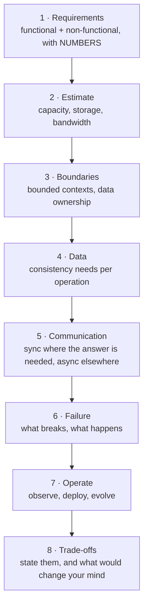

> Sixty-six lessons, one design. This is where the patterns stop being a catalogue and start
> being a set of trade-offs you argue about with numbers.

| | |
|---|---|
| **Module** | [11 — Operations and evolution](/modules/operations-and-evolution/README) |
| **Prerequisites** | All preceding lessons |
| **Also known as** | the system design interview, an architecture decision record |
| **Category** | Structure |

---

## 1. The problem

You know 55 patterns. That is not the same as being able to design a system, and it is
dangerously close to being able to *sound* like you can.

The failure mode of pattern knowledge is applying patterns because you know them: sagas in a
system with one database, event sourcing on a settings table, a service mesh for four services,
multi-region for a domestic business. Every one is defensible in isolation and indefensible
against the actual requirements.

**Design is the discipline of deciding which patterns *not* to use, and being able to say why.**

## 2. In plain language

A doctor who knows every drug is not a good doctor. A good doctor takes a history, narrows the
diagnosis, prescribes as little as possible, and says out loud what they are watching for.

The same four moves work here. Establish the requirements — what load, what latency, what
consistency, what failure is tolerable. Narrow to the constraint that actually binds. Apply the
smallest intervention that resolves it. Then state what would make you change your mind.

**Where the analogy breaks down:** a patient's condition is given. Yours is partly a choice —
the best architectural move is often to change the requirement rather than to satisfy it.

## 3. How it works: the method



### Step 1 — Requirements, with numbers

An architecture cannot be evaluated without them. Insist on:

| Question | ShopFlow's answer |
|---|---|
| Traffic, peak and average | 12,000 rps reads, 600 rps writes at peak |
| Read/write ratio | 95:5 |
| Latency budget, p99 | 2s checkout, 300ms catalogue |
| Data volume and growth | 40M orders, +50k/day |
| Availability target | 99.95% checkout, 99.9% catalogue |
| Consistency requirement | Per operation — see step 4 |
| Team size and shape | 4 teams, 25 engineers |
| Constraints | ERP cannot change; EU data residency |

**The last two rows determine as much as the first six.** A 25-engineer organisation cannot
operate 40 services, whatever the traffic says.

### Step 2 — Estimate

From [00-04](/modules/foundations/04-latency-throughput-and-back-of-envelope). Compute
before deciding: required concurrency, storage growth, bandwidth, cache size, whether one
machine would do.

For ShopFlow: catalogue reads are 12,000 × 8ms = 96 concurrent — trivially served by ~20
instances. Orders are 40M × 2KB = 80GB, which **fits comfortably on one database**. That single
calculation removes [sharding](/modules/scalability/04-partitioning-and-sharding) from the
design, and with it sagas across shards, cross-shard queries and resharding operations.

**Most estimates end an argument rather than starting one.**

### Step 3 — Boundaries

[08-01](/modules/microservice-architecture/01-decomposition-and-bounded-contexts). Cut by
business capability; one team per context; check that a typical change touches one service.
Then check each boundary against the transaction test: if the hot path needs a
[saga](/modules/data-and-consistency/02-saga), reconsider the cut.

### Step 4 — Data and consistency, per operation

[00-05](/modules/foundations/05-consistency-models-cap-and-pacelc). This table is the single
highest-value artefact of a design:

| Operation | Consistency | Mechanism |
|---|---|---|
| Decrement last unit of stock | Linearizable | Atomic conditional update, single leader |
| Read product | Eventual, ≤5 min | Cache with TTL + jitter |
| Read price at checkout | Read-your-writes for merchants | Version token |
| Order status timeline | Causal | Version-gated projection |
| Recommendations | Eventual, unbounded | Local snapshot |

Very few rows need the top of the ladder. Every one that does costs latency and availability.

### Step 5 — Communication

Synchronous where the caller cannot proceed without the answer; asynchronous everywhere else
([01-01](/modules/communication/01-synchronous-request-response),
[01-02](/modules/communication/02-asynchronous-messaging)). The test: if the caller ignores
the response, it should not have been synchronous.

### Step 6 — Failure

For each dependency: what happens when it is slow, when it is down, and when the answer is
ambiguous. This produces the resilience configuration rather than the other way round.

### Step 7 — Operate

Observability signals, deployment strategy, kill switches. A design that cannot be observed or
changed is not finished.

### Step 8 — Trade-offs

State what you gave up, and — the part that separates a design from a diagram — **what evidence
would make you revisit it.**

## 4. Pseudo-code: the design, assembled

**The decision record — the actual deliverable.**

```
# ============ ShopFlow architecture decisions ============
#
# CONTEXT: 12,000 rps read / 600 rps write peak, 40M orders (80GB),
#          99.95% checkout, 2s p99, 4 teams / 25 engineers,
#          legacy ERP unchangeable, EU data residency.
#
# --- DECIDED ---
#
# D1  Six services, aligned to bounded contexts, one team each.     [08-01]
#     WHY: 4 teams blocking each other on one deployable was the actual pain.
#     NOT 40 services: 25 engineers cannot operate that, and nothing in the
#     numbers requires it.
#
# D2  Database per service; separate schemas, enforced grants,      [08-03]
#     one physical instance to start.
#     WHY: ownership without nine databases to operate. Split physically only
#     when a service's load justifies it.
#     NOT sharded: 80GB fits on one machine with room for years. Revisit at ~2TB.
#
# D3  Checkout is synchronous to Inventory and Payment; everything  [01-01, 01-02]
#     else is events via the outbox.
#     WHY: the customer needs a stock and payment answer before the response.
#     They do not need the email, the search index or the analytics.
#     RESULT: p50 1355ms → 855ms. Derivation: the 1355ms breakdown is in 01-01 §4
#             (50 reserve + 800 charge + 5 save + 300 email + 120 index + 80 analytics);
#             moving the last three off the request path leaves 855ms. See 01-02 §4.
#             Checkout also survives an email provider outage, which it did not before.
#
# D4  Saga (orchestrated) for order placement.                      [04-02]
#     WHY: three services, three databases, no distributed transaction possible.
#     Orchestrated, not choreographed: it has branches, timers and compensations.
#     NOT 2PC: it would make checkout's availability the product of three
#     services and block on coordinator failure.                    [04-01]
#
# D5  Transactional outbox + idempotent consumers everywhere.       [04-03, 04-04]
#     WHY: non-negotiable. Without the outbox, events are lost silently.
#     Without idempotency, at-least-once delivery duplicates effects.
#
# D6  Two-tier cache for the catalogue: in-process L1 (10s) +       [03-03]
#     shared L2 (1h, jittered), stale-on-error, origin rate-limited.
#     WHY: 95% of traffic is catalogue reads of 2,000 hot SKUs.
#     Target 95% hit rate → origin sees 600 rps instead of 12,000.
#
# D7  Full Module 02 on every external dependency: deadline         [02-01…02-08]
#     propagation, bounded retries with jitter and a budget, per-dependency
#     breakers with slow-call detection, bulkheads, priority load shedding,
#     tiered degradation, correctly scoped health checks.
#     WHY: the payment provider is 4s p99 with 0.5% errors and a 50 rps cap.
#     RESULT: a provider outage degrades checkout to PENDING; it does not stop it.
#
# D8  Single region (eu-west-1), three AZs, N+2 at 65% utilisation. [09-01]
#     WHY: EU-only business, EU-only residency. Multi-AZ covers the realistic
#     failures at a third of the cost and a tenth of the complexity.
#     NOT multi-region: revisit if we open a non-EU market or the availability
#     target moves to 99.99%.                                       [09-02]
#
# D9  Strangler fig for the ERP, behind an anti-corruption layer.   [08-05, 08-06]
#     WHY: it cannot be replaced in one step and it cannot be left to infect
#     the domain model. Comparison running on reads before each cutover.
#
# D10 Canary deploys with automated analysis; expand/contract for   [11-02, 11-03]
#     every schema change; kill switches on every tier 1–3 feature.
#     WHY: separating deploy from release is what makes the other nine
#     decisions safe to change later.
#
# --- EXPLICITLY REJECTED, WITH TRIGGERS ---
#
# R1  Sharding           [03-04] — 80GB fits. Revisit at ~2TB or 5,000 write rps.
# R2  Event sourcing     [04-05] — audit needs are met by an audit table at 5%
#                                  of the cost. Revisit if temporal queries
#                                  become a product requirement.
# R3  CQRS (level 3+)    [04-06] — API composition is adequate at 600 rps.
#                                  Revisit when order-list queries exceed 200ms.
# R4  Service mesh       [08-04] — 6 services, 2 languages. Libraries are
#                                  cheaper. Revisit at ~15 services or 4 languages,
#                                  or if mTLS everywhere is mandated.
# R5  Multi-region       [09-02] — see D8.
# R6  Distributed locks  [10-01] — atomic conditional updates express every
#                                  contended operation we have.
#
# Every rejection has a TRIGGER. A design without triggers is a design that
# cannot be revisited, because nobody knows what would count as evidence.
```

**The checkout path, with every pattern visible.**

The block below assembles patterns defined elsewhere and does not redeclare them. Omitted, and
where each is defined: `seen` and `pending` (the idempotency and reconciliation stores,
[01-03](/modules/communication/03-delivery-guarantees-and-idempotency),
[00-03](/modules/foundations/03-failure-models-and-partial-failure)); `try_charge` and its
three-valued `ChargeOutcome` ([00-03 §4](/modules/foundations/03-failure-models-and-partial-failure));
`AdmissionController` ([02-06](/modules/resilience/06-load-shedding-and-backpressure));
`OutboxRecord` ([04-03](/modules/data-and-consistency/03-transactional-outbox));
`accept_pending` and `DEFERRED_LIMIT` (the degraded-checkout path,
[02-07 §4](/modules/resilience/07-fallback-and-graceful-degradation)). Per
[the spec](/spec/PSEUDOCODE-SPEC#10-elision-and-comments), elision is deliberate — but
in a capstone it should be named rather than assumed.

```
service OrderService:
  uses inventory: Client<InventoryService>
    with timeout(300ms), retry(max: 2, backoff: exponential(base: 20ms, jitter: full)),
         bulkhead(size: 40)                                          # 02-01, 02-02, 02-04
  uses payments: Client<PaymentService>
    with timeout(800ms), circuit_breaker(threshold: 5, slow_call: 500ms, cooldown: 30s),
         bulkhead(size: 100), retry(max: 0)                          # 02-03: no blind retry
  uses orders: Store<OrderId, Order> at schema "orders"              # 08-03
  uses outbox: Store<UUID, OutboxRecord> at schema "orders"          # 04-03
  state admission: AdmissionController(limit: adaptive)              # 02-06

  @timeout(2s)
  @idempotent(key: request_id)                                       # 01-03
  handler place_order(ctx: RequestContext, cmd: PlaceOrder) -> Result<Order, OrderError>:

    if not admission.admit(ctx, priority: CRITICAL):                 # 02-06
      return Err(Overloaded)                                          # 503 + Retry-After

    if existing = seen.get(cmd.request_id):                          # 01-03
      return Ok(orders.get(existing))

    with span("order.place_order", attributes: {...}):               # 11-01
      with deadline(now() + 2s):                                      # 02-01

        # Step 1 of the saga: compensatable.                          # 04-02
        reservation = await inventory.reserve(ctx, cmd.lines,
                        idempotency_key: cmd.request_id + ":reserve")?

        # PIVOT. After this we go forward, never back.
        if not pay_breaker.allow():                                   # 02-03
          # Degraded checkout: accept, charge later. Bounded exposure.  # 02-07
          if total_of(cmd.lines) > DEFERRED_LIMIT: return Err(Unavailable)
          return Ok(accept_pending(ctx, cmd))

        outcome = await try_charge(ctx, cmd)                           # 00-03
        match outcome:
          case Captured(pid): pass
          case Declined(r):
            await inventory.release(ctx, reservation.id)               # compensate
            return Err(PaymentDeclined(r))
          case Unknown(key):
            pending.put(key, cmd.order_id)                             # reconcile later
            return Ok(accept_pending(ctx, cmd))

        order = Order(id: cmd.order_id, status: PAID, ...)

        # State and event commit together, or neither does.            # 04-03
        atomically:
          orders.put(order.id, order)
          seen.put(cmd.request_id, order.id)
          outbox.append(OrderPlaced(order.id, order.customer_id, order.total, now()))

        log.event("order_placed", {trace_id: ctx.trace_id, ...})       # 11-01
        return Ok(order)
```

**The failure table — the artefact that proves the design was thought through.**

```
# Dependency      | Slow                    | Down                    | Ambiguous
# ----------------|-------------------------|-------------------------|------------------
# Inventory       | bulkhead caps at 40;    | breaker opens; checkout | retry with key;
#                 | deadline cuts at 300ms  | rejects with 503        | reserve is idempotent
# Payment         | slow-call breaker trips | degraded checkout:      | PENDING + reconcile
#                 | within ~10s             | accept ≤€200 as PENDING | loop every 30s
# Orders DB       | pool wait visible;      | read-only mode;         | idempotency key
#                 | shed NORMAL and below   | orders queued           | dedupes on retry
# Event bus       | outbox lag grows,       | outbox retains; alert   | consumers are
#                 | alert at 5m             | at 5m; nothing lost     | idempotent
# ERP             | ACL cache serves stale  | catalogue serves cache; | file-level dedup
#                 | up to 24h               | no new products         | on reprocess
# Cache (L2)      | 50ms timeout, fall      | origin rate-limited to  | n/a
#                 | through to origin       | 500 rps; shed the rest  |
#
# Every cell in this table is a decision. A design where any cell is blank is
# a design with an unowned failure mode.
```

## 5. Knobs and variants

The design changes shape at each of these thresholds. Knowing them is what makes an architect
useful:

| If this changes | The design changes |
|---|---|
| Orders exceed ~2TB or 5,000 write rps | [Shard](/modules/scalability/04-partitioning-and-sharding) by customer |
| Non-EU market opens | [Multi-region](/modules/availability-and-dr/02-multi-region-architecture), home-region partitioning |
| Availability target → 99.99% | Multi-region active-active; every fallback tested continuously |
| Services > 15, languages > 3 | [Service mesh](/modules/microservice-architecture/04-sidecar-and-service-mesh) |
| Order-list queries exceed 200ms | [CQRS read model](/modules/data-and-consistency/06-cqrs) |
| Regulatory audit of order history | [Event sourcing](/modules/data-and-consistency/05-event-sourcing) for the order aggregate only |
| Team grows past ~60 engineers | Finer service boundaries; a platform team |

## 6. Challenges and failure modes

- **Pattern-driven design.** Choosing patterns first and fitting requirements to them. The
  diagnostic: can you state the number that made you choose it?
- **No numbers.** A design discussion without traffic, latency and data volume is aesthetics.
- **Optimising for imagined scale.** Building for 100× traffic that will not arrive, and paying
  the complexity every day until then.
- **Ignoring the organisation.** Conway's Law is not advice. A design that does not match team
  boundaries will be eroded by the people doing the work.
- **No rejection list.** A design that lists only what was chosen cannot be reviewed, because
  the alternatives are invisible.
- **No triggers.** Rejections without evidence conditions become permanent by default.
- **Skipping the failure table.** The most common gap between a design that looks good and one
  that works.
- **Designing once.** Architecture is a continuous activity. The design above is wrong within
  18 months, by construction.

## 7. Alternatives

Three coherent alternative designs for the same requirements, each defensible:

- **Modular monolith.** One deployable, enforced module boundaries, one database. Given 25
  engineers and 600 write rps, this is **genuinely competitive** and would be the right answer
  if deployment contention were not the stated pain.
- **Serverless.** Functions per capability, managed queues, a managed database. Much less to
  operate; cold starts, per-invocation cost, and less control over the tail.
- **Buy rather than build.** A commerce platform handles catalogue, checkout and payment. The
  build case must beat "configure someone else's", and frequently does not.

## 8. Trade-offs

| We chose | We gave up | Because |
|---|---|---|
| Six services | Simplicity of one deployable | Four teams were blocking each other |
| Eventual consistency for events | Immediate cross-service consistency | Availability during dependency failure matters more |
| Single region | Region-failure survival | EU-only business; 99.95% does not require it |
| No sharding | Headroom beyond ~2TB | 80GB fits; complexity now buys nothing |
| Libraries, not a mesh | Uniform policy across languages | 6 services and 2 languages do not justify a control plane |
| Sagas | Atomicity | 2PC would make availability the product of three services |
| Caching | Freshness (≤5 min on catalogue) | 12,000 rps cannot reach the origin |

## 9. Complexity introduced

The honest total, across all decisions: six deployables with their own pipelines and on-call;
an outbox publisher and its lag monitoring; a saga orchestrator with stuck-saga alerting; a
two-tier cache with a cold-start procedure; DLQs with an owner and a replay tool; canary
tooling; a flag service; a telemetry bill of roughly 20% of infrastructure spend.

**Every one of those is an ongoing cost, not a one-off.** A design that does not enumerate them
has not been costed. If the total looks larger than the problem, that is the argument for the
modular monolith in §7.

## 10. Related concepts

- **Builds on:** all 66 preceding lessons
- **Composes with:** [the decision guide](/reference/DECISION-GUIDE), [the pattern index](/reference/PATTERN-INDEX)
- **Conflicts with / tension:** the desire for a single correct answer. There isn't one
- **Contrast with:** the system design interview, which rewards breadth; real design rewards restraint
- **Leads to:** doing this for your own system

## 11. Exercises

1. **Trace it.** Take the decision record and change one input: peak write traffic becomes
   6,000 rps. Which of D1–D10 change, which rejections flip, and what is the new failure table
   row for the orders database?
2. **Extend it.** Write the equivalent decision record for a system you actually work on. Ten
   decisions, each with a reason and a number; five rejections, each with a trigger. This is the
   single most valuable exercise in the course.
3. **Break it.** Argue the strongest possible case that ShopFlow should be a modular monolith,
   using the same numbers. Then say what evidence would settle the argument — and whether your
   organisation currently collects it.

## 12. References

- Alex Xu, *System Design Interview*, vols. 1–2 — the estimation-first method.
- Martin Kleppmann, *Designing Data-Intensive Applications* — the best single book on the data decisions above.
- Michael Nygard, "Documenting Architecture Decisions" (2011) — the ADR format used in §4.
- Sam Newman, *Building Microservices*, 2nd ed.
- Google SRE Book and *The Site Reliability Workbook*.
- Gregor Hohpe, *The Software Architect Elevator* — on architecture as an organisational activity.

---

**Up:** [Module 11](/modules/operations-and-evolution/README) · **Previous:** [← 11-03](/modules/operations-and-evolution/03-configuration-and-feature-flags) · **Next:** [Pattern index](/reference/PATTERN-INDEX) · [Decision guide](/reference/DECISION-GUIDE)
