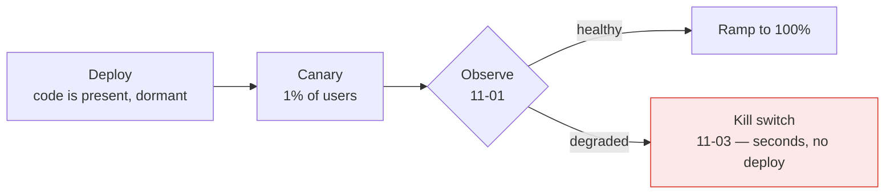

> A system you cannot observe, deploy or change safely is not finished, however good its
> architecture is. This module is what makes the previous nine survivable in production.

## What you will be able to do

- Answer "why is this request slow?" for a request that touched fourteen services.
- Deploy on a Friday afternoon and mean it.
- Change behaviour without deploying, and turn a feature off in ten seconds.
- Assemble everything in this course into one coherent design, with the trade-offs argued.

## Lessons

| # | Lesson | What it makes possible |
|---|---|---|
| 11-01 | [Observability](/modules/operations-and-evolution/01-observability) | Understanding a system you cannot hold in your head |
| 11-02 | [Deployment strategies](/modules/operations-and-evolution/02-deployment-strategies) | Changing a running system without downtime |
| 11-03 | [Configuration and feature flags](/modules/operations-and-evolution/03-configuration-and-feature-flags) | Changing behaviour without deploying |
| 11-04 | [Capstone: designing a system](/modules/operations-and-evolution/04-capstone-designing-a-system) | Putting all 66 preceding lessons together |

## The one idea

**In a distributed system, the unit of change is not the deploy — it is the release, and they
should not be the same event.**

Deploying puts code on machines. Releasing exposes behaviour to users. Separating them is what
turns a risky, irreversible, all-at-once event into a gradual, observable, instantly reversible
one:

The three lessons are one idea seen from three angles: observability tells you what is
happening, deployment strategies limit who is affected, and feature flags let you undo it
without waiting for a build.

## ShopFlow at the end of this module

Any engineer can trace a slow checkout across all nine services in under a minute. Deploys are
canaried automatically and roll back on their own if error budgets are burning. Every risky
feature has a kill switch that works in seconds. And schema migrations happen without downtime
because they are always expand-then-contract.

---

**Up:** [Curriculum](/CURRICULUM) · **Previous:** [← Module 10](/modules/performance-and-concurrency/README) · **Next:** [11-01 Observability →](/modules/operations-and-evolution/01-observability)
