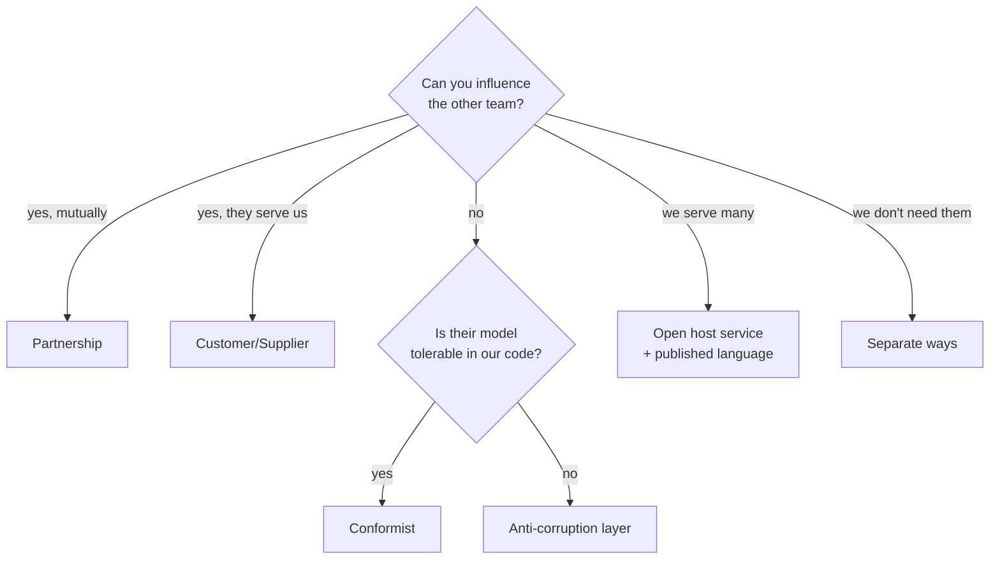

The complete DDD catalogue in one place: every pattern, what it is for, and where it is taught
in depth. Use this as a lookup; use [Module 06](/modules/domain-driven-design/README)
to actually learn them.

**Contents:** [Strategic patterns](#strategic-design) · [Context relationships](#context-relationship-patterns) ·
[Tactical patterns](#tactical-design) · [Supple design](#supple-design) · [Process](#modelling-process) ·
[Decision tables](#decision-tables) · [Common mistakes](#the-mistakes-in-order-of-cost)

---

## Strategic design

*Between contexts. The half that determines whether the architecture works.*

| Pattern | What it is | Use when | Lesson |
|---|---|---|---|
| **Ubiquitous language** | One vocabulary shared by code and experts, within a context | Always | [06-01](/modules/domain-driven-design/01-ubiquitous-language-and-the-domain-model) |
| **Bounded context** | A boundary within which one model and one vocabulary hold | The same term means different things to different people | [06-05](/modules/domain-driven-design/05-strategic-design-bounded-contexts-and-context-maps) |
| **Core subdomain** | The part that differentiates you commercially | Concentrate your best people here | [06-05](/modules/domain-driven-design/05-strategic-design-bounded-contexts-and-context-maps) |
| **Supporting subdomain** | Necessary, specific to you, not differentiating | Build simply | [06-05](/modules/domain-driven-design/05-strategic-design-bounded-contexts-and-context-maps) |
| **Generic subdomain** | Every business needs it; nobody differentiates on it | **Buy it. Never build** | [06-05](/modules/domain-driven-design/05-strategic-design-bounded-contexts-and-context-maps) |
| **Context map** | The documented relationships between contexts | More than two contexts | [06-05](/modules/domain-driven-design/05-strategic-design-bounded-contexts-and-context-maps) |
| **Distillation** | Separating the core from the surrounding mud | The core is buried in a big ball | [06-05](/modules/domain-driven-design/05-strategic-design-bounded-contexts-and-context-maps) |
| **Segregated core** | Physically separating core model from supporting code | The core cannot be understood alone | [06-05](/modules/domain-driven-design/05-strategic-design-bounded-contexts-and-context-maps) |
| **Big ball of mud** | A region with no boundaries — named so it can be quarantined | Legacy you cannot fix yet | [06-05](/modules/domain-driven-design/05-strategic-design-bounded-contexts-and-context-maps) |

### Context relationship patterns

The nine canonical relationships, ordered from most to least cooperative. **The choice is
usually determined by organisational power, not technology.**

| Relationship | Upstream ↔ downstream | Choose when | Where it appears |
|---|---|---|---|
| **Partnership** | Mutual; coordinated releases | Two teams genuinely succeed or fail together | [06-05](/modules/domain-driven-design/05-strategic-design-bounded-contexts-and-context-maps) |
| **Shared kernel** | Co-owned subset of the model | Small, stable, two aligned teams. Rare | [06-05](/modules/domain-driven-design/05-strategic-design-bounded-contexts-and-context-maps) |
| **Customer/Supplier** | Downstream's needs enter upstream's backlog | Upstream is accountable to downstream | [06-05](/modules/domain-driven-design/05-strategic-design-bounded-contexts-and-context-maps) |
| **Conformist** | Downstream adopts upstream's model wholesale | Upstream won't accommodate you; their model is tolerable | [06-05](/modules/domain-driven-design/05-strategic-design-bounded-contexts-and-context-maps) |
| **Anti-corruption layer** | Downstream translates defensively | Upstream won't accommodate you; their model is *not* tolerable | [08-06](/modules/microservice-architecture/06-anti-corruption-layer) |
| **Open host service** | Upstream publishes one general protocol | Many downstreams; bespoke service is impossible | [06-05](/modules/domain-driven-design/05-strategic-design-bounded-contexts-and-context-maps) |
| **Published language** | A documented interchange format | Cross-organisation integration | [05-04](/modules/messaging-and-eip/04-message-translator-and-canonical-data-model) |
| **Separate ways** | No integration at all | Integration costs more than duplication | [06-05](/modules/domain-driven-design/05-strategic-design-bounded-contexts-and-context-maps) |
| **Big ball of mud** | Quarantine and defend | Legacy with no internal boundaries | [08-05](/modules/microservice-architecture/05-strangler-fig) |

---

## Tactical design

*Inside one context. The building blocks.*

| Pattern | What it is | Rule of thumb | Lesson |
|---|---|---|---|
| **Value object** | Identity is the value; immutable | **Default to this** | [06-02](/modules/domain-driven-design/02-entities-value-objects-and-aggregates) |
| **Entity** | Stable identity across changing values | Only when identity outlives the values | [06-02](/modules/domain-driven-design/02-entities-value-objects-and-aggregates) |
| **Aggregate** | A consistency boundary with one root | As small as the true invariants allow | [06-02](/modules/domain-driven-design/02-entities-value-objects-and-aggregates) |
| **Aggregate root** | The only entry point to the aggregate | External refs point here, by ID | [06-02](/modules/domain-driven-design/02-entities-value-objects-and-aggregates) |
| **Domain event** | A fact the business cares about, past tense | Raised by the aggregate | [06-03](/modules/domain-driven-design/03-domain-events-and-domain-services) |
| **Integration event** | A published, versioned contract across contexts | **Never publish domain events directly** | [06-03](/modules/domain-driven-design/03-domain-events-and-domain-services) |
| **Domain service** | Stateless domain logic belonging to no aggregate | Rare. Most things belong on an aggregate | [06-03](/modules/domain-driven-design/03-domain-events-and-domain-services) |
| **Policy** | "Whenever X happens, do Y" | Named, one per rule | [06-03](/modules/domain-driven-design/03-domain-events-and-domain-services) |
| **Repository** | Collection-like access to aggregates | One per aggregate root, not per table | [06-04](/modules/domain-driven-design/04-repositories-factories-and-the-application-layer) |
| **Factory** | Encapsulates complex construction | Only when construction is a domain concern | [06-04](/modules/domain-driven-design/04-repositories-factories-and-the-application-layer) |
| **Application service** | Use-case orchestration; no business rules | Load, call, save, publish — nothing else | [06-04](/modules/domain-driven-design/04-repositories-factories-and-the-application-layer) |
| **Module** | A named grouping inside a context | Aligns with the ubiquitous language | [07-02](/modules/modular-monolith/02-module-boundaries-and-enforcement) |

### Supple design

Evans' patterns for a model that stays changeable. Less famous than aggregates and often more
immediately useful.

| Pattern | What it is |
|---|---|
| **Intention-revealing interfaces** | Names state *what*, never *how* |
| **Side-effect-free functions** | Queries that compute and change nothing |
| **Assertions** | Invariants stated explicitly, not implied by tests |
| **Closure of operations** | `Money + Money → Money`. Operations that stay in the type |
| **Conceptual contours** | Split along the domain's natural joints, not arbitrary ones |
| **Standalone classes** | Reduce coupling so a concept can be understood alone |
| **Specification** | A predicate as a first-class object, composable and reusable |
| **Declarative design** | The model reads as a statement of the rules |

All are taught in context in [06-01](/modules/domain-driven-design/01-ubiquitous-language-and-the-domain-model)
and [06-06](/modules/domain-driven-design/06-modelling-in-practice).

---

## Modelling process

| Technique | Best for | Lesson |
|---|---|---|
| **EventStorming — Big Picture** | Finding contexts and pain across a whole business | [06-06](/modules/domain-driven-design/06-modelling-in-practice) |
| **EventStorming — Process** | One flow: commands, policies, read models | [06-06](/modules/domain-driven-design/06-modelling-in-practice) |
| **EventStorming — Design** | Deriving aggregates directly | [06-06](/modules/domain-driven-design/06-modelling-in-practice) |
| **Domain storytelling** | A single sequential flow, with non-technical participants | [06-06](/modules/domain-driven-design/06-modelling-in-practice) |
| **Example mapping** | Nailing invariants once boundaries are known | [06-06](/modules/domain-driven-design/06-modelling-in-practice) |
| **Refactoring toward deeper insight** | Making implicit concepts explicit, continuously | [06-06](/modules/domain-driven-design/06-modelling-in-practice) |
| **Wardley mapping** | Deciding build vs buy per subdomain | [06-05](/modules/domain-driven-design/05-strategic-design-bounded-contexts-and-context-maps) |

---

## Decision tables

### Entity or value object?

| Question | Entity | Value object |
|---|---|---|
| Do you care *which one* it is, over time? | Yes | No |
| Would you ever say "the same X, changed"? | Yes | No — you replace it |
| Does it need an ID that outlives its fields? | Yes | No |
| **Default** | | **✓ this one** |

### How big should the aggregate be?

| Signal | Action |
|---|---|
| An invariant must hold at every instant across two things | Same aggregate |
| Consistency within seconds is acceptable | Separate aggregates + event |
| A collection has no natural upper bound | Split it out |
| Concurrent edits to unrelated parts collide | Too large — split |
| You need a saga for your most common operation | Too small — reconsider |

### Which relationship with that other context?

### Where does this logic go?

| The logic… | Goes in |
|---|---|
| Enforces an invariant of one aggregate | The aggregate |
| Computes from one value | A value object |
| Is a rule spanning two aggregates, stateless | A domain service |
| Loads, calls, saves, publishes | An application service |
| Reacts to something that happened | A policy |
| Translates to or from a foreign model | An anti-corruption layer |
| Answers a query across aggregates | A read model, not a repository |

---

## The mistakes, in order of cost

1. **Building a generic subdomain.** Bespoke auth, billing or CMS. Consumes a team indefinitely
   for something worse than a product you could buy. [06-05](/modules/domain-driven-design/05-strategic-design-bounded-contexts-and-context-maps)
2. **Assuming bounded context = microservice.** Distributes before the boundaries are proven,
   then freezes them. [06-05](/modules/domain-driven-design/05-strategic-design-bounded-contexts-and-context-maps), [07-01](/modules/modular-monolith/01-why-a-modular-monolith-first)
3. **Publishing domain events as integration events.** Every internal refactor becomes a
   breaking change for teams you have never met. [06-03](/modules/domain-driven-design/03-domain-events-and-domain-services)
4. **One model for everything.** The 94-field class serving four purposes. [06-05](/modules/domain-driven-design/05-strategic-design-bounded-contexts-and-context-maps)
5. **Aggregates too large.** Contention, slow loads, and unshardable later. [06-02](/modules/domain-driven-design/02-entities-value-objects-and-aggregates)
6. **Tactical patterns without strategic design.** Beautiful aggregates inside the wrong
   boundaries. [Module 06 README](/modules/domain-driven-design/README)
7. **Anaemic domain model.** Data classes plus service classes; rules scattered across callers.
   [06-01](/modules/domain-driven-design/01-ubiquitous-language-and-the-domain-model)
8. **Domain types in a `shared` package.** Universal coupling with better package names.
   [07-02](/modules/modular-monolith/02-module-boundaries-and-enforcement)
9. **Modelling from the database schema.** Rediscovers the boundaries you set out to question.
   [06-06](/modules/domain-driven-design/06-modelling-in-practice)
10. **Applying DDD everywhere.** A settings table does not need an aggregate. Reserve the effort
    for the core. [06-01](/modules/domain-driven-design/01-ubiquitous-language-and-the-domain-model)

---

## Where DDD meets the rest of this course

| DDD concept | Becomes, elsewhere |
|---|---|
| Aggregate boundary | Transaction boundary ([04-01](/modules/data-and-consistency/01-distributed-transactions-and-two-phase-commit)), concurrency unit ([10-01](/modules/performance-and-concurrency/01-concurrency-control)), partition key ([03-04](/modules/scalability/04-partitioning-and-sharding)), event stream ([04-05](/modules/data-and-consistency/05-event-sourcing)) |
| Bounded context | Module ([07-02](/modules/modular-monolith/02-module-boundaries-and-enforcement)) or service ([08-01](/modules/microservice-architecture/01-decomposition-and-bounded-contexts)) |
| Domain event | In-process event ([07-03](/modules/modular-monolith/03-in-process-communication-between-modules)) |
| Integration event | Outbox message ([04-03](/modules/data-and-consistency/03-transactional-outbox)), versioned contract ([01-04](/modules/communication/04-serialization-and-schema-evolution)) |
| Anti-corruption layer | Message translator ([05-04](/modules/messaging-and-eip/04-message-translator-and-canonical-data-model)), strangler façade ([08-05](/modules/microservice-architecture/05-strangler-fig)) |
| Repository / port | The seam that makes extraction cheap ([07-05](/modules/modular-monolith/05-extracting-a-module-into-a-service)) |
| Multi-aggregate operation | Saga ([04-02](/modules/data-and-consistency/02-saga)) or process manager ([05-07](/modules/messaging-and-eip/07-process-manager-and-routing-slip)) |

---

## Further reading

- Eric Evans, *Domain-Driven Design* (2003) — the original. Read Part IV (strategic) first.
- Eric Evans, "Domain-Driven Design Reference" (2015) — free, and the best pattern summary.
- Vaughn Vernon, *Implementing Domain-Driven Design* (2013); "Effective Aggregate Design" (2011).
- Vlad Khononov, *Learning Domain-Driven Design* (2021) — the best modern introduction.
- Scott Wlaschin, *Domain Modeling Made Functional* (2018).
- Alberto Brandolini, *EventStorming*.
- Nick Tune & Scott Millett, *Patterns, Principles and Practices of Domain-Driven Design*.

---

**See also:** [Module 06 — DDD](/modules/domain-driven-design/README) · [Module 07 — Modular monolith](/modules/modular-monolith/README) · [Pattern index](/reference/PATTERN-INDEX) · [Decision guide](/reference/DECISION-GUIDE)
