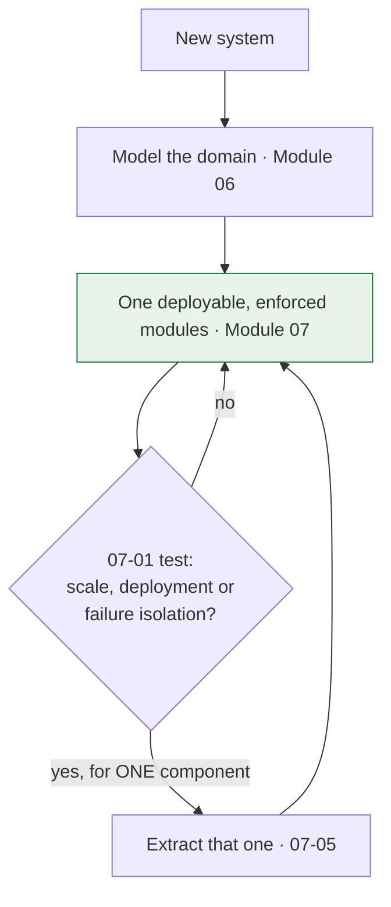
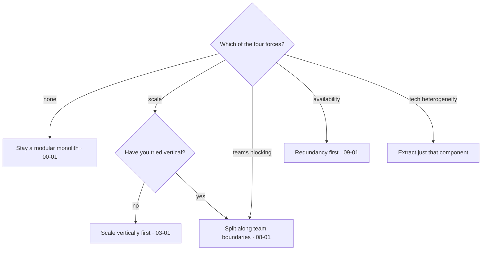

Start from a symptom or a question; arrive at the lesson. For the reverse direction — start
from a pattern name — see the [pattern index](/reference/PATTERN-INDEX). For DDD specifically, the
[DDD pattern reference](/reference/DDD-REFERENCE) has decision tables of its own.

---

## Symptom → pattern

### "Everything falls over when one dependency is slow"

| Observation | Read |
|---|---|
| Threads or connections all consumed | [02-01 Timeouts](/modules/resilience/01-timeouts-and-deadlines), [02-04 Bulkhead](/modules/resilience/04-bulkhead) |
| A failure in one feature breaks unrelated ones | [02-04 Bulkhead](/modules/resilience/04-bulkhead) |
| We keep calling a dependency that is clearly down | [02-03 Circuit breaker](/modules/resilience/03-circuit-breaker) |
| The whole page fails when a widget's service is down | [02-07 Degradation](/modules/resilience/07-fallback-and-graceful-degradation) |
| A dependency slowed but never errored, and nothing tripped | [02-03 §6](/modules/resilience/03-circuit-breaker), [00-03 Gray failure](/modules/foundations/03-failure-models-and-partial-failure) |

### "A brief blip became a long outage"

| Observation | Read |
|---|---|
| Load tripled the moment things got slow | [02-02 Retries and budgets](/modules/resilience/02-retries-backoff-and-jitter) |
| It stayed broken after the cause was fixed | [02-06 Congestion collapse](/modules/resilience/06-load-shedding-and-backpressure) |
| All clients retried at the same instant | [02-02 Jitter](/modules/resilience/02-retries-backoff-and-jitter) |
| Every instance restarted at once | [02-08 Health checks](/modules/resilience/08-health-checks-and-self-healing) |
| Cache restarted and the origin died | [03-03 Stampedes](/modules/scalability/03-caching) |

### "It's slow"

| Observation | Read |
|---|---|
| Low CPU, high latency, flat throughput | [10-03 Pool exhaustion](/modules/performance-and-concurrency/03-resource-pooling) |
| Every service's p99 is fine, the page's is not | [10-04 Tail latency](/modules/performance-and-concurrency/04-tail-latency-and-hedged-requests) |
| Latency exploded past ~80% utilisation | [00-04 Queueing](/modules/foundations/04-latency-throughput-and-back-of-envelope) |
| Many small calls per request | [01-01 Chattiness](/modules/communication/01-synchronous-request-response), [08-02 BFF](/modules/microservice-architecture/02-api-gateway-and-backend-for-frontend) |
| The request does work the user never sees | [10-02 Work queues](/modules/performance-and-concurrency/02-asynchronous-processing-and-work-queues) |
| Reads dominate and hit the database | [03-03 Caching](/modules/scalability/03-caching), [03-05 Replicas](/modules/scalability/05-replication) |
| Writes are the ceiling | [03-04 Partitioning](/modules/scalability/04-partitioning-and-sharding) |

### "The data is wrong"

| Observation | Read |
|---|---|
| A customer was charged twice | [01-03 Idempotency](/modules/communication/03-delivery-guarantees-and-idempotency), [00-03 Ambiguity](/modules/foundations/03-failure-models-and-partial-failure) |
| An order exists with no shipment | [04-03 Outbox](/modules/data-and-consistency/03-transactional-outbox) |
| A consumer processed the same message twice | [04-04 Idempotent consumer](/modules/data-and-consistency/04-idempotent-consumer-and-inbox) |
| Two users bought the last unit | [10-01 Concurrency control](/modules/performance-and-concurrency/01-concurrency-control) |
| One agent's edit silently overwrote another's | [10-01 Optimistic concurrency](/modules/performance-and-concurrency/01-concurrency-control) |
| "It didn't save" — the change isn't visible | [00-05 Read-your-writes](/modules/foundations/05-consistency-models-cap-and-pacelc), [03-05 Replication lag](/modules/scalability/05-replication) |
| Stock reserved for an order that failed | [04-02 Saga compensation](/modules/data-and-consistency/02-saga) |
| Events arrived out of order | [04-04 Version gating](/modules/data-and-consistency/04-idempotent-consumer-and-inbox), [05-02 Partition keys](/modules/messaging-and-eip/02-point-to-point-and-publish-subscribe) |
| Two nodes both thought they were leader | [04-07 Consensus](/modules/data-and-consistency/07-consensus-and-leader-election), [10-01 Fencing](/modules/performance-and-concurrency/01-concurrency-control) |

### "The model is a mess"

| Observation | Read |
|---|---|
| The same word means different things to different teams | [06-01 Ubiquitous language](/modules/domain-driven-design/01-ubiquitous-language-and-the-domain-model), [06-05 Bounded contexts](/modules/domain-driven-design/05-strategic-design-bounded-contexts-and-context-maps) |
| One class with 90 fields serving four purposes | [06-05 Bounded contexts](/modules/domain-driven-design/05-strategic-design-bounded-contexts-and-context-maps) |
| Business rules live in controllers and service classes | [06-01 Anaemic models](/modules/domain-driven-design/01-ubiquitous-language-and-the-domain-model), [06-04 Application layer](/modules/domain-driven-design/04-repositories-factories-and-the-application-layer) |
| Illegal combinations of fields are reachable in code | [06-02 Aggregates and invariants](/modules/domain-driven-design/02-entities-value-objects-and-aggregates) |
| Loading one entity loads thousands of objects | [06-02 Aggregate sizing](/modules/domain-driven-design/02-entities-value-objects-and-aggregates) |
| A 400-line handler that grows with every new requirement | [06-03 Domain events and policies](/modules/domain-driven-design/03-domain-events-and-domain-services) |
| Renaming an internal field broke four other teams | [06-03 Integration events](/modules/domain-driven-design/03-domain-events-and-domain-services) |
| The domain model cannot be unit-tested without a database | [06-04 Ports and adapters](/modules/domain-driven-design/04-repositories-factories-and-the-application-layer) |
| Our best engineers are building authentication | [06-05 Generic subdomains](/modules/domain-driven-design/05-strategic-design-bounded-contexts-and-context-maps) |
| Boundary workshops keep reproducing the current schema | [06-06 Modelling in practice](/modules/domain-driven-design/06-modelling-in-practice) |

### "We have microservices and it hurts"

| Observation | Read |
|---|---|
| 14 services, 12 engineers, 40 rps | [07-01 Why a modular monolith first](/modules/modular-monolith/01-why-a-modular-monolith-first) |
| Local dev needs nine containers | [07-01](/modules/modular-monolith/01-why-a-modular-monolith-first) |
| Every feature touches four services in order | [08-01 Distributed monolith](/modules/microservice-architecture/01-decomposition-and-bounded-contexts), [07-01](/modules/modular-monolith/01-why-a-modular-monolith-first) |
| Two engineers of twelve are full-time platform | [07-01](/modules/modular-monolith/01-why-a-modular-monolith-first) |
| Module boundaries erode despite the design document | [07-02 Enforcement](/modules/modular-monolith/02-module-boundaries-and-enforcement) |
| A query joins three modules' tables | [07-04 Schema per module](/modules/modular-monolith/04-data-and-transactions-in-a-modular-monolith) |
| Extraction estimated at a quarter, not a week | [07-05 Extraction](/modules/modular-monolith/05-extracting-a-module-into-a-service) |

### "We can't ship"

| Observation | Read |
|---|---|
| Deploying one service needs three teams to coordinate | [08-01 Distributed monolith](/modules/microservice-architecture/01-decomposition-and-bounded-contexts) |
| A field rename broke four consumers | [01-04 Schema evolution](/modules/communication/04-serialization-and-schema-evolution) |
| A migration broke the running version | [11-02 Expand/contract](/modules/operations-and-evolution/02-deployment-strategies) |
| A bug reached 100% of users in four minutes | [11-02 Canary](/modules/operations-and-evolution/02-deployment-strategies) |
| Turning a feature off takes 40 minutes | [11-03 Kill switches](/modules/operations-and-evolution/03-configuration-and-feature-flags) |
| Every deploy produces a burst of errors | [01-05 Graceful shutdown](/modules/communication/05-service-discovery), [02-08](/modules/resilience/08-health-checks-and-self-healing) |
| We can't touch the legacy system | [08-05 Strangler fig](/modules/microservice-architecture/05-strangler-fig), [08-06 ACL](/modules/microservice-architecture/06-anti-corruption-layer) |

### "Something is silently broken"

These share a signature: **no errors, no latency change, and the system is wrong.** Each needs
a specific metric that generic instrumentation will not give you.

| Silent failure | Metric that catches it | Read |
|---|---|---|
| Events published but not delivered | Outbox lag (age of oldest unpublished) | [04-03](/modules/data-and-consistency/03-transactional-outbox) |
| A consumer stopped | Consumer group presence and lag | [05-02](/modules/messaging-and-eip/02-point-to-point-and-publish-subscribe) |
| Messages accumulating unread | DLQ depth and age of oldest | [05-06](/modules/messaging-and-eip/06-dead-letter-channel-and-poison-messages) |
| Read model hours behind | Projection lag | [04-06](/modules/data-and-consistency/06-cqrs) |
| Replicas hours behind | Replication lag | [03-05](/modules/scalability/05-replication) |
| A feature degraded for weeks | Degraded-mode rate per feature | [02-07](/modules/resilience/07-fallback-and-graceful-degradation) |
| Backups useless for months | Age of last **verified** backup | [09-03](/modules/availability-and-dr/03-disaster-recovery-rpo-and-rto) |
| Sagas stuck mid-flow | Stuck saga count and age | [04-02](/modules/data-and-consistency/02-saga) |
| One instance 3× slower than its peers | Per-instance latency percentiles | [03-02](/modules/scalability/02-load-balancing) |

---

## Question → lesson

### "We're starting a new system. What do we build?"

The loop is the point. The default state is a modular monolith; extraction is an event
triggered by evidence, not a programme. Most systems end at "a monolith plus two services".

### "Should we split this into services?"

Before this question, answer the previous one. If the boundaries are not yet modelled
([Module 06](/modules/domain-driven-design/README)) or not yet enforced in one deployable
([Module 07](/modules/modular-monolith/README)), splitting will freeze boundaries you have not validated.

Then: [00-01](/modules/foundations/01-why-distributed-systems) →
[08-01](/modules/microservice-architecture/01-decomposition-and-bounded-contexts) →
[08-03](/modules/microservice-architecture/03-database-per-service).

### "Synchronous or asynchronous?"

| The caller… | Choose |
|---|---|
| Cannot proceed without the answer | [Synchronous](/modules/communication/01-synchronous-request-response) |
| Ignores the response | [Asynchronous](/modules/communication/02-asynchronous-messaging) |
| Needs an answer but can wait minutes | Async request/reply, or 202 + status URL |
| Is a burst that the receiver cannot absorb | [Queue](/modules/performance-and-concurrency/02-asynchronous-processing-and-work-queues) |

### "How consistent does this need to be?"

| If a stale or conflicting read costs… | Choose |
|---|---|
| Money or safety | Linearizable — [00-05](/modules/foundations/05-consistency-models-cap-and-pacelc) |
| A confusing UI ("it didn't save") | Read-your-writes |
| An impossible-looking sequence | Causal |
| Nothing anyone notices | Eventual |

### "Which consistency mechanism?"

| Situation | Mechanism |
|---|---|
| One database, multiple tables | A local transaction. Stop here |
| Multiple services, must be atomic *now* | [2PC](/modules/data-and-consistency/01-distributed-transactions-and-two-phase-commit) — and reconsider the boundary |
| Multiple services, eventual is fine | [Saga](/modules/data-and-consistency/02-saga) |
| State change + event | [Outbox](/modules/data-and-consistency/03-transactional-outbox) |
| Consuming at-least-once | [Inbox](/modules/data-and-consistency/04-idempotent-consumer-and-inbox) |
| Contended single resource | [Atomic update or reservation](/modules/performance-and-concurrency/01-concurrency-control) |
| Exactly one node must act | [Leader election + fencing](/modules/data-and-consistency/07-consensus-and-leader-election) |

### "How do we scale this?"

| Constraint | Move |
|---|---|
| Read throughput | [Cache](/modules/scalability/03-caching) → [replicas](/modules/scalability/05-replication) → [CQRS](/modules/data-and-consistency/06-cqrs) |
| Write throughput | Batch → [async](/modules/performance-and-concurrency/02-asynchronous-processing-and-work-queues) → [shard](/modules/scalability/04-partitioning-and-sharding) |
| Data volume | Archive/tier → [shard](/modules/scalability/04-partitioning-and-sharding) |
| Compute | [Stateless + horizontal](/modules/scalability/01-stateless-services-and-horizontal-scaling) |
| Connections | Pool sizing → [proxy pooler](/modules/performance-and-concurrency/03-resource-pooling) |

### "Where does this logic go?"

| The logic… | Goes in |
|---|---|
| Enforces an invariant of one aggregate | The aggregate ([06-02](/modules/domain-driven-design/02-entities-value-objects-and-aggregates)) |
| Computes from one value | A value object ([06-02](/modules/domain-driven-design/02-entities-value-objects-and-aggregates)) |
| Is a stateless rule spanning two aggregates | A domain service ([06-03](/modules/domain-driven-design/03-domain-events-and-domain-services)) |
| Loads, calls, saves, publishes | An application service ([06-04](/modules/domain-driven-design/04-repositories-factories-and-the-application-layer)) |
| Reacts to something that happened | A policy ([06-03](/modules/domain-driven-design/03-domain-events-and-domain-services)) |
| Translates a foreign model | An anti-corruption layer ([08-06](/modules/microservice-architecture/06-anti-corruption-layer)) |
| Answers a query across aggregates | A read model ([04-06](/modules/data-and-consistency/06-cqrs)) |

### "How should two modules talk?"

| The caller… | Use |
|---|---|
| Needs the answer to continue | A direct call to the published API ([07-03](/modules/modular-monolith/03-in-process-communication-between-modules)) |
| Is announcing a fact | An after-commit event ([07-03](/modules/modular-monolith/03-in-process-communication-between-modules)) |
| Needs foreign data on every request | A local read model ([07-03](/modules/modular-monolith/03-in-process-communication-between-modules)) |
| Must not lose the side effect | A persisted job in the same transaction ([07-03](/modules/modular-monolith/03-in-process-communication-between-modules)) |
| Wants to read another module's tables | Nothing. This is forbidden ([07-04](/modules/modular-monolith/04-data-and-transactions-in-a-modular-monolith)) |

### "Which resilience patterns, in what order?"

1. [Timeouts and deadlines](/modules/resilience/01-timeouts-and-deadlines) — nothing else works without them.
2. [Idempotency](/modules/communication/03-delivery-guarantees-and-idempotency) — before any retry.
3. [Retries with jitter and a budget](/modules/resilience/02-retries-backoff-and-jitter).
4. [Bulkheads](/modules/resilience/04-bulkhead) — containment before detection.
5. [Circuit breakers](/modules/resilience/03-circuit-breaker) — with slow-call detection.
6. [Load shedding](/modules/resilience/06-load-shedding-and-backpressure).
7. [Fallbacks](/modules/resilience/07-fallback-and-graceful-degradation) — last, and only over bounded calls.

---

## Reality checks

Before adopting any pattern, answer these. If you cannot, you are not ready to adopt it.

| Pattern | The question that decides it |
|---|---|
| Microservices | Can you name which of the four forces applies, with a number? |
| Modular monolith | Is anything enforcing the boundaries, or only a document? |
| Extracting a module | Does the extraction check in [07-05](/modules/modular-monolith/05-extracting-a-module-into-a-service) pass today? |
| DDD tactical patterns | Are the *boundaries* right first? Aggregates inside wrong contexts are wasted |
| Building a generic subdomain | Would a product costing £500/month do this adequately? |
| Aggregate design | Must these things be consistent *at every instant*, or merely eventually? |
| Sharding | Does the data actually not fit? What is the number? |
| Event sourcing | Would an audit table meet the requirement at 5% of the cost? |
| CQRS (level 3+) | Is API composition genuinely too slow? Measured? |
| Service mesh | How many services and languages? Under 15 and 3, use libraries |
| Multi-region | Which failure or which regulation requires it? |
| Distributed lock | Can this be an atomic conditional update instead? |
| Circuit breaker | What will you *do* when it opens? |
| Retry | Is the operation idempotent? Does anything below you already retry? |
| Cache | What staleness is acceptable, and who agreed to it? |
| Saga | Would moving the boundary remove the need entirely? |

---

## The rules that apply everywhere

1. **A timeout is an ambiguous outcome.** It is *no answer*: do not infer whether the operation
   committed, but return/handle the caller-visible timeout as such ([00-03](/modules/foundations/03-failure-models-and-partial-failure)).
2. **Retries require idempotency.** Without it, a retry is a duplicate ([01-03](/modules/communication/03-delivery-guarantees-and-idempotency)).
3. **Every queue must be bounded.** Unbounded queues convert throughput problems into latency problems and hide them ([02-06](/modules/resilience/06-load-shedding-and-backpressure)).
4. **Never write to a database and a broker separately.** Use the outbox ([04-03](/modules/data-and-consistency/03-transactional-outbox)).
5. **Never fail a health check on a shared dependency.** All instances fail together ([02-08](/modules/resilience/08-health-checks-and-self-healing)).
6. **A distributed lock without a fencing token is not a lock** ([10-01](/modules/performance-and-concurrency/01-concurrency-control)).
7. **Never change a schema in one step.** Expand, migrate, contract ([11-02](/modules/operations-and-evolution/02-deployment-strategies)).
8. **Replication is not backup.** It replicates your mistakes faithfully ([09-03](/modules/availability-and-dr/03-disaster-recovery-rpo-and-rto)).
9. **Run at ≤65% utilisation.** Above the knee, latency is not linear ([00-04](/modules/foundations/04-latency-throughput-and-back-of-envelope)).
10. **Alert on the age of the oldest stuck thing**, not on error rates. Silent failures have no errors ([11-01](/modules/operations-and-evolution/01-observability)).
11. **A bounded context is not a microservice.** One is discovered in the domain, the other chosen for operations ([06-05](/modules/domain-driven-design/05-strategic-design-bounded-contexts-and-context-maps)).
12. **Never publish a domain event as an integration event.** Translate at the boundary, or your internals become a public contract ([06-03](/modules/domain-driven-design/03-domain-events-and-domain-services)).
13. **An unenforced boundary is already crossed.** A design document is not enforcement ([07-02](/modules/modular-monolith/02-module-boundaries-and-enforcement)).
14. **Buy generic subdomains.** Bespoke auth or billing consumes a team forever ([06-05](/modules/domain-driven-design/05-strategic-design-bounded-contexts-and-context-maps)).

---

**See also:** [Pattern index](/reference/PATTERN-INDEX) · [DDD reference](/reference/DDD-REFERENCE) · [Capstone](/modules/operations-and-evolution/04-capstone-designing-a-system) · [Curriculum](/CURRICULUM)
