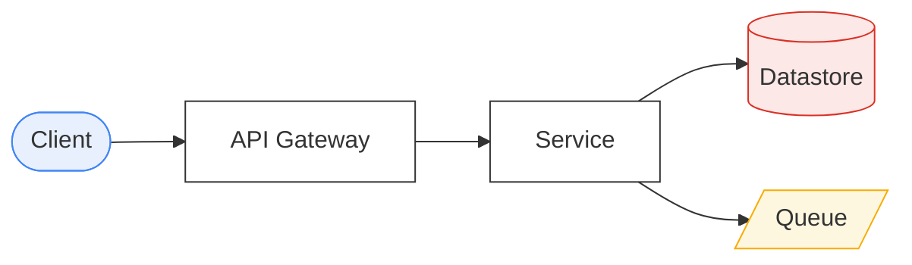

> The single notation used by every lesson in this project. Read this once; every code
> block in `modules/` obeys it.

**Design rules**

1. **Readable over runnable.** Nothing here compiles. Ambiguity is resolved in favour of the reader.
2. **No incidental detail.** No imports, no DI wiring, no null checks that don't teach anything.
3. **Failure is explicit.** Anything that crosses the network must show its timeout, its error path, or a comment saying why it doesn't.
4. **One way to say a thing.** If two syntaxes would work, this document picks one.

**Contents**

- [1. Lexical basics](#1-lexical-basics)
- [2. Values and types](#2-values-and-types)
- [3. Data declarations](#3-data-declarations)
- [4. Expressions and control flow](#4-expressions-and-control-flow)
- [5. Functions](#5-functions)
- [6. Errors and `Result`](#6-errors-and-result)
- [7. Services — the unit of deployment](#7-services--the-unit-of-deployment)
- [7b. Contexts, modules and aggregates](#7b-contexts-modules-and-aggregates)
- [8. Concurrency and time](#8-concurrency-and-time)
- [9. Annotations](#9-annotations)
- [10. Elision and comments](#10-elision-and-comments)
- [11. Diagram conventions](#11-diagram-conventions)
- [12. Full worked example](#12-full-worked-example)
- [13. Cheat sheet](#13-cheat-sheet)

---

## 1. Lexical basics

- Blocks are **indentation-based** (2 spaces). No braces, no semicolons.
- Comments start with `#`. A comment that spans the block explains *why*, never *what*.
- `snake_case` for functions, fields and variables. `PascalCase` for types and services.
- `SCREAMING_CASE` for constants and enum members.
- Assignment is `=`. Equality is `==`. There is no `===`.

```
# a comment
MAX_ATTEMPTS = 3          # constant
order_total = 42.00       # variable
```

---

## 2. Values and types

Types are written after a colon: `name: Type`. Type annotations are **required** on
declarations that cross a service boundary (records, handler params, return types) and
**optional** everywhere else.

| Type | Meaning | Literal |
|---|---|---|
| `Bool` | true / false | `true`, `false` |
| `Int`, `Float` | numbers | `42`, `3.14` |
| `String` | text | `"abc"` |
| `Bytes` | opaque binary payload | `bytes("...")` |
| `Duration` | a span of time | `250ms`, `2s`, `5m`, `1h`, `7d` |
| `Instant` | a point in time | `now()` |
| `UUID` | unique id | `uuid()` |
| `Money` | amount + currency (never a `Float` in real code) | `Money(42.00, "EUR")` |
| `List<T>` | ordered | `[a, b, c]` |
| `Set<T>` | unordered, unique | `{a, b}` |
| `Map<K,V>` | dictionary | `{"k": v}` |
| `Option<T>` | value or absence | `Some(x)`, `None` |
| `Result<T,E>` | success or failure — see §6 | `Ok(x)`, `Err(e)` |

Nothing is implicitly nullable. If a value may be missing it is an `Option<T>`.

**Durations are first-class.** `now() + 2s`, `timeout 500ms`, `retry after 1s * 2^attempt`.

---

## 3. Data declarations

### Records — immutable data that travels

```
record Order:
  id: OrderId
  customer_id: CustomerId
  lines: List<OrderLine>
  total: Money
  status: OrderStatus
  version: Int = 0        # default value
```

Records are **immutable**. Produce a changed copy with `with`:

```
paid = order with { status: PAID, version: order.version + 1 }
```

### Enums

```
enum OrderStatus: DRAFT | PENDING_PAYMENT | PAID | SHIPPED | CANCELLED
```

Enums may carry data:

```
enum PaymentOutcome:
  Approved(auth_code: String)
  Declined(reason: String)
  Pending(retry_after: Duration)
```

### Type aliases

```
type OrderId = String
type CustomerId = String
```

### Messages — records that go on the wire

Same shape as a record, tagged with its role so the reader knows the direction of travel.

```
command PlaceOrder:            # imperative, one intended handler, may be rejected
  order_id: OrderId
  lines: List<OrderLine>

event OrderPlaced:             # a fact, past tense, zero-or-more listeners, immutable
  order_id: OrderId
  occurred_at: Instant

query GetOrder:                # read-only, no side effects
  order_id: OrderId
```

The distinction between `command` / `event` / `query` is not decoration — it is the whole
of [CQRS](/modules/data-and-consistency/06-cqrs) and most of
[EIP](/modules/messaging-and-eip/README).

---

## 4. Expressions and control flow

```
if balance >= amount:
  charge(amount)
elif balance > 0:
  partial_charge(balance)
else:
  decline()

for line in order.lines:
  reserve(line.sku, line.qty)

while queue.has_next():
  handle(queue.next())

# `match` on enums, always exhaustive
match outcome:
  case Approved(code):  mark_paid(code)
  case Declined(why):   mark_failed(why)
  case Pending(after):  schedule_retry(after)
```

Loop control: `break`, `continue`. Early exit: `return`.

Comprehensions are allowed when they read better than a loop:

```
skus = [line.sku for line in order.lines]
```

### Collections

The common collection operations are deliberately small and deterministic. `map`, `filter`,
`find`, `any`, `all`, `first`, `last`, `sorted`, `min_by`, `max_by`, `group_by`, and `count`
have their ordinary collection meanings. The operations that change shape are explicit:

```
products.index_by(p => p.sku) -> Map<Sku, Product>   # one item per key; duplicate keys are an error
items.without(x) -> List<T>                           # immutable removal of one matching item
map.keys() / map.values()
```

Use a named helper when a collection operation carries domain meaning; it is then lesson-local,
not a new standard-library primitive.

---

## 5. Functions

```
fn total_of(lines: List<OrderLine>) -> Money:
  return sum(line.price * line.qty for line in lines)

# Async functions are marked `async` and called with `await`.
async fn fetch_customer(id: CustomerId) -> Result<Customer, Error>:
  return await customers.get(id) timeout 500ms
```

Anonymous functions: `(x) => x.price`.

Named arguments are used whenever a call has more than two parameters:

```
breaker = CircuitBreaker(failure_threshold: 5, cooldown: 30s, half_open_probes: 1)
```

---

## 6. Errors and `Result`

Two mechanisms, used for two different things.

**`Result<T, E>` — expected, business-meaningful failure.** Payment declined. Item out of
stock. Version conflict. The caller *must* deal with it.

```
async fn charge(req: ChargeRequest) -> Result<Receipt, ChargeError>:
  if req.amount <= 0:
    return Err(InvalidAmount)
  return Ok(receipt)
```

Consuming a `Result`:

```
match await charge(req):
  case Ok(receipt):  confirm(receipt)
  case Err(e):       compensate(e)

# `?` propagates an Err to the caller unchanged — the common case
receipt = await charge(req)?

# or supply a default
receipt = (await charge(req)).unwrap_or(EMPTY_RECEIPT)
```

**`raise` / `try` — exceptional, infrastructural failure.** Timeouts, connection resets,
serialization faults. Anything a retry might fix.

```
try:
  result = await inventory.reserve(sku) timeout 1s
catch TimeoutError as e:
  metrics.increment("inventory.timeout")
  raise                       # bare `raise` re-throws
catch NetworkError:
  return Err(Unavailable)
finally:
  span.end()
```

Standard error kinds used throughout: `TimeoutError`, `NetworkError`, `ConflictError`,
`NotFoundError`, `RejectedError` (shed load / rate limited), `CircuitOpenError`.

> **Convention.** A `Result` never carries a timeout. A `raise` never carries a business
> decision. Keeping this separation is the difference between a retry that helps and a
> retry that double-charges a customer.

---

## 7. Services — the unit of deployment

A `service` is one independently deployable process with private state.

```
service OrderService:

  # --- dependencies: everything this service talks to, declared up front ---
  uses payments: Client<PaymentService>
  uses inventory: Client<InventoryService>
  uses orders: Store<OrderId, Order>
  uses bus: Topic<OrderEvent>

  # --- local, in-process state; lost on restart unless noted ---
  state breaker: CircuitBreaker = CircuitBreaker(failure_threshold: 5, cooldown: 30s)

  # --- inbound request/response (RPC, HTTP, gRPC — the transport is irrelevant here) ---
  @timeout(2s)
  handler place_order(cmd: PlaceOrder) -> Result<Order, OrderError>:
    ...

  # --- inbound event subscription ---
  on event PaymentCaptured(e):
    ...

  # --- scheduled work ---
  every 30s:
    expire_stale_reservations()

  # --- lifecycle hooks, only when they matter to the lesson ---
  on start:
    warm_cache()
```

Reading the five block kinds tells you everything about a service's surface area:
`uses` (fan-out), `handler` (synchronous surface), `on event` (asynchronous surface),
`every` (background load), `state` (what is lost on restart).

**Client calls** always name the remote service:

```
res = await payments.charge(req)          # crosses the network — can time out
res = total_of(order.lines)               # local — cannot
```

---

## 7b. Contexts, modules and aggregates

Used by [Module 06](/modules/domain-driven-design/README) and
[Module 07](/modules/modular-monolith/README). These constructs describe *structure*;
they have no runtime behaviour of their own.

### `context` — a bounded context

A boundary within which one model and one vocabulary hold. Purely a grouping: it says that the
declarations inside share a meaning.

```
context Inventory:
  record StockItem: ...
  enum StockError: ...
```

### `module` — a deployable-internal boundary

A context with a compilation boundary. `public` members form the API; `internal` members are
invisible outside; `requires` declares dependencies on other modules' public APIs.

```
module Ordering:
  requires Inventory.ReservationApi          # explicit, reviewable dependency

  public interface OrderApi:
    fn place(cmd: PlaceOrderCommand) -> Result<OrderView, OrderError>

  public record OrderView: ...               # a DTO — never an aggregate

  internal aggregate Order: ...              # invisible outside this module
  internal service PlaceOrderHandler: ...
```

Reading a module tells you its surface area: `requires` (what it depends on), `public` (what
others may use), `internal` (what it owns).

### `aggregate` — a consistency boundary

A `record` with a designated root, an `invariants` block, and behaviour. Everything inside
changes together, in one transaction.

```
aggregate Order:
  root:                                      # the root entity's fields
    id: OrderId
    lines: List<OrderLine>
    total: Money
    version: Int

  invariants:                                # true at every instant, enforced on change
    total == sum_of(lines)
    lines.size <= 100

  fn add_line(sku: SKU, qty: Quantity) -> Result<Order, OrderError>:
    ...                                      # returns a new value; never mutates
```

`invariants` may also appear on a plain `record`, where it constrains construction:

```
record Money:
  amount: Int
  currency: String
  invariants: currency in ISO_4217
```

### `policy` — a named reaction

An event handler with domain meaning: *whenever X happens, do Y*.

```
policy ReserveStockWhenOrderPlaced:
  on OrderPlaced(e):
    reservations.reserve(e.order_id, e.lines)
```

### `domain_service` and `factory`

Stateless domain logic belonging to no single aggregate, and construction that is itself a
domain concern.

```
domain_service FundsTransfer:
  fn transfer(from: Account, to: Account, amount: Money)
      -> Result<(Account, Account), TransferError>: ...

factory OrderFactory:
  fn create_from_basket(b: Basket, c: CustomerSnapshot) -> Result<Order, OrderError>: ...
```

### `architecture_test` — a build-time structural rule

Fails the build rather than a runtime check.

```
architecture_test "modules may not reach into another module's internals":
  for m in all_modules():
    no_class_in(m).may_depend_on(other_modules().internals())
```

---

## 8. Concurrency and time

```
# sequential await
a = await svc_a.get()

# fire-and-forget, no result awaited
spawn audit.record(event)

# run concurrently, wait for all, fail if any fails
parallel:
  stock  = inventory.check(sku)
  price  = pricing.quote(sku)
  rating = reviews.score(sku)

# run concurrently, take the first to finish (see: hedged requests)
fastest = race:
  replica_a.read(key)
  replica_b.read(key)

# bound anything that can hang
res = await gateway.charge(req) timeout 800ms      # raises TimeoutError

# a deadline that propagates through every downstream call
with deadline(now() + 2s):
  await a.call()
  await b.call()
```

Locks and atomicity:

```
with lock("order:" + id, ttl: 10s):     # distributed lease, auto-released
  ...

atomically:                              # local database transaction; participating stores share it
  orders.put(order)
  outbox.append(event)
```

Time is always injected, never read from the wall clock implicitly:
`now()`, `sleep(200ms)`, `deadline`, `after 5m`.

---

## 9. Annotations

Annotations state a property the reader must know without cluttering the body.

| Annotation | Meaning |
|---|---|
| `@timeout(2s)` | the handler must complete within this budget |
| `@idempotent(key: field)` | safe to call more than once; dedup key named |
| `@retryable` | callers may safely retry this on failure |
| `@at_least_once` / `@at_most_once` / `@exactly_once` | delivery guarantee assumed |
| `@rate_limit(1000/s)` | enforced admission limit |
| `@bulkhead(pool: "payments", size: 20)` | isolated concurrency pool |
| `@circuit_breaker(threshold: 5, cooldown: 30s)` | wrapped in a breaker |
| `@compensates(step)` | this is the undo for a saga step |
| `@critical` | must not be degraded or shed |
| `@eventually_consistent(lag: ~2s)` | read may be stale, typical lag noted |

```
@idempotent(key: request_id)
@timeout(3s)
handler charge(cmd: ChargeCard) -> Result<Receipt, ChargeError>:
  ...
```

---

## 10. Elision and comments

`...` means "omitted, and not important here". Use it freely — a lesson on circuit
breakers should not show SQL.

Three comment idioms carry meaning:

```
# WHY: we retry only on 5xx because a 4xx will fail identically forever
# TRAP: this line is where the double-charge happens if the key isn't persisted
# COST: adds one network round-trip per request (~1ms p50, ~40ms p99)
```

---

## 11. Diagram conventions

Every lesson uses Mermaid, with a consistent visual vocabulary.

- **Sequence diagrams** for protocols and message flow over time.
- **Flowcharts (`graph LR`)** for topology and component relationships.
- **State diagrams** for anything with modes (breakers, sagas, leases).

Node shape encodes role:



Failure is drawn with a dotted red edge and labelled with what broke.

---

## 12. Full worked example

Everything above, in one service. This is the shape every lesson's code will take.

```
type OrderId = String

enum OrderStatus: PENDING_PAYMENT | PAID | FAILED

record Order:
  id: OrderId
  customer_id: CustomerId
  total: Money
  status: OrderStatus

command PlaceOrder:
  request_id: UUID          # the client's idempotency key
  customer_id: CustomerId
  lines: List<OrderLine>

event OrderPlaced:
  order_id: OrderId
  total: Money
  occurred_at: Instant


service OrderService:
  uses payments: Client<PaymentService>
  uses inventory: Client<InventoryService>
  uses orders: Store<OrderId, Order>
  uses outbox: Store<UUID, OutboxRecord>
  uses seen: Store<UUID, OrderId>         # request_id -> order_id, for dedup

  state breaker: CircuitBreaker = CircuitBreaker(failure_threshold: 5, cooldown: 30s)

  @idempotent(key: request_id)
  @timeout(3s)
  handler place_order(cmd: PlaceOrder) -> Result<Order, OrderError>:

    # 1. Idempotency: a retried request returns the original answer, not a second order.
    if existing = seen.get(cmd.request_id):
      return Ok(orders.get(existing))

    order = Order(
      id: uuid(),
      customer_id: cmd.customer_id,
      total: total_of(cmd.lines),
      status: PENDING_PAYMENT)

    # 2. Independent checks run concurrently; the deadline covers both.
    with deadline(now() + 1s):
      parallel:
        stock = inventory.check(cmd.lines)
        limit = payments.check_limit(cmd.customer_id, order.total)

    if not stock.available:
      return Err(OutOfStock(stock.missing))

    # 3. The only call that moves money is protected and bounded.
    if breaker.is_open():
      return Err(Unavailable)          # fail fast rather than queue behind a dead dep

    try:
      receipt = await payments.charge(order.id, order.total) timeout 800ms
      breaker.record_success()
    catch TimeoutError:
      breaker.record_failure()
      # TRAP: a timeout is NOT a decline. The charge may have succeeded.
      # We record the order as PENDING and reconcile asynchronously.
      order = order with { status: PENDING_PAYMENT }
      atomically:
        orders.put(order.id, order)
        seen.put(cmd.request_id, order.id)
      spawn reconcile_later(order.id, after: 30s)
      return Ok(order)

    order = order with { status: PAID }

    # 4. State change and the event announcing it commit together — or not at all.
    atomically:
      orders.put(order.id, order)
      seen.put(cmd.request_id, order.id)
      outbox.append(OrderPlaced(order.id, order.total, now()))

    return Ok(order)

  every 30s:
    publish_pending_outbox()      # see: Transactional Outbox
```

---

## 13. Cheat sheet

```
record / enum / type / command / event / query      declarations
service X: uses / state / handler / on event / every / on start
context / module: requires / public / internal      structure  (§7b)
aggregate X: root / invariants / fn                 consistency boundary
policy / domain_service / factory / architecture_test
fn / async fn / await / spawn / parallel / race
timeout 2s / with deadline(t) / with lock(k, ttl) / atomically
Result: Ok / Err / ? / unwrap_or        raise / try / catch / finally
Option: Some / None
if / elif / else / for / while / match-case / break / continue / return
with { field: value }                   immutable update
...                                     omitted detail
@timeout @idempotent @retryable @bulkhead @circuit_breaker @rate_limit
# WHY:  # TRAP:  # COST:
```

---

**Next:** [The standard library](/spec/STDLIB) — the built-in primitives (`Store`, `Queue`,
`Topic`, `Client`, `Cache`, `Lock`) that the code above assumes.

**See also:** [Lesson template](/spec/LESSON-TEMPLATE) · [Curriculum](/CURRICULUM)
